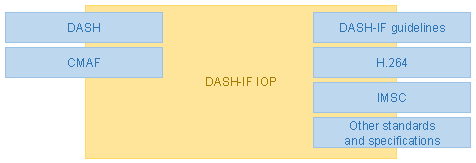

# Purpose # {#why-iop}

The scope of the DASH-IF InterOperability Points (<dfn>IOP</dfn>s) defined in this document is to provide support interoperable services for high-quality video distribution based on MPEG-DASH and related standards. The specified features enable relevant use cases including on-demand and live services, ad insertion, content protection and subtitling. The integration of different media codecs into DASH-based distribution is also defined.

The guidelines are provided in order to address DASH-IF members' needs and industry best practices. The guidelines provide support the implementation of conforming service offerings as well as the DASH client implementation. While alternative interpretations may be equally valid in terms of standards conformance, services and clients created following the guidelines defined in this document can be expected to exhibit highly interoperable behavior between different implementations.

Any identified bugs or missing features may be submitted through the DASH-IF issue tracker at https://gitreports.com/issue/Dash-Industry-Forum/DASH-IF-IOP.

# Interpretation # {#how-iop}

Requirements in this document describe required service and client behaviors that DASH-IF considers interoperable:

1. If a service provider follows these requirements in a published DASH service, that service is likely to experience successful playback on a wide variety of clients and exhibit graceful degradation when a client does not support all features used by the service. 
2. If a client implementer follows the client-oriented requirements described in this document, the client plays the content conforming to this document.

This document uses statements of fact (e.g. "is" and "can") when describing normative requirements defined in referenced specifications such as [[!MPEGDASH]] and [[!MPEGCMAF]]. [[RFC2119!]] statements (e.g. "SHALL" and "SHOULD") are used when this document defines a new requirement or further constrains a requirement from a referenced document. See also [[#conformance]].

All DASH presentations are assumed to be conforming to an [=IOP=]. A service may explicitly signal itself as conforming by including the string `https://dashif.org/guidelines/` in `MPD@profiles`.

There is no strict backward compatibility with previous versions - best practices change over time and what was once considered sensible may be replaced by a superior approach later on. Therefore, clients and services that were conforming to version N of this document are not guaranteed to conform to version N+1.

# Disclaimer # {#legal}

This is a document made available by DASH-IF. The technology embodied in this document may involve the use of intellectual property rights, including patents and patent applications owned or controlled by any of the authors or developers of this document. No patent license, either implied or express, is granted to you by this document. DASH-IF has made no search or investigation for such rights and DASH-IF disclaims any duty to do so. The rights and obligations which apply to DASH-IF documents, as such rights and obligations are set forth and defined in the DASH-IF Bylaws and IPR Policy including, but not limited to, patent and other intellectual property license rights and obligations. A copy of the DASH-IF Bylaws and IPR Policy can be obtained at http://dashif.org/.

The material contained herein is provided on an "AS IS" basis and to the maximum extent permitted by applicable law, this material is provided AS IS, and the authors and developers of this material and DASH-IF hereby disclaim all other warranties and conditions, either express, implied or statutory, including, but not limited to, any (if any) implied warranties, duties or conditions of merchantability, of fitness for a particular purpose, of accuracy or completeness of responses, of workmanlike effort, and of lack of negligence.

In addition, this document may include references to documents and/or technologies controlled by third parties. Those third party documents and technologies may be subject to third party rules and licensing terms. No intellectual property license, either implied or express, to any third party material is granted to you by this document or DASH-IF. DASH-IF makes no any warranty whatsoever for such third party material.

Note that technologies included in this document and for which no test and conformance material is provided, are only published as a candidate technologies, and may be removed if no test material is provided before releasing a new version of this guidelines document. For the availability of test material, please check http://www.dashif.org.

# DASH and related standards # {#dash-is-important}

DASH is a set of manifest and media formats for adaptive media delivery defined by [[!MPEGDASH]]. Dynamic Adaptive Streaming over HTTP (DASH) is initially defined in the first edition of ISO/IEC 23009-1 which was published in April 2012 and some corrections were done in 2013. In May 2014, ISO/IEC published the second version of ISO/IEC 23009-1 that includes additional features and provide additional clarifications. ISO/IEC published the third and fourth editions of ISO/IEC 23009-1 in 2019 and 2020. 

ISO/IEC also published the 1st and 2nd edition of ISO/IEC 23000-19 'Common media application format (CMAF) for segmented media' [[!MPEGCMAF]] in 2018 and 2019. CMAF defines segment and chunk format based on ISO Base Media File Format, optimized for streaming delivery. CMAF defines a set of well defined constraints that allows interoperability for media deliverable objects, which are compatible with [[!MPEGDASH]].

This document is based on the 4th edition DASH [[!MPEGDASH]] and 2nd edition CMAF [[!MPEGCMAF]] specifications.

DASH together with related standards and specifications is the foundation for an ecosystem of services and clients that work together to enable audio/video/text and related content to be presented to end-users.

<figure>
	
	<figcaption>This document connects DASH with international standards, industry specifications and DASH-IF guidelines.</figcaption>
</figure>

[[!MPEGDASH]] defines a highly flexible set of building blocks that needs to be constrained to a meaningful subset to ensure interoperable behavior in common scenarios. This document defines constraints that limit DASH features to those that are considered appropriate for use in interoperable clients and services.

This document was generated in close coordination with [[!DVB-DASH]]. The features are aligned to the extent considered reasonable. The tools and features are aligned to the extent considered reasonable. In addition, DASH-IF worked closely with ATSC to develop a DASH profile for ATSC3.0 for broadcast distribution [[!ATSC3.0]].

Clients consuming DASH content will need to interact with the host device's media platform. While few constraints are defined on these interactions, this document does assume that the media platform implements APIs that are equivalent to the popular [[media-source|Media Source Extensions (MSE)]] and [[encrypted-media|Encrypted Media Extensions (EME)]].

## Relationship to the previous versions of this document ## {#previous-versions}

There is no strict backward compatibility with previous versions of this document - best practices change over time and what was once considered sensible may be replaced by a superior approach later on. Therefore, clients and services that were conforming to version N of this document are not guaranteed to conform to version N+1.

The initial two versions of this document where based on the first edition of ISO/IEC 23009-1. Version 4.3 was mostly relying on the third edition of ISO/IEC 23009-1.

This version of the document relies on the 4th edition of ISO/IEC 23009-1 that was technically frozen in July 2019 and is expected to be published by the end of 2019 as ISO/IEC 23009-1:2020.

## Structure of a DASH presentation ## {#what-is-dash}

[[!MPEGDASH]] specifies the structure of a DASH presentation, which consists primarily of:

1. The manifest or <dfn>MPD</dfn>, which describes the content and how it can be accessed.
1. Data containers that clients will download over the course of a presentation in order to obtain media samples.

<figure>
	
	<figcaption>Relationships of primary DASH data structure and the standards they are defined in.</figcaption>
</figure>

The MPD is an XML file that follows a schema defined by [[!MPEGDASH]]. This schema defines various extension mechanisms for 3rd parties. This document defines some extensions, as do other industry specifications.

[[!MPEGDASH]] defines two data container formats, one based on [[!ISOBMFF]] and the other [[!MPEG2TS]]. However, only the former is used in modern solutions. This document only supports services using the [[!ISOBMFF]] container format.

[!MPEGCMAF] is the constrained media format based on [[!ISOBMFF]], specifically designed for adaptive streaming. This document uses [[!MPEGCMAF]] compatible data containers.

Note: The relationship to [[!MPEGCMAF]] is constrained to the container format. In particular, there is no requirement to conform to [[!MPEGCMAF]] media profiles.

The data container format defines the physical structure of the following elements described by the MPD:

1. Each [=representation=] in the [=MPD=] references an [=initialization segment=].
1. Each [=representation=] in the [=MPD=] references any number of [=media segments=].
1. Some [=representations=] in the [=MPD=] may reference an [=index segment=], depending on the [=addressing mode=] used.

Note: HLS (RFC8216) also support ([[!MPEGCMAF]]). Therefore, under certain constraints, the content encoded in ([![MPEGCMAF]]) can be delivered using MPD or HLS m3u8 manifest format.

<figure id="cmaf-terms">
	<table class="data">
		<thead>
			<tr>
				<th>[[!MPEGDASH]]
				<th>[[!MPEGCMAF]]
				<th>[[!ISOBMFF]]
		<tbody>
			<tr>
				<td>(media) segment, subsegment
				<td>CMAF segment
				<td>
			<tr>
				<td>initialization segment
				<td>CMAF header
				<td>
			<tr>
				<td>index segment, segment index
				<td>
				<td>segment index box (`sidx`)
	</table>
	<figcaption>Quick reference of closely related terms in different standards.</figcaption>
</figure>

Note: [[!MPEGDASH]] has the concept of "segment" (URL-addressable media object) and "subsegment" (byte range of URL-addressable media object), whereas [[!MPEGCMAF]] does not make such a distinction. This document uses [[!MPEGCMAF]] segment terminology, with the term segment in this document being equivalent to "CMAF segment" which in turns means "DASH media segment or media subsegment", depending the employed DASH profile.