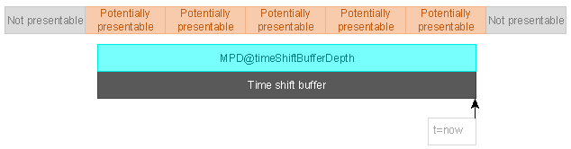

## Timing model ## {#timing}
The purpose of this chapter is to give a holistic overview of DASH presentation timing and related segment addressing. It is not intended to provide details of the timing model and all possible uses of the attributes in [[!MPEGDASH]]. 

In order to achieve higher interoperability, DASH-IF's Implementation Guidelines allow considerably limited options than the ones provided by [[!MPEGDASH]], constraining services to a specific set of reasonably flexible behaviors that are highly interoperable with modern client platforms. This chapter covers the timing model and related segment addressing schemes for these common use-cases. 

### Conformance requirements ### {#conformance-req}
This document adds additional constraints to [[!MPEGDASH]] timing requirements.

To be conformant to this document:
- Content generated by a service offering SHALL be compliant to
	- [[!MPEGDASH]] and [[!MPEGDASHCMAFPROFILE]].
	- Additional constraints in following sections
- Clients SHALL be compliant to the constraints in the following sections.

### MPD Timeline ### {#mpd-general-timeline}
[[!MPEGDASH]] defines DASH general timing model in its clause 4.3.

The [=MPD=] defines the <dfn>MPD timeline</dfn> of a <dfn>Media Presentation</dfn>, which serves as the baseline for all scheduling decisions made during DASH presentation playback.

There exist two types of Media Presentations, indicated by the `MPD@type`.

The playback of a <dfn>static MPD</dfn> (defined in [[!MPEGDASH]] as a MPD with `MPD@type="static"`) does not depend on the mapping of the MPD timeline to real time. This means that entire presentation is available at any time and  a client can play any part of the presentation at any time (e.g. it can start playback at any time and seek freely within the entire presentation).

The [=MPD timeline=] of a <dfn>dynamic MPD</dfn> (defined in [[!MPEGDASH]] as a MPD with `MPD@type="dynamic"`) has a fixed mapping to wall clock time, with each point on the [=MPD timeline=] corresponding to a point in real time. This means that segments of the presentation get available over time. Clients can introduce an additional offset with respect to wall clock time for the purpose of maintaining an input buffer to cop with network bandwidth fluctuations. 

Note: In addition to mapping the [=MPD timeline=] to wall clock time, [[#timing-mpd-updates|a dynamic MPD can be updated during the presentation]]. Updates may add new [=periods=] and remove or modify existing ones including adding new segments with progress in time, though some restrictions apply. See [[#timing-mpd-updates]].

The time zero on the [=MPD timeline=] of a [=dynamic MPD=] is mapped to the point in wall clock time indicated by `MPD@availabilityStartTime`. 

The ultimate purpose of the [=MPD=] is to enable the client to obtain media samples for playback. Additionally it may possibly dynamically switch between different bitrate of the same content to adopt to the network bandwidth fluctuation. The following data structures are most relevant to locating and scheduling the samples:

1. The [=MPD=] consists of consecutive [=periods=] which map data onto the [=MPD timeline=].
1. Each [=period=] contains of one or more [=representations=], each of which provides media samples inside a sequence of [=media segments=].
1. [=Representations=] within a [=period=] are grouped in [=adaptation sets=], which associate related [=representations=] and decorate them with metadata.

<figure>
	
	<figcaption>The primary elements described by an [=MPD=].</figcaption>
</figure>

### Periods ### {#timing-period}

An [=MPD=] defines an ordered list of one or more consecutive <dfn title="period">periods</dfn>. A [=period=] is both a time span on the [=MPD timeline=] and a definition of the data to be presented during this time span. [=Period=] timing is relative to the zero point of the [=MPD timeline=].

<figure>
	
	<figcaption>An [=MPD=] is a collection of consecutive periods.</figcaption>
</figure>

Common reasons for defining multiple [=periods=] are:

* Assembling a presentation from multiple self-contained pieces of content.
* Inserting ads in the middle of existing content and/or replacing spans of existing content with ads.
* Adding/removing certain [=representations=] as the nature of the content changes (e.g. a new title starts with a different set of offered languages).
* Updating period-scoped metadata (e.g. codec configuration or DRM signaling).

[=Periods=] are self-contained - a client is not required to know the contents of another [=period=] in order to correctly present a [=period=]. Knowledge of the contents of different periods may be used by a client to achieve seamless [=period=] transitions, especially when working with [[#timing-connectivity|period-connected representations]].

The below [=static MPD=] consists of two 20-second [=periods=]. The duration of the first [=period=] is calculated using the start point of the second [=period=]. The total duration of the presentation is 40 seconds.

<xmp highlight="xml">
<MPD xmlns="urn:mpeg:dash:schema:mpd:2011" type="static">
	<Period>
		...
	</Period>
	<Period start="PT20S" duration="PT20S">
		...
	</Period>
</MPD>
</xmp>

Parts of the [=MPD=] structure that are not relevant for this chapter have been omitted - this is not a fully functional [=MPD=] file.

[[!MPEGDASH]] clause 5.3.2 defines the period's requirements in MPD authoring. Among others it requires the followings:

1. All periods must be consecutive and non-overlapping. A [=period=] may have a duration of zero.

Note: A [=period=] with a duration of zero might, for example, be the result of ad-insertion logic deciding not to insert any ad.

2. In a [=static MPD=], the first [=period=] must start at the time zero of the [=MPD timeline=]. In a [=dynamic MPD=], the first [=period=] must start at or after the zero point of the [=MPD timeline=].

1. In a [=static MPD=], either the last [=period=] must have a `Period@duration` or `MPD@mediaPresentationDuration` must exist. 
1. In a [=dynamic MPD=], the last [=period=] may have a `Period@duration`, in which case it has a fixed duration. If without `Period@duration`, the last [=period=] in a [=dynamic MPD=] has an unknown duration, which allows to extend the timeline indefinitely.

Note: In a [=dynamic MPD=], a [=period=] with an unknown duration may be converted to fixed-duration by an MPD update. Periods in a [=dynamic MPD=] can also be shortened or removed entirely under certain conditions. However, [=Media Presentation=] is defined until (current wall clock time + `MPD@minimumUpdatePeriod`), by which the current MPD is still valid. See [[#timing-mpd-updates]].

5. `MPD@mediaPresentationDuration` may be present. If present, it must accurately match the duration between the time zero on the [=MPD timeline=] and the end of the last period. Clients must calculate the total duration of a [=static MPD=] by adding up the durations of each [=period=] and must rely on the presence of `MPD@mediaPresentationDuration`.

Note: This calculation is necessary because the durations of [[#xlink-feature|XLink periods]] can only be known after the [=XLink=] is resolved. Therefore it is impossible to always determine the total [=MPD=] duration on the service side as only the client is guaranteed to have access to all the required knowledge.

### Representations ### {#timing-representation}

A <dfn>representation</dfn> is a sequence of <dfn>segment</dfn> as defined by [[!MPEGDASH]] 5.3.1 and 5.3.5.  A `Representation` element is a collection of these <dfn> segment references</dfn> and a description of the samples within the referenced [=media segments=]. 

In practice, each representation usually belongs to exactly one [=adaptation set=] and often belongs to exactly one [=period=], although [[#timing-connectivity|a representation may be connected with a representation in another period]].

Each [=segment=] reference addresses a [=media segment=] that corresponds to a specific time span on the [=sample timeline=]. Each [=media segment=] contains samples for a specific time span on the [=sample timeline=].

Note: [=Simple addressing=] allows the actual time span of samples within a [=media segment=] to deviate from the corresponding time span described in the [=MPD=] ([[!MPEGDASH]] 7.2.1). All timing-related clauses in this document refer to the  timing described in the [=MPD=] (i.e. according to [=MPD timeline=])unless otherwise noted.

The exact mechanism used to define segment references depends on the [=addressing mode=] used by the representation.

This document requires the following additional requirement:
 - All [=representations=] in the same [=adaptation set=] SHALL use the same [=addressing mode=].

As recommended by [[!MPEGDASH]] 7.2.1:
- There should not be gaps or overlapping [=media segments=] in a [=representation=].

This document additionally requires:
 - In a [=static MPD=] a [=representation=] SHALL contain enough [=segment references=] to cover the entire time span of the [=period=]. However, gaps in this time span are allowed.

<figure>
	
	<figcaption>In a [=static MPD=], the entire [=period=] must be covered with [=media segments=].</figcaption>
</figure>

- In a [=dynamic MPD=], a [=representation=] element SHALL contain enough [=segment references=] to cover the time span of the [=period=] that intersects with the [=time shift buffer=]. However, gaps in this time span are allowed.

<figure>
	
	<figcaption>In a [=dynamic MPD=], the [=time shift buffer=] determines the set of required [=segment references=] in each [=representation=]. [=Media segments=] filled with gray need not be referenced due to falling outside the [=time shift buffer=], despite falling within the bounds of a [=period=].</figcaption>
</figure>

Note: In a dynamic MPD, each [=Media segments=] only become [=available=] when its end point is within their [=availability window=] (This time may need to be adjusted by availabilityTimeOffset (need to be defined) and `@availabilityTimeComplete` values) ([[!MPEGDASH]] 5.3.9.5.1 and 5.3.5.3). It is a valid situation that a [=media segment=] is required to be referenced but is not yet [=available=].

As required by [[!MPEGDASH]] 5.3.9.5.3:
- A [=dynamic MPD=] must remain valid for its entire validity duration after publishing. In other words, a [=dynamic MPD=] must supply enough [=segment references=] to allow the [=time shift buffer=] to extend to `now + MPD@minimumUpdatePeriod`, where `now` is the current time according to [[#clock-sync|the synchronized clock]].

As allowed by [[!MPEGDASH]] 7.2.1:
- [=Media segment=] start/end points may be unaligned with [=period=] start/end points except when using [=simple addressing=]. This possible offset is signaled by `@eptDelta`.

An <dfn>unnecessary segment reference</dfn> is one that is not defined as required by this chapter.

This document requires the following additional requirements to [[!MPEGDASH]]:
- In a [=static MPD=], a [=representation=] SHALL NOT contain [=unnecessary segment references=], except when using [=indexed addressing=] in which case such segment references MAY be present.

- In a [=dynamic MPD=], a [=representation=] SHALL NOT contain [=unnecessary segment references=] except when any of the following applies, in which case an [=unnecessary segment reference=] MAY be present:

1. The [=segment reference=] is for future content and will eventually become necessary.
1. The [=segment reference=] is defined via [=indexed addressing=].
1. The [=segment reference=] is defined by an `<S>` element that defines multiple references using `S@r`, some of which are necessary.
1. Removal of the [=segment reference=] is not allowed by [[#timing-mpd-updates-remove-content|content removal constraints]].

This document also requires the following requirements for clients:
- Clients SHALL NOT present any samples from [=media segments=] that are entirely outside the [=period=], even if such [=media segments=] are referenced.

<figure>
	
	<figcaption>[=Media segments=] and samples need not align with [=period=] boundaries. Some samples may be entirely outside a [=period=] (marked gray) and some may overlap the [=period=] boundary (yellow).</figcaption>
</figure>

- If a [=media segment=] overlaps a [=period=] boundary, clients SHOULD NOT present the samples that lie outside the [=period=] and SHOULD present the samples that lie either partially or entirely within the [=period=].

Note: In the end, which samples are presented is entirely up to the client. It may sometimes be impractical to present [=media segments=] only partially, depending on the capabilities of the client platform, the type of media samples involved and any dependencies between samples.

### Sample timeline ### {#timing-sampletimeline}
The samples within a [=representation=] exist on a linear <dfn>sample timeline</dfn> defined by the encoder that created the samples. One or more [=sample timelines=] are mapped onto the [=MPD timeline=] by metadata stored in or referenced by the [=MPD=] ([[!MPEGDASH]] 7.3.2).

<figure>
	
	<figcaption>Sample timelines are mapped onto the [=MPD timeline=] based on parameters defined in the [=MPD=].</figcaption>
</figure>

Note: A [=sample timeline=] is linear - encoders are expected to use an appropriate [=timescale=] and sufficiently large timestamp fields to avoid any wrap-around. If wrap-around does occur, a new [=period=] must be started in order to establish a new [=sample timeline=].

The [=sample timeline=] is formed after applying any [[!ISOBMFF]] edit lists ([[!MPEGDASH]] 7.3.2).

This document additionally requires:
- The same [=sample timeline=] SHALL be shared by all [=representations=] in the same [=adaptation set=]. [=Representations=] in different [=adaptation sets=] MAY use different [=sample timelines=].

- The [=sample timeline=] is measured in <dfn>timescale units</dfn> defined as a number of units per second. This value (the <dfn>timescale</dfn>) SHALL be present in the MPD as `SegmentTemplate@timescale` or `SegmentBase@timescale` (depending on the [=addressing mode=]).

Note: While optional in [[!MPEGDASH]], the presence of the `@timescale` attribute is required by the interoperable timing model because the default value of 1 is unlikely to match any real-world content and is far more likely to indicate an unintentional content authoring error.

<figure>
	
	<figcaption>`@presentationTimeOffset` is the key component in establishing the relationship between the [=MPD timeline=] and a [=sample timeline=].</figcaption>
</figure>

The point on the [=sample timeline=] indicated by `@presentationTimeOffset` is equivalent to the [=period=] start point on the [=MPD timeline=] ([[!MPEGDASH]] Table 15). The value is provided by `SegmentTemplate@presentationTimeOffset` or `SegmentBase@presentationTimeOffset`, depending on the [=addressing mode=], and has a default value of 0 [=timescale units=].

Note: To transform a [=sample timeline=] position `SampleTime` to an [=MPD timeline=] position, use the formula `MpdTime = Period@start + (SampleTime - @presentationTimeOffset) / @timescale`.

### Clock drift is forbidden ### {#no-clock-drift}

Some encoders experience clock drift - they do not produce exactly 1 second worth of output per 1 second of input, either stretching or compressing the [=sample timeline=] with respect to the [=MPD timeline=].

This document adds the following requirement:
- A DASH service SHALL NOT publish content that suffers from clock drift.

If a packager receives input from an encoder at the wrong rate, it must take corrective action. For example, it might:

1. Drop a span of content if input is produced faster than real-time.
1. Insert regular padding content if input is produced slower than real-time. This padding can take different forms:
	* Silence or a blank picture.
	* Repeating frames.
	* Insertion of short-duration [=periods=] where the affected [=representations=] are not present.

Of course, such after-the-fact corrective actions can disrupt the end-user experience. The optimal solution is to fix the defective encoder.

### Media segments ### {#timing-mediasegment}

A <dfn>media segment</dfn> is an HTTP-addressable data structure that contains one or more media samples.

Note: Different media segments may be different byte ranges accessed on the same URL.

[[!MPEGCMAF]] requires that [=Media segments=] must contain one or more consecutive media samples, and consecutive [=media segments=] in the same [=representation=] must contain consecutive media samples.

[[!MPEGDASH]] 7.2.1 requires the followings:

- [=Media segments=] must contain the media samples that exactly match the time span on the [=sample timeline=] that is assigned to the [=media segment=] by the MPD, except when using [=simple addressing=] in which case a certain amount of inaccuracy may be present as defined in [[#addressing-simple-inaccuracy]].

- The [=media segment=] that starts at or overlaps the [=period=] start point must contain a media sample that starts at or overlaps the [=period=] start point and the [=media segment=] that ends at or overlaps the [=period=] end point must contain a media sample that ends at or overlaps the [=period=] end point.

[[!MPEGCMAF]] 7.3.4 and [[!MPEGDASHCMAFPROFILE]] requires the following:
- [[#segment-alignment|Aligned media segments]] in different [=representations=] of the same adaptation set must contain samples for the same true time span, even if using [=simple addressing=] with [[#addressing-simple-inaccuracy|inaccurate media segment timing]].

#### Media segment duration deviation #### {#segment-duration-deviation}

When using [=simple addressing=], the samples contained in a media segment may cover a different time span on the [=sample timeline=] than what is indicated by the nominal timing in the [=MPD timeline=]. This deviation is defined as the offset between the edges of the nominal time span (as defined by [=MPD timeline=]) and the edges of the true time span (as defined by [=sample timeline], and is calculated separately for each edge. 

<figure>
	
	<figcaption>In simple addressing,  a media segment may cover a different time span on the [=sample timeline=] than what is indicated by the nominal timing in the [=MPD timeline=]. Red boxes indicate samples.</figcaption>
</figure>

[[!MPEGDASH]] 7.2.1 requires:
The duration deviation must be no more than 50% of the nominal media segment duration and may be in either direction.

This document also recommends:
- [=Media segments=] of a [=representation=] SHOULD be equal in duration. Occasional jitter MAY occur (e.g. due to encoder decisions on GOP size).

Note: [[DVB-DASH]] defines some relevant constraints in section 4.5. Consider obeying these constraints to be compatible with [[DVB-DASH]].

#### Segments must be aligned #### {#segment-alignment}

[=Media segments=] are said to be aligned if the earliest/latest presentation time of all [=media segments=] on the [=sample timeline=] are equal in all [=representations=] that belong to the same [=adaptation set=].

[[!MPEGDASHCMAFPROFILE]] requires:
- [=Media segments=] must be aligned.
- When using [=simple addressing=] or [=explicit addressing=], the media segments alignment must be signaled by `AdaptationSet@segmentAlignment=true` in the [=MPD=]. When using [=indexed addressing=], this must be signaled by `AdaptationSet@subsegmentAlignment=true` in the [=MPD=].

### Period connectivity ### {#timing-connectivity}

The precise definition of Period connectivity can found in [[!MPEGDASH]] 5.3.2.4. However, generally speaking, in certain circumstances content may be offered such that a [=representation=] is technically compatible with the content of a [=representation=] in a previous [=period=]. Such [=representations=] are <dfn>period-connected</dfn>.

Any subset of the [=representations=] in a [=period=] may be [=period-connected=] with their counterparts in a future or past [=period=]. [=Period=] connectivity may be chained across any number of [=periods=].

Note: Connectivity is generally achieved by using the same encoder to encode the content of multiple [=periods=] using the same settings. Keep in mind, however, that decryption is also a part of the client media pipeline - it is not only the codec parameters that are configured by the initialization segment; different decryption parameters are likely to break connectivity that would otherwise exist.

For signaling the period connectivity between [=representation=] of two periods in a MPD, [[!MPEGDASH]] 5.3.2.4 requires:
* `Representation@id` is equal.
* `AdaptationSet@id` is equal.
* The [=adaptation set=] in the second [=period=] has a [=supplemental property descriptor=] with:
	* `@shemeIdUri` set to `urn:mpeg:dash:period-connectivity:2015`.
	* `@value` set to the `Period@id` of the first period.
* Initialization segments of period-connected [=representations=] to be functionally equivalent (i.e. the initialization segment from any period-connected [=representation=] can be used to initialize playback of any period-connected [=representation=]).

<figure>
	
	<figcaption>[=Representations=] can be signaled as [=period-connected=], enabling client optimizations. Arrows on diagram indicate direction of connectivity reference (from future to past), with the implied message being "the client can use the same decoder it used where the arrow points to".</figcaption>
</figure>

Note: Not all [=representations=] in an [=adaptation set=] need to be [=period-connected=]. For example, if a new [=period=] is introduced to add a [=representation=] that contains a new video quality level, all other [=representations=] will likely be connected but not the one that was added.

 Note that [[!MPEGDASH]] allows:
 * An [=MPD=] may contain unrelated [=periods=] between [=periods=] that contain [=period-connected=] [=representations=].

* The [=sample timelines=] of [=period-connected=] [=representations=] may be mutually discontinuous (e.g. due to encoder clock wrap-around or skipping some content as a result of editorial decisions).

* As a [=period=] may start and/or end in the middle of a [=media segment=], the same [=media segment=] may simultaneously exist in two [=period-connected=] [=representations=], with one part of it scheduled for playback during the first [=period=] and the other part during the second [=period=]. This is likely to be the case when no [=sample timeline=] discontinuity is introduced by the transition.

<figure>
	
	<figcaption>The same [=media segment=] will often exist in two [=periods=] at a [=period-connected=] transition. On the diagram, this is segment 4.</figcaption>
</figure>

This document recommends:
- [=Media Presentation=] with connected content cross periods SHOULD be signaled in the [=MPD=] as [=period-connected=]. This is expected to help clients ensure seamless playback across [=period=] transitions.

This document also recommends:
* Clients SHOULD NOT present a [=media segment=] twice when it occurs on both sides of a [=period=] transition in a [=period-connected=] [=representation=].

* Clients SHOULD ensure seamless playback of [=period-connected=] [=representations=] in consecutive [=periods=].

Note: The exact mechanism that ensures seamless playback depends on client capabilities and will be implementation-specific. Any shared [=media segment=] overlapping the [=period=] boundary may need to be detected and deduplicated to avoid presenting it twice.

#### Period continuity #### {#timing-connectivity-continuity}

In addition to [[#timing-connectivity|period connectivity]], [[!MPEGDASH]] 5.3.2.4 defines [=period=] continuity, which is a special case of [=period=] connectivity where the two samples on the boundary between the connected [=representations=] are consecutive on the same [=sample timeline=]. Continuity implies connectivity.

Note: The above can only be true if the sample boundary exactly matches the [=period=] boundary.

For signaling the period continuity, [[!MPEGDASH]] 5.3.2.4 requires:
* The same signaling as for [[#timing-connectivity|period connectivity]], except that the value to use for `@schemeIdUri` is `urn:mpeg:dash:period-continuity:2015`.

This document requires:
* [=Media Presentation=] with continuous content cross periods SHOULD be signaled in the [=MPD=] with period continuity.
* [=period=] connectivity SHALL NOT be simultaneously signaled on the same [=representation=] for which period continuity is signaled.

This document requires:
* Clients MAY take advantage of any platform-specific optimizations for seamless playback that knowledge of [=period=] continuity enables; beyond that, clients SHALL treat continuity the same as connectivity.

### Dynamic MPDs ### {#timing-dynamic}

This section only applies to [=dynamic MPDs=].

Three main factors differentiate them from [=static MPDs=]:

1. The segments described in a [=dynamic MPD=] may become available over time, i.e. not all segments are available.   

1. Playback of a [=dynamic MPD=] is synchronized to a real time clock (with some amount of client-chosen time shift allowed).

1. A [=dynamic MPD=] may change over time, with clients retrieving new snapshots of the [=MPD=] when the validity duration of the previous snapshot expires.

[[!MPEGDASH]] 5.4.1 requires:
* A dynamic MPD SHALL conform to the constraints in this document not only at its moment of initial publishing but through the entire <dfn>MPD validity duration</dfn>, which is a period of `MPD@minimumUpdatePeriod` starting from the moment the MPD download is started by a client, unless overridden by [[#inband|in-band validity expiration signaling]].

Advisement: The [=MPD validity duration=] starts when the MPD download is initiated by a client, which may be some time after it is generated/published!

This document requires:
DASH clients SHALL support the presentation of [=dynamic MPDs=].

#### Real time clock synchronization #### {#clock-sync}

It is critical to synchronize the clocks of the client with the clock of service when using a [=dynamic MPD=]. The time indicated by the clock does not necessarily need to match some universal standard as long as the two are mutually synchronized.

The use of UTCTiming is optional in [[!MPEGDASH]].

This document requires:
* A [=dynamic MPD=] SHALL include at least one `UTCTiming` element that defines a clock synchronization mechanism. If multiple `UTCTiming` elements are listed, their order determines the order of preference.

* The set of time synchronization mechanisms SHALL be restricted to the following schemes defined in [[!MPEGDASH]]:

	* `urn:mpeg:dash:utc:http-xsdate:2014`
	* `urn:mpeg:dash:utc:http-iso:2014`
	* `urn:mpeg:dash:utc:http-ntp:2014`
	* `urn:mpeg:dash:utc:ntp:2014`
	* `urn:mpeg:dash:utc:http-head:2014`
	* `urn:mpeg:dash:utc:direct:2014`

Advisement: The use of a "default time source" is not allowed. The mechanism of time synchronization must always be explicitly defined in the [=MPD=] by every service.

This document requires:
* A client presenting a [=dynamic MPD=] SHALL synchronize its local clock according to the `UTCTiming` elements in the [=MPD=] and SHALL emit a warning or error to application developers when clock synchronization fails, no `UTCTiming` elements are defined or none of the referenced clock synchronization mechanisms are supported by the client.

Issue: We could benefit from some detailed examples here, especially as clock sync is such a critical element of live services.

#### Availability #### {#timing-availability}

A [=media segment=] is <dfn>available</dfn> when an HTTP request to acquire the [=media segment=] can be started and successfully performed to completion by a client. During playback of a [=dynamic MPD=], new [=media segments=] continuously become [=available=] and stop being [=available=] with the passage of time.

An <dfn>availability window</dfn> is a time span on the [=MPD timeline=] that determines which [=media segments=] can be expected to be [=available=]. Each [=representation=] has its own [=availability window=].

A <dfn>segment start point</dfn> (referred to as <dfn>MPD start time</dfn> of a segment in [[!MPEGDASH]]) is the presentation start time of the segment in [=MPD timeline=].

A <dfn>segment end point</dfn> is defined is the presentation end time of the segment in [=MPD timeline=].

[!MPEGDASH]] requires:
* A service must make [=available=] all [=media segments=] that have their end point inside or at the end of the [=availability window=].

Advisement: It is the responsibility of the service to ensure that [=media segments=] are [=available=] to clients when they are described as [=available=] by the [=MPD=]. Consider that the criterium for availability is a successful download by clients, not successful publishing from a packager.

The [=availability window=] is calculated as follows:

1. Let <var>now</var> be the current wall clock time according to [[#clock-sync|the synchronized clock]].
1. Let <var>AvailabilityWindowStart</var> be <code><var>now</var> - MPD@timeShiftBufferDepth</code>.
	* If `MPD@timeShiftBufferDepth` is not defined, let <var>AvailabilityWindowStart</var> be `MPD@availabilityStartTime`.
1. Let <var>TotalAvailabilityTimeOffset</var> be the sum of all `@availabilityTimeOffset` values that apply to the [=representation=] (those directly on the `Representation` element and any of its ancestors).
1. The [=availability window=] is the time span from <var>AvailabilityWindowStart</var> to <code><var>now</var> + <var>TotalAvailabilityTimeOffset</var></code>.

<figure>
	
	<figcaption>The [=availability window=] determines which [=media segments=] can be expected to be [=available=], based on where their [=segment end point=] lies.</figcaption>
</figure>

This document requires:
* Clients MAY at any point attempt to acquire any [=media segments=] that the [=MPD=] signals as [=available=]. Clients SHALL NOT attempt to acquire [=media segments=] that the [=MPD=] does not signal as [=available=].

* Clients SHOULD NOT assume that [=media segments=] described by the [=MPD=] as [=available=] are [=available=] and SHOULD implement appropriate retry/fallback behavior to account for timing errors by slow-publishing or eagerly-unpublishing services.

#### Time shift buffer #### {#timing-timeshift}

The <dfn>time shift buffer</dfn> is a time span on the [=MPD timeline=] that defines the set of [=media segments=] that a client is allowed to present at the current moment in time according to [[#clock-sync|the synchronized clock]] (`now`).

This is the mechanism by which clients can introduce a <dfn>time shift</dfn> (an offset) between real time and the [=MPD timeline=] when presenting [=dynamic MPDs=]. The [=time shift=] is zero when a client always chooses to play back the [=media segment=] at the end point of the [=time shift buffer=]. By playing back [=media segments=] from further in the past, a [=time shift=] is introduced.

Note: A [=time shift=] of 30 seconds means that the client starts presenting a [=media segment=] at the moment when its position on the [=MPD timeline=] reaches a distance of 30 seconds from the end of the [=time shift buffer=].

The following additional factors further constrain the set of [=media segments=] that can be presented at the current time and can force a client to introduce a [=time shift=]:

1. [[#timing-availability]] - not every [=media segment=] in the time shift buffer is guaranteed to be [=available=].
1. [[#timing-delay]] - the service may define a delay that forbids the use of a section of the [=time shift buffer=].

The [=time shift buffer=] extends from `now - MPD@timeShiftBufferDepth` to `now`. In the absence of `MPD@timeShiftBufferDepth` the start of the [=time shift buffer=] is `MPD@availabilityStartTime`.

<figure>
	
	<figcaption>[=Media segments=] overlapping the [=time shift buffer=] may potentially be presented by a client, if other constraints do not forbid it.</figcaption>
</figure>

This document requires:
* Clients MAY present samples from [=media segments=] that overlap (either in full or in part) the time shift buffer, assuming no other constraints forbid it. 
* Clients SHALL NOT present samples from [=media segments=] that are entirely outside the [=time shift buffer=] (whether in the past or the future).
* The start of the [=time shift buffer=] may be before the start of the first [=period=]. Clients SHALL NOT use regions of the [=time shift buffer=] that are not covered by [=periods=].

A [=dynamic MPD=] SHALL contain a [=period=] that ends at or overlaps the end point of the [=time shift buffer=], except when reaching [[#timing-mpd-updates-theend|the end of live content]] in which case the last [=period=] MAY end before the end of the [=time shift buffer=].

#### Presentation delay #### {#timing-delay}

There is a natural conflict between the [=availability window=] and the [=time shift buffer=]. It is legal for a client to present [=media segments=] as soon as they overlap the [=time shift buffer=], yet such [=media segments=] might not yet be [=available=].

Furthermore, the delay between [=media segments=] entering the [=time shift buffer=] and becoming [=available=] might be different for different [=representations=] that use different [=media segment=] durations. This difference may also change over time if a [=representation=] does not use a constant [=media segment=] duration.

This document requires:
* Clients SHALL calculate a suitable <dfn>presentation delay</dfn> to ensure that the [=media segments=] it schedules for playback are [=available=] and that there is sufficient time to download them once they become [=available=]. In essence, the [=presentation delay=] decreases the [=time shift buffer=], creating an [=effective time shift buffer=] with a reduced duration.

[[!MPEGDASH]] allows:
* Services may define the `MPD@suggestedPresentationDelay` attribute to provide a suggested [=presentation delay=]. 

This document requires:
* Clients SHOULD use `MPD@suggestedPresentationDelay` when provided, ignoring the calculated value.

Note: As different clients might use different algorithms for calculating the presentation delay, providing `MPD@suggestedPresentationDelay` enables services to roughly synchronize the playback start position of clients.

The <dfn>effective time shift buffer</dfn> is the time span from the start of the [=time shift buffer=] to `now - PresentationDelay`.

<figure>
	
	<figcaption>[=Media segments=] that overlap the [=effective time shift buffer=] are the ones that may be presented at time `now`. Two [=representations=] with different segment lengths are shown. Diagram assumes `@availabiltiyTimeOffset=0`.</figcaption>
</figure>

This document requires:
* Clients SHALL constrain seeking to the [=effective time shift buffer=]. Clients SHALL NOT attempt to present [=media segments=] that fall entirely outside the [=effective time shift buffer=].

#### MPD updates #### {#timing-mpd-updates}

[=Dynamic MPDs=] may change over time. The nature of the change is not restricted unless such a restriction is explicitly defined.

Some common reasons to make changes in [=dynamic MPDs=]:

* Adding new [=segment references=] to an existing [=period=].
* Adding new [=periods=].
* Converting unlimited-duration [=periods=] to fixed-duration [=periods=] by adding `Period@duration`.
* Removing [=segment references=] and/or [=periods=] that have fallen out of the [=time shift buffer=].
* Shortening an existing [=period=] when changes in content scheduling take place.
* Removing `MPD@minimumUpdatePeriod` to signal that [=MPD=] will no longer be updated.
* Converting the [=MPD=] to a [=static MPD=] to signal that a live service has become available on-demand as a recording.

[[!MPEGDASH]] 5.4.1 requires the following restrictions for MPD updates:

* `MPD@id` must not change.
* `MPD.Location` must not change.
* `MPD@availabilityStartTime` must not change.
* `Period@id` must not change.
* `Period@start` must not change.
* `Period@duration` must not change except when explicitly allowed by other statements in this document.
* The [=adaptation sets=] present in a [=period=] (i.e. the set of `AdaptationSet@id` values) must not change.
* The [=representations=] present in an [=adaptation set=] (i.e. the set of `Representation@id` values) must not change.
* The functional behavior of a [=representation=] (identified by a matching `Representation@id` value) must not change, neither in terms of metadata-driven behavior (including metadata inherited from [=adaptation set=] level) nor in terms of [=media segment=] timing. In particular:
	* `SegmentTemplate@presentationTimeOffset` must not change.
	* `SegmentBase@presentationTimeOffset` must not change.

Advisement: Additional restrictions on MPD updates are defined by other parts of this document.

This document requires:
* The presence or absence of `MPD@minimumUpdatePeriod` SHALL be used by a service to signal whether the MPD might be updated (with presence indicating potential for future updates). The value of this field indicates the [=MPD validity duration=] of the present snapshot of the [=MPD=], starting from the moment its download was initiated. Absence of the `MPD@minimumUpdatePeriod` attribute indicates an infinite validity (the [=MPD=] will never be updated). The value 0 indicates that the [=MPD=] has no validity after the moment it was retrieved.

* Since clients usually require some time to download and process an [=MPD=] update, a service SHOULD NOT assume perfect update timing.

* In addition to signaling that clients are expected to poll for regular [=MPD=] updates, a service MAY publish [[#inband|in-band events to update the MPD validity duration]] at moments of its choosing.

This document also requires:
* Clients SHOULD use `@id` to track [=period=], [=adaptation set=] and [=representation=] identity across MPD updates.

* Clients SHALL process state changes that occur during the [=MPD validity duration=]. For example new [=media segments=] will become [=available=] over time if they are referenced by the [=MPD=] and old ones become unavailable, even without an [=MPD=] update.

* `MPD@minimumUpdatePeriod = 0` indicates that the [=MPD=] has no validity after the moment it was retrieved. In such a situation, the client SHALL have to acquire a new [=MPD=] whenever it wants to make new [=media segments=] available (no "natural" state changes will occur).

* Clients SHOULD NOT assume that they can get all updates in time (they may already be attempting to buffer some [=media segments=] that were removed by an [=MPD=] update).

##### Adding content to the MPD ##### {#timing-mpd-updates-add-content}

[!MPEGDASH]] allows two mechanisms for adding content:

* Additional [=segment references=] may be added to the last [=period=].
* Additional [=periods=] may be added to the end of the MPD.

Multiple content adding mechanisms may be combined in a single [=MPD=] update. An [=MPD=] update that adds content may be combined [[#timing-mpd-updates-remove-content|with an MPD update that removes content]].

<figure>
	
	<figcaption>[=MPD=] updates can add both [=segment references=] and [=periods=] (additions highlighted in blue).</figcaption>
</figure>

This document requires:
* [=Segment references=] SHALL NOT be added to any [=period=] other than the last [=period=].
* An MPD update MAY combine adding [=segment references=] to the last [=period=] with adding of new [=periods=].

Note: The duration of the last [=period=] cannot change as a result of adding [=segment references=]. A live service will generally use a [=period=] with an unlimited duration to continuously add new [=segment references=].

When using [=simple addressing=] or [=explicit addressing=], it is possible for a [=period=] to define an infinite sequence of [=segment references=] that extends to the end of the [=period=] (e.g. using `SegmentTemplate@duration` or `r="-1"`). Such self-extending reference sequences are equivalent to explicitly defined [=segment reference=] sequences that extend to the end of the [=period=] and clients MAY obtain new [=segment references=] from such sequences even between [=MPD=] updates.

##### Removing content from the MPD ##### {#timing-mpd-updates-remove-content}

Advisement: Removal of content is only allowed if the content to be removed is not yet [=available=] to clients and guaranteed not to become [=available=] until clients receive the [=MPD=] update. See [[#timing-availability]].

To determine the content that may be removed, let `EarliestRemovalPoint` be `availability window end + MPD@minimumUpdatePeriod`.

Note: As each [=representation=] has its own [=availability window=], so does each [=representation=] have its own `EarliestRemovalPoint`.

<figure>
	
	<figcaption>[=MPD=] updates can remove both [=segment references=] and [=periods=] (removals highlighted in red).</figcaption>
</figure>

An [=MPD=] update removing content MAY remove any [=segment references=] to [=media segments=] that start after `EarliestRemovalPoint` at the time the update is published.

[=Media segments=] that overlap or end before `EarliestRemovalPoint` might be considered by clients to be [=available=] at the time the [=MPD=] update is processed and therefore SHALL NOT be removed by an [=MPD=] update.

The following mechanisms exist removing content:

* The last [=period=] MAY change from unlimited duration to fixed duration.
* The duration of the last [=period=] MAY be shortened.
* One or more [=periods=] MAY be removed entirely from the end of the [=MPD=].

Multiple content removal mechanisms MAY be combined in a single [=MPD=] update.

Note: When using [=indexed addressing=] or [=simple addressing=], removal of [=segment references=] from the end of the [=period=] only requires changing `Period@duration`. When using [=explicit addressing=], pruning some `S` elements may be appropriate to avoid leaving [=unnecessary segment references=].

Clients SHALL NOT fail catastrophically if an [=MPD=] update removes already buffered data but MAY incur unexpected [=time shift=] or a visible transition at the point of removal. It is the responsibility of the service to avoid removing data that may already be in use.

In addition to editorial removal from the end of the [=MPD=], content naturally expires due to the passage of time. Expired content also needs to be removed:

* Explicitly defined [=segment references=] (`S` elements) SHALL be removed when they have expired (i.e. the [=media segment=] end point has fallen out of the [=time shift buffer=]).
	* A repeating explicit [=segment reference=] (`S` element with `@r != 0`) SHALL NOT be removed until all repetitions have expired.
* [=Periods=] with their end points before the time shift buffer SHALL be removed.

An [=MPD=] update that removes content MAY be combined [[#timing-mpd-updates-add-content|with an MPD update that adds content]].

##### End of live content ##### {#timing-mpd-updates-theend}

Live services can reach a point where no more content will be produced - existing content will be played back by clients and once they reach the end, playback will cease.

This document requires:
* When this occurs, services SHALL define a fixed duration for the last [=period=], remove the `MPD@minimumUpdatePeriod` attribute and cease performing [=MPD=] updates to signal that no more content will be added to the [=MPD=]. 

* The `MPD@type` MAY be changed to `static` at this point or later if the service is to be converted to a [=static MPD=] for on-demand viewing.

#### MPD refreshes #### {#timing-mpd-refreshes}

To stay informed of the [=MPD=] updates, clients need to perform <dfn>MPD refreshes</dfn> at appropriate moments to download the updated [=MPD=] snapshots.

This document requires: 
* Clients presenting [=dynamic MPDs=] SHALL execute the following [=MPD=] refresh logic:

1. When an [=MPD=] snapshot is downloaded, it is valid for the present moment and at least `MPD@minimumUpdatePeriod` after that.
1. A client can expect to be able to successfully download any [=media segments=] that the [=MPD=] defines as [=available=] at any point during the [=MPD validity duration=].
1. The clients MAY refresh the [=MPD=] at any point. Typically this will occur because the client wants to obtain more [=segment references=] or make more [=media segments=] (for which it might already have references) [=available=] by extending the [=MPD=] validity duration.
    * This may result in a different [=MPD=] snapshot being downloaded, with updated information.
    * Or it may be that the [=MPD=] has not changed, in which case its validity period is extended to `now + MPD@minimumUpdatePeriod`.

Note: There is no requirement that clients poll for updates at `MPD@minimumUpdatePeriod` interval. They can do so as often or as rarely as they wish - this attribute simply defines the [=MPD=] validity duration.

Services may [[#inband|publish in-band events to explicitly signal MPD validity]] instead of expecting clients to regularly refresh on their own initiative. This enables finer control by the service but might not be supported by all clients. 

This document requires:
* Services SHALL NOT require clients to support in-band events.

### Timing of stand-alone IMSC1 and WebVTT text files ### {#standalone-text-timing}

Some services store [=text adaptation sets=] in stand-alone IMSC1 or WebVTT files, without segmentation or [[!ISOBMFF]] encapsulation.

This document requires:
* Timecodes in stand-alone text files SHALL be relative to the [=period=] start point.

* `@presentationTimeOffset` SHALL NOT be present and SHALL be ignored by clients if present.

IMSC1 subtitles in stored in a stand-alone XML file.

<xmp highlight="xml">
<AdaptationSet mimeType="application/ttml+xml" lang="en-US">
	<Role schemeIdUri="urn:mpeg:dash:role:2011" value="subtitle" />
	<Representation>
		<BaseURL>subtitles_en_us.xml</BaseURL>
	</Representation>
</AdaptationSet>
</xmp>

Parts of the [=MPD=] structure that are not relevant for this chapter have been omitted - this is not a fully functional `AdaptationSet` element.

### Forbidden techniques ### {#timing-nonos}

Some aspects of [[!MPEGDASH]] are not compatible with the interoperable timing model defined in this document. In the interest of clarity, they are explicitly listed here:

* The `@presentationDuration` attribute SHALL NOT be used.

### Examples ### {#timing-examples}

This section is informative.

#### Offer content with imperfectly aligned tracks #### {#timing-examples-not-same-length}

It may be that for various content processing workflow reasons, some tracks have a different duration from others. For example, the audio track might start a fraction of a second before the video track and end some time before the video track ends.

<figure>
	
	<figcaption>Content with different track lengths, before packaging as DASH.</figcaption>
</figure>

You now have some choices to make in how you package these tracks into a DASH presentation that conforms to this document. Specifically, there exists the requirement that every [=representation=] must cover the entire [=period=] with media samples.

<figure>
	
	<figcaption>Content may be cut (indicated in black) to equalize track lengths.</figcaption>
</figure>

The simplest option is to define a single [=period=] that contains [=representations=] resulting from cutting the content to match the shortest common time span, thereby covering the entire [=period=] with samples. Depending on the nature of the data that is removed, this may or may not be acceptable.

<figure>
	
	<figcaption>Content may be padded (indicated in green) to equalize track lengths.</figcaption>
</figure>

If you wish to preserve track contents in their entirety, the most interoperable option is to add padding samples (e.g. silence or black frames) to all tracks to ensure that all [=representations=] have enough data to cover the entire [=period=] with samples. This may require customization of the encoding process, as the padding must match the codec configuration of the real content and might be impractical to add after the real content has already been encoded.

<figure>
	
	<figcaption>New [=periods=] may be started at any change in the set of available tracks.</figcaption>
</figure>

Another option that preserves track contents is to [[#timing-examples-splitperiod|split the content]] into multiple [=periods=] that each contain a different set of [=representations=], starting a new [=period=] whenever a track starts or ends. This enables you to ensure every [=representations=] covers its [=period=] with samples. The upside of this approach is that it can be done easily, requiring only manipulation of the MPD. The downside is that some clients may be unable to seamlessly play across every [=period=] transition.

<figure>
	
	<figcaption>You may combine the different approaches, cutting in some places (black), padding in others (green) and defining multiple [=periods=] as needed.</figcaption>
</figure>

You may wish to combine the different approaches, depending on the track, to achieve the optimal result.

Some clients are known to fail when transitioning from a [=period=] with audio and video to a [=period=] with only one of these components. You should avoid such transitions unless you have exact knowledge of the capabilities of your clients.

#### Split a period #### {#timing-examples-splitperiod}

There exist scenarios where you would wish to split a [=period=] in two. Common reasons would be:

* to insert an ad [=period=] in the middle of an existing [=period=].
* parameters of one [=adaptation set=] change (e.g. KID or display aspect ratio), requiring a new [=period=] to update signaling.
* some [=adaptation sets=] become available or unavailable (e.g. different languages).

This example shows how an existing [=period=] can be split in a way that clients capable of [[#timing-connectivity|seamless period-connected playback]] do not experience interruptions in playback among [=representations=] that are present both before and after the split.

Our starting point is a presentation with a single [=period=] that contains an audio [=representation=] with short samples and a video [=representation=] with slightly longer samples, so that [=media segment=] start points do not always overlap.

<figure>
	
	<figcaption>Presentation with one period, before splitting. Blue is a segment, yellow is a sample. Duration in arbitrary units is listed on samples. Segment durations are taken to be the sum of sample durations. `presentationTimeOffset` may have any value - it is listed because will be referenced later.</figcaption>
</figure>

Note: [=Periods=] may be split at any point in time as long as both sides of the split remain in conformance to this document (e.g. each contains at least 1 [=media segment=]). Furthermore, [=period=] splitting does not require manipulation of the segments themselves, only manipulation of the MPD.

Let's split this [=period=] at position 220. This split occurs during segment 3 for both [=representations=] and during sample 8 and sample 5 of the audio and video [=representation=], respectively.

The mechanism that enables [=period=] splitting in the middle of a segment is the following:

* a [=media segment=] that overlaps a [=period=] boundary exists in both [=periods=].
* [=representations=] that are split are signaled in the MPD as [=period-connected=].
* a representation that is [=period-connected=] with a representation in a previous [=period=] [[#timing-connectivity|is marked with the [=period=] connectivity descriptor]].
* clients are expected to deduplicate boundary-overlapping [=media segments=] for [=representations=] on which [[#timing-connectivity|period connectivity]] is signaled, if necessary for seamless playback (implementation-specific).
* clients are expected to present only the samples that are within the bounds of the current [=period=] (may be limited by client platform capabilities).

After splitting the example presentation, we arrive at the following structure.

<figure>
	
	<figcaption>Presentation with two [=periods=], after splitting. Audio segment 3 and video segment 3 are shared by both [=periods=], with the connectivity signaling indicating that seamless playback with de-duplicating behavior is expected from clients.</figcaption>
</figure>

If [=indexed addressing=] is used, both [=periods=] will reference all segments as both [=periods=] will use the same unmodified index segment. Clients are expected to ignore [=media segments=] that fall outside the [=period=] bounds.

Advisement: [=Simple addressing=] has significant limitations on alignment at [=period=] start, making it unsuitable for some multi-period scenarios. See [[#addressing-simple-startpoint]].

Other [=periods=] (e.g. ads) may be inserted between the two [=periods=] resulting from the split. This does not affect the addressing and timing of the two [=periods=].

#### Change the default_KID #### {#timing-examples-defaultkid}

In encrypted content, the `default_KID` of a [=representation=] might need to be changed at certain points in time. Often, the changes are closely synchronized in different [=representations=].

To perform the `default_KID` change, start a new [=period=] on every change, treating each [=representation=] as an independently changing element. With proper signaling, clients can perform this change seamlessly.

Issue: What about [=period=] connectivity? [#238](https://github.com/Dash-Industry-Forum/DASH-IF-IOP/issues/238)

<figure>
	
	<figcaption>A change in `default_KID` starts a new [=period=]. Orange indicates audio and yellow video [=representation=].</figcaption>
</figure>

The same pattern can also be applied to other changes in [=representation=] configuration.