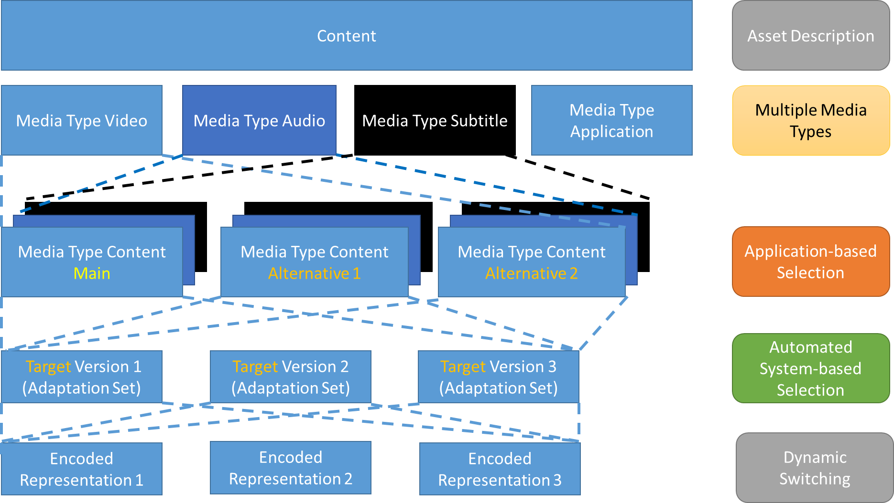

# Content annotation and selection # {#selection}

[[!MPEGDASH]] enables a service to annotate [=adaptation sets=] to enable clients to make an informed decision on which [=adaptation set=] to select for presentation from among the alternatives offered for each [[#adaptation-set-types|adaptation set type]]. The selection is based on client capabilities, client preferences, user preferences and possibly also interactive choices presented to the user. Typically, the signalling and selection is independent of the codec in use.

This chapter defines requirements and recommendations for annotating [=adaptation sets=] with interoperable descriptive information.

A service may offer multiple [=adaptation sets=] of the same type to provide the same content in different encodings or different source formats (e.g. one [=adaptation set=] encoded from a standard dynamic range master and another encoded from a high dynamic range video master). Alternatively, [=adaptation sets=] may describe different content (e.g. different languages or different camera views).

Note: While the typical situation is that a client selects one [=adaptation set=] per [[#adaptation-set-types|adaptation set type]], there may be cases where multiple [=adaptation sets=] of the same type are chosen for playback (e.g. [[#seamless-switching-xas]]).

Proper annotation of [=adaptation sets=] in [=MPDs=] is essential in order to enable interoperable client implementations.

## Annotations for content selection ## {#selection-annotations}

[[!MPEGDASH]] provides many options for annotating [=adaptation sets=]. This document defines a restricted subset considered interoperable by DASH-IF members.

The table below lists the permitted annotations for each [[#adaptation-set-types|adaptation set type]]. It is expected that interoperable DASH clients recognize the descriptors, elements, and attributes as documented in this chapter.

Content selection annotations SHALL be defined by a service in sufficient detail to differentiate every [=adaptation set=] from others of the same type. A service SHALL limit content selection annotations to those defined in this chapter.

Many of these annotations are defined by [[!MPEGDASH]]. Other organizations may define additional descriptors or elements. Some are defined by [=IOP=].

Note: [=Supplemental property descriptors=] are intended for presentation optimization and are intentionally not listed as annotations to be used for content selection.

<figure>
	<table class="data">
		<thead>
			<tr>
				<th>Attribute or element
				<th>Use
				<th>Usage requirements
		<tbody>
			<tr>
				<td>`@profiles`
				<td>O
				<td>If not present, it is inherited from the [=MPD=] or [=period=]. This may be used for example to signal extensions for new media profiles in the MPD.
			<tr>
				<td>`@group`
				<td>OD 
				default=unique (see [[!MPEGDASH]])
				<td>The attribute MAY be used. If present, it SHALL be greater than 0.

				The value SHALL be different for different [=adaptation set=] types and MAY be different for [=adaptation sets=] of the same type.

				This attribute enables a service to define logical groupings of [=adaptation sets=]. A client SHALL select either zero or one [=adaptation sets=] from each group.
			<tr>
				<td>`@selectionPriority`
				<td>OD 
				default=1
				<td>This attribute SHOULD be used to expresses the preferences of the service on selecting [=adaptation sets=] for which the DASH client does make a decision otherwise.

				Examples include two video codecs providing the same content, but one of the two provides higher compression efficiency and is therefore preferred.
			<tr>
				<td>`ContentProtection`
				<td>0...N
				<td>If this element is present, then the content is protected. If not present, no content protection is applied.

				See [[#security]]
			<tr>
				<td>`EssentialProperty`
				<td>0...N
				<td>Defines an annotation that is considered essential for processing the [=adaptation set=]. See also [=essential property descriptor=].

				Clients SHALL NOT select [=adaptation sets=] that are annotated with any instances of this element that are not understood by the client.

				The following schemes are expected to be recognized by a client independent of the [=adaptation set=] type:

				* `http://dashif.org/guidelines/trickmode` (see [[#trickmode]])
			<tr>
				<td>`Viewpoint`
				<td>0...N
				<td>Indicates that [=adaptation set=] differentiates by a different viewpoint or combination of viewpoints.

				If present then all [=adaptation sets=] of the same type SHALL carry this descriptor with the same `@schemeIdUri` and different `@value`.
			<tr>
				<td>`Label`
				<td>0...N
				<td>Provides a textual description of the content. This element SHOULD be used if content author expects a client to support a UI for selection.

				If present then all [=adaptation sets=] of the same type SHALL carry this element with different values.

				This element SHALL NOT be used as the sole differentiating element, as scenarios with no user interaction must still lead to umanbiguous selection.
	</table>
	<figcaption>Content selection annotations for any [=adaptation set=] type.</figcaption>
</figure>

The following annotations are specific to an [=adaptation set=] type.

Issue: https://github.com/Dash-Industry-Forum/DASH-IF-IOP/issues/274

<figure>
	<table class="data">
		<thead>
			<tr>
				<th>Attribute or element
				<th>Use
				<th>Usage requirements specific to [=video adaptation sets=]
		<tbody>
			<tr>
				<td>`@codecs`
				<td>1...N
				<td>Defines the codec that is necessary to present one or more [=representations=] in an [=adaptation set=].

				This attribute can be present on either the [=adaptation set=] level (as a single value) or the [=representation=] level (in which case multiple values might be present).

				See [[#codecs]] for a description of interoperable codecs.
			<tr>
				<td>`@par`
				<td>M
				<td>The display aspect ratio at which content is intended to be displayed.
			<tr>
				<td>`@maxWidth`
				<td>O
				<td>This attribute should be present to express the maximum width in samples after decoder sample cropping of any [=representation=] contained in the [=adaptation set=].

				The value should be the maximum horizontal sample count of any SPS in the contained bitstream.
			<tr>
				<td>`@maxHeight`
				<td>O
				<td>This attribute should be present to express the maximum height in pixel of any [=representation=] contained in the [=adaptation set=].

				The value should be the maximum horizontal sample count of any SPS in the contained bitstream.
			<tr>
				<td>`@maxFrameRate`
				<td>O
				<td>This attribute should be present to express the maximum frame rate, i.e. the maximum value of any entry in the decoder configuration record of the signaled frame rate, if constant frame rate is provided. contained in the [=adaptation set=].
			<tr>
				<td>`EssentialProperty`
				<td>0...N
				<td>Defines an annotation that is considered essential for processing the [=adaptation set=]. See also [=essential property descriptor=].

				Clients SHALL NOT select [=adaptation sets=] that are annotated with any instances of this element that are not understood by the client.

				The following schemes are expected to be recognized by a client for [=video adaptation sets=]:

				* `urn:mpeg:mpegB:cicp:<Parameter>` as defined in [[!iso23001-8]] and `<Parameter>` being one of the following: `ColourPrimaries`, `TransferCharacteristics`, or `MatrixCoefficients`
			<tr>
				<td>`Accessibility`
				<td>0...N
				<td>Defines the type of accessibility-relevant content present in the [=adaptation set=].

				The set of descriptors SHALL be restricted to the following:

				* The "Role" scheme as defined by [[!MPEGDASH]], with `@schemeIdUri="urn:mpeg:dash:role:2011"`. A client is expected to recognize the following values when this scheme is used in the `Accessibility` descriptor:
					* `sign`
					* `caption`
				* The CEA-608 scheme with `@schemeIdUri="urn:scte:dash:cc:cea-608:2015"` (see [[#codecs-cea608]])
			<tr>
				<td>`Role`
				<td>0...N
				<td>Defines the role of the content in the [=adaptation set=].

				The set of descriptors SHALL be restricted to the "Role" scheme as defined by [[!MPEGDASH]] with `@schemeIdUri="urn:mpeg:dash:role:2011"` MAY be used for differentiation. A client is expected to recognize the following values when this scheme is used in the `Role` descriptor:

				* `caption`
				* `subtitle`
				* `main`
				* `alternate`
				* `supplementary`
				* `sign`
				* `emergency`

				Clients SHALL consider there to be an implicit Role descriptor with the "Role" scheme and the value `main` if no explicitly defined Role descriptor with the "Role" scheme is present.
	</table>
	<figcaption>Annotations for [=video adaptation sets=].</figcaption>
</figure>

<figure>
	<table class="data">
		<thead>
			<tr>
				<th>Attribute or element
				<th>Use
				<th>Usage requirements specific to [=audio adaptation sets=]
		<tbody>
			<tr>
				<td>`@codecs`
				<td>1...N
				<td>Defines the codec that is necessary to present one or more [=representations=] in an [=adaptation set=].

				This attribute can be present on either the [=adaptation set=] level (as a single value) or the [=representation=] level (in which case multiple values might be present).

				See [[#codecs]] for a description of interoperable codecs.
			<tr>
				<td>`@lang`
				<td>M
				<td>The language of the audio stream.
			<tr>
				<td>`@audioSamplingRate`
				<td>M
				<td>The audio sampling rate.
			<tr>
				<td>`AudioChannelConfiguration`
				<td>1...N
				<td>specifies information about the audio channel configuration.  The following schemes are expected to be recognized by a client:

				* `urn:mpeg:dash:23003:3:audio_channel_configuration:2011` as defined in [[!MPEGDASH]].
				* `urn:mpeg:mpegB:cicp:ChannelConfiguration` as defined in [[!iso23001-8]].
				* `tag:dolby.com,2014:dash:audio_channel_configuration:2011` as defined [in the DASH-IF identifier registry](https://dashif.org/identifiers/audio_source_metadata/)
			<tr>
				<td>`EssentialProperty`
				<td>0...N
				<td>Defines an annotation that is considered essential for processing the [=adaptation set=]. See also [=essential property descriptor=].

				Clients SHALL NOT select [=adaptation sets=] that are annotated with any instances of this element that are not understood by the client.

				The following schemes are expected to be recognized by a client for audio [=adaptation sets=]:

				* `urn:mpeg:dash:audio-receiver-mix:2014` as defined in [[!MPEGDASH]]
			<tr>
				<td>`Accessibility`
				<td>0...N
				<td>Defines the type of accessibility-relevant content present in the [=adaptation set=].

				The set of descriptors SHALL be restricted to the "Role" scheme as defined by [[!MPEGDASH]], with `@schemeIdUri="urn:mpeg:dash:role:2011"`. A client is expected to recognize the following values when this scheme is used in the `Accessibility` descriptor:

				* `description`
				* `enhanced-audio-intelligibility`
			<tr>
				<td>`Role`
				<td>0...N
				<td>The set of descriptors SHALL be restricted to the "Role" scheme as defined by [[!MPEGDASH]] with `@schemeIdUri="urn:mpeg:dash:role:2011"` MAY be used for differentiation. A client is expected to recognize the following values when this scheme is used in the `Role` descriptor:

				* `main`
				* `alternate`
				* `supplementary`
				* `commentary`
				* `dub`
				* `emergency`

				Clients SHALL consider there to be an implicit Role descriptor with the "Role" scheme and the value `main` if no explicitly defined Role descriptor with the "Role" scheme is present.
	</table>
	<figcaption>Annotations for [=audio adaptation sets=].</figcaption>
</figure>

<figure>
	<table class="data">
		<thead>
			<tr>
				<th>Attribute or element
				<th>Use
				<th>Usage requirements specific to [=text adaptation sets=]
		<tbody>
			<tr>
				<td>`@codecs`
				<td>0...N
				<td>Defines the codec that is necessary to present one or more [=representations=] in an [=adaptation set=].

				This attribute can be present on either the [=adaptation set=] level (as a single value) or the [=representation=] level (in which case multiple values might be present).

				The attribute SHALL be present, except when [=IOP=] does not define a `@codecs` value for the used text codec and encapsulation mode combination, in which case it SHALL be omitted.

				See [[#codecs]] for a description of interoperable codecs.
			<tr>
				<td>`@lang`
				<td>M
				<td>The text language.
			<tr>
				<td>`Accessibility`
				<td>0...N
				<td>Defines the type of accessibility-relevant content present in the [=adaptation set=].

				The set of descriptors SHALL be restricted to the "Role" scheme as defined by [[!MPEGDASH]], with `@schemeIdUri="urn:mpeg:dash:role:2011"`. A client is expected to recognize the following values when this scheme is used in the `Accessibility` descriptor:

				* `sign`
				* `caption`
			<tr>
				<td>`Role`
				<td>0...N
				<td>Defines the role of the content in the [=adaptation set=].

				The set of descriptors SHALL be restricted to the "Role" scheme as defined by [[!MPEGDASH]] with `@schemeIdUri="urn:mpeg:dash:role:2011"` MAY be used for differentiation. A client is expected to recognize the following values when this scheme is used in the `Role` descriptor:

				* `main`
				* `alternate`
				* `subtitle`
				* `supplementary`
				* `commentary`
				* `dub`
				* `description`
				* `emergency`

				Clients SHALL consider there to be an implicit Role descriptor with the "Role" scheme and the value `main` if no explicitly defined Role descriptor with the "Role" scheme is present.
	</table>
	<figcaption>Annotations for [=text adaptation sets=].</figcaption>
</figure>

## Content model ## {#selection-model}

In order to support the content author in providing content in a consistent manner, this chapter provides a conceptual content model for DASH content in one [=period=] of an [=MPD=]. The content may be described by an [=asset identifier=] as a whole and may contain different [[#adaptation-set-types|adaptation set types]].

<figure>
	
	<figcaption>Model for content selection.</figcaption>
</figure>

Within each [=adaptation set=] type, the content author may want to offer alternative content that is time-aligned but where each alternative represents different content (e.g. multiple camera angles). Automatic selection of the alternative content is not expected to be done by the DASH client as the client would not have sufficient information to make such decisions. However, the selection is expected to be done by communication with an application or the user, typically using a user interface appropriate for selection.

In the absence of user indication to select from among the alternatives, the DASH client still needs to select content to be presented. A DASH service must therefore signal the preferred default content. The preferred content is referred to as <dfn>main content</dfn>, whereas any content that is not [=main content=] is referred to as <dfn>alternative content</dfn>. There may be multiple alternatives which may need to be distinguished. See [[#selection-alternative-content]].

Furthermore, it may be that content of different [[#adaptation-set-types|adaptation set types] is linked by the content author, to express that two content of different [=adaptation set=] type are preferably played together. We define <dfn>associated content</dfn> for this purpose. As an example, there may be a main commentator associated with the main camera view, but for a different camera view, a different associated commentary is provided. See [[#selection-associated-content]].

In addition to semantical content level differentiation, each [=alternative content=] may be provided in different variants, based on content preparation properties (downmix, subsampling, translation, suitable for trick mode, etc.), client preferences (decoding or rendering preferences, e.g. codec), client capabilities (DASH profile support, decoding capabilities, rendering capabilities) or user preferences (accessibility, language, etc.). Both [=main content=] and [=alternative content=] in all their variants are differentiated in the [=MPD=] as defined in [[#selection-annotations]].

### Signaling alternative content ### {#selection-alternative-content}

If a [=period=] contains alternative content for one [=adaptation set=] type , then the alternatives SHALL be differentiated according to [[#selection-annotations]] and one of the alternatives SHALL be provided as [=main content=].

[=Main content=] is signaled by using the `Role` descriptor with scheme `urn:mpeg:dash:role:2011` and value set to `main`. Alternative content is signaled by using the `Role` descriptor with scheme `urn:mpeg:dash:role:2011` and value set to `alternative`.

### Signaling associated content ### {#selection-associated-content}

A `Viewpoint` descriptor with the same `@schemeIdUri` and `@value` SHALL be used by services to signal [=associated content=].

Clients SHALL use identical `Viewpoint` descriptors for determining associated content even if they do not understand the `@schemeIdUri`.

## Client processing reference model ## {#selection-clientprocessing}

The following client model serves two purposes:

* In the absence of other information, the following client model may be implemented in a DASH client for the purpose of selection of [=adaptation set=] for playout
* A content author may use the model to verify that the annotation is properly done in order to get the desired client behaviour.

In the model it is assumed that the client can get sufficient information on at least the following properties:

* For each codec in the `@codecs` string, the DASH client can get information if the media playback platform can decode the codec as described in the string. The answer should be yes or no.
* For each DRM system in the `ContentProtection` element string, the DASH client can get information if the media playback platform can handle this content protection scheme as described in the string. The answer should be yes or no.
* the DASH client can get information on the media playback platform and rendering capabilities in terms of of
	* the maximum spatial resolution for video that can be handled
	* the maximum frame rate for video that can be handled
	* the audio channel configuration of the audio system
	* the audio sampling rate of the audio system
* the preferred language of the system
* Accessibility settings for captions, subtitles, audio description, enhanced audio intelligibility,
* Potentially preferences on media playback and rendering of the platform

Note: If any of these functionalities are not fulfilled, then the client may still be functional, but it may not result in the full experience as provided by the content author. As an example, if the DASH client cannot determine the preferred language, it may just use the selection priority for language selection.

The DASH client uses the MPD and finds the [=period=] that it likes to join, typically the first one for On-Demand content and the one at the live edge for live content. In order to select the media to be played, the DASH client assumes that the content is offered according to the content model above.

1. The DASH client looks for [=main content=], i.e. any [=adaptation set=] with annotation `Role@schemeIdUri="urn:mpeg:dash:role:2011"` and  `Role@value="alternative"` is excluded initially for selection. Note that in this model it is assumed that immediate startup is desired. If the DASH client wants to go over the alternatives upfront before starting the service, then the sequence is slightly different, but still follows the remaining principles.
1. DASH Client checks each [=adaptation set=] for the supported capabilities of the platform. If any of the capabilities are not supported, then the [=adaptation set=] is excluded from the selection process.
	* Codec support
	* DRM support
	* Rendering capabilities
1. The DASH client checks if it supports for CEA-608 rendering as defined in clause [[#codecs-cea608]]. If not supported, any accessibility descriptor with `@schemeIdUri="urn:scte:dash:cc:cea-608:2015"` is removed. Note that the [=adaptation set=] is maintained as it may used for regular video decoding.
1. DASH Client checks is there are any specific settings for accessibility in the user preferences
	* If captions are requested by the system, the DASH client extracts
		* all video [=adaptation sets=] that have an `Accessibility` descriptor assigned with either the `@schemeIdUri="urn:mpeg:dash:role:2011"` and `@value="caption"` or `@schemeIdUri="urn:scte:dash:cc:cea-608:2015"` (burned-in captions and SEI-based), as well as
			*  all [=text adaptation sets=] that have an `Accessibility` descriptor assigned with either the `@schemeIdUri="urn:mpeg:dash:role:2011"` and `@value="caption"`
			* and makes those available for [=adaptation sets=] that can be selected by the DASH client for caption support.
		* If multiple [=text adaptation sets=] remain, the DASH client removes all [=adaptation sets=] from the selection that are not in the preferred language, if language settings are provided in the system. If no language settings in the system are provided, or none of the [=adaptation sets=] meets the preferred languages, none of the [=adaptation sets=] are removed from the selection. Any [=adaptation sets=] that do not contain language annotation are removed, if any of the remaining [=adaptation sets=] provides proper language settings.
		* If still multiple [=text adaptation sets=] remain, then the ones with the highest value of `@selectionPriority` are chosen.
		* If still multiple [=text adaptation sets=] remain, then the DASH client makes a random choice on which caption to enable.
	* else if no captions are requested
		* the `Accessibility` element signaling captions may be removed from the [=adaptation set=] before continuing the selection.
	* If sign language is requested
		* all [=video adaptation sets=] that have an `Accessibility` descriptor assigned with `@schemeIdUri="urn:mpeg:dash:role:2011"` and `@value="sign"` are made available for sign language support.
	* else if no sign language is requested
		* the [=adaptation set=] signaling sign language with the `Accessibility` element may be removed from the [=adaptation set=] before continuing the selection
	* If audio descriptions are requested
		* all [=video adaptation sets=] that have an `Accessibility` descriptor assigned with `@schemeIdUri="urn:mpeg:dash:role:2011"` and `@value="description"` are made available for audio description support.
	* else if no audio descriptions are requested
		* the [=adaptation set=] signaling audio descriptions with the  `Accessibility` element may be removed from the [=adaptation set=] before continuing the selection.
	*  If enhanced audio intelligibility is requested
		* all [=audio adaptation sets=] that have an `Accessibility` descriptor assigned with `@schemeIdUri="urn:mpeg:dash:role:2011"` and `@value="enhanced-audio-intelligibility"` are made available for enhanced audio intelligibility support.
	* else if no enhanced audio intelligibility is requested
		* the `Accessibility` element may be removed from the [=adaptation set=] before continuing the selection.
1. If video rendering is enabled, based on the remaining [=video adaptation sets=] the client selects one as follows:
	* Any [=adaptation set=] for which an [=essential property descriptor=] is present for which the scheme or value is not understood by the DASH client, is excluded from the selection
	* Any [=adaptation set=] for which an [=essential property descriptor=] is present for which the scheme is `http://dashif.org/guidelines/trickmode`, is excluded from the initial selection
	* If still multiple [=video adaptation sets=] remain, then the ones with the highest value of `@selectionPriority` is chosen.
	* If still multiple [=video adaptation sets=] remain, then the DASH client makes a choice for itself, possibly on a random basis.
	* Note that an [=adaptation set=] selection may include multiple [=adaptation sets=], if [[#seamless-switching-xas|adaptation set switching]] is signaled. However, the selection is done for only one [=adaptation set=].
1. If audio rendering is enabled, based on the remaining [=audio adaptation sets=] the client selects one as follows:
	* Any [=adaptation set=] for which an [=essential property descriptor=] is present for which the scheme or value is not understood by the DASH client, is excluded from the selection
	* If multiple [=audio adaptation sets=] remain, the DASH client removes all [=adaptation sets=] from the selection that are not in the preferred language, if language settings are provided in the system. If no language settings in the system are provided, or none of the [=adaptation sets=] meets the preferred languages, none of the [=adaptation sets=] are removed from the selection. Any [=adaptation set=] that does not contain language annotation are removed, if any of the remaining [=adaptation sets=] provides proper language settings
	* If still multiple [=audio adaptation sets=] remain, then the ones with the highest value of `@selectionPriority` are chosen
	* If still multiple [=audio adaptation sets=] remain, then the DASH client makes a choice for itself, possibly on a random basis
	* Note that an [=adaptation set=] may include multiple [=adaptation sets=], if [[#seamless-switching-xas|adaptation set switching]] or receiver mix is signaled. However, the selection is done for only one [=adaptation set=].
1. If text rendering is enabled, based on the [=text adaptation sets=] the client selects one as follows:
	* Any [=adaptation set=] for which an [=essential property descriptor=] is present for which the scheme or value is not understood by the DASH client, is excluded from the selection
	* If multiple [=text adaptation sets=] remain, the DASH client removes all [=adaptation sets=] from the selection that are not in the preferred language, if language settings are provided in the system. If no language settings in the system are provided, or none of the [=adaptation sets=] meets the preferred languages, none of the [=adaptation sets=] are removed from the selection. Any [=adaptation set=] that does not contain language annotation are removed, if any of the remaining [=adaptation sets=] provides proper language settings.
	* If still multiple [=text adaptation sets=] remain, then the ones with the highest value of `@selectionPriority` are chosen.
	* If still multiple [=text adaptation sets=] remain, then the DASH client makes a choice for itself, possibly on a random basis.
1. If the DASH client has the ability to possibly switch to alternative content, then alternative content may be selected either through the `Label` function or the `Viewpoint` functionality. This selection may be done dynamically during playout and the DASH client is expected to switch to the alternative content. Once all alternative content is selected, the procedures following from step 2 onwards apply.
1. At [=period=] boundary a DASH client initially looks for [[#timing-connectivity-continuity|period continuity or connectivity]], i.e. does the [=period=] include an [=adaptation set=] that is a continuation of the existing one. If not present it will go back to step 1 and execute the decision logic.