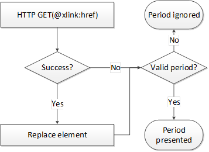
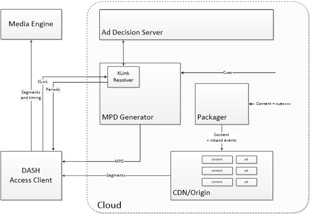
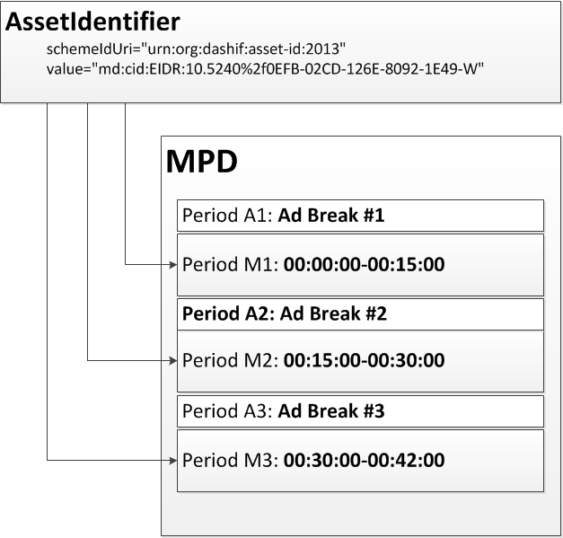
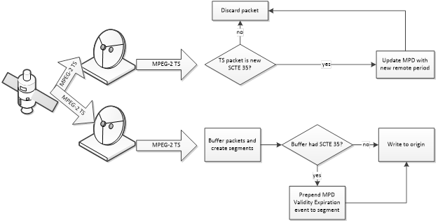
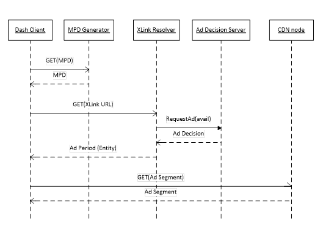
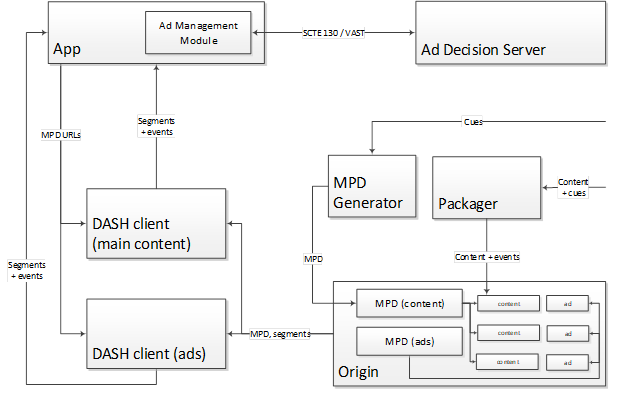
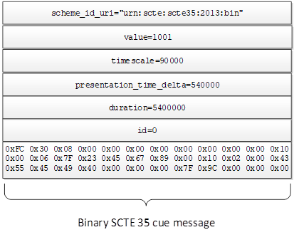
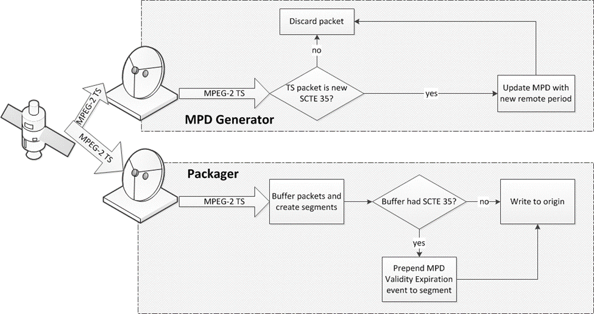

# Ad insertion # {#ads}

Issue: Needs to be checked for conformance with timing model.

Issue: Needs proper Bikeshed formatting and referencing

Issue: Needs deduplication of DASH concepts that are re-defined here.

This section provides recommendations for implementing ad insertion in DASH. Specifically, it defines the reference architecture and interoperability points for a DASH-based ad insertion solution.

The baseline reference architecture addresses both server-based and app-based scenarios. The former approach is what is typically used for Apple HLS, while the latter is typically used with Microsoft SmoothStreaming and Adobe HDS.

The following definitions are used in this section:

: Ad Break
:: A location or point in time where one or more ads may be scheduled for delivery; same as avail and placement opportunity.
: Ad Decision Service
:: functional entity that decides which ad(s) will be shown to the user. It interfaces deployment-specific and are out of scope for this document.
: Ad Management Module
:: logical service that, given cue data, communicates with the ad decision service and determines which advertisement content (if at all) should be presented during the ad break described in the cue data.
: Cue
:: indication of time and parameters of the upcoming ad break. Note that cues can indicate a pending switch to an ad break, pending switch to the next ad within an ad break, and pending switch from an ad break to the main content.
: CDN node
:: functional entity returning a segment on request from DASH client. There are no assumptions on location of the node.
: Packager
:: functional entity that processes conditioned content and produces media segments suitable for consumption by a DASH client. This entity is also known as fragmenter, encapsulater, or segmenter. Packager does not communicate directly with the origin server – its output is written to the origin server’s storage.
: Origin
:: functional entity that contains all media segments indicated in the MPD, and is the fallback if CDN nodes are unable to provide a cached version of the segment on client request. Splice Point: point in media content where its stream may be switched to the stream of another content, e.g. to an ad.
: MPD Generator
:: functional entity returning an MPD on request from DASH client. It may be generating an MPD on the fly or returning a cached one.
: XLink resolver
:: functional entity which returns one or more remote elements on request from DASH client.

DASH ad insertion relies on several DASH tools defined in [[!MPEGDASH]], which are introduced in this section. The correspondence between these tools and ad insertion concepts are explained below.

## Remote elements ## {#ads-remote-elements}

Remote elements are elements that are not fully contained in the MPD document but are referenced in the MPD with an HTTP-URL using a simplified profile of XLink.

A remote element has two attributes, `@xlink:href` and `@xlink:actuate`. `@xlink:href` contains the URL for the complete element, while `@xlink:actuate` specifies the resolution model. The value `onLoad` requires immediate resolution at MPD parse time, while `onRequest` allows deferred resolution at a time when an XML parser accesses the remote element. In this text we assume deferred resolution of remote elements, unless explicitly stated otherwise. While there is no explicit timing model for earliest time when deferred resolution can occur, the specification strongly suggests it should be close to the expected playout time of the corresponding Period. A reasonable approach is to choose the resolution at the nominal download time of the Segment.

<figure>
    
    <figcaption>XLink resolution</figcaption>
</figure>

Resolution (a.k.a. dereferencing) consists of two steps. Firstly, a DASH client issues an HTTP GET request to the URL contained in the `@xlink:href`, attribute of the in-MPD element, and the XLink resolver responds with a remote element entity in the response content. In case of error response or syntactically invalid remote element entity, the `@xlink:href` and `@xlink:actuate` attributes the client shall remove the in-MPD element.

If the value of the `@xlink:href` attribute is `urn:mpeg:dash:resolve-to-zero:2013`, HTTP GET request is not issued, and the in-MPD element shall be removed from the MPD. This special case is used when a remote element can be accessed (and resolved) only once during the time at which a given version of MPD is valid.

If a syntactically valid remote element entity was received, the DASH client will replace in-MPD element with remote period entity.  Once a remote element entity is resolved into a fully specified element, it may contain an `@xlink:href` attribute with `@xlink:actuate` set to `onRequest`, which contains a new XLink URL allowing repeated resolution.  Note that the only information passed from the DASH client to the XLink resolver is encoded within the URL. Hence there may be a need to incorporate parameters into it, such as splice time (i.e., PeriodStart for the remote period) or cue message.

Note: In ISO/IEC 23009-1:2014/Cor.3 it is clarified that if multiple top-level remote elements are included, the remote element entity is not a valid XML document.

## Periods ## {#ads-periods}

Periods are time-delimited parts of a DASH Media Presentation. The value of PeriodStart can be explicitly stated using the Period@start attribute or indirectly computed using Period@duration of the previous Periods.

Precise period duration of period i is given by PeriodStart(i+1) – PeriodStart(i). This can accommodate the case where media duration of period i is slightly longer than the period itself, in which case a client will schedule the start of media presentation for period i+1 at time PeriodStart(i+1).

Representation@presentationTimeOffset specifies the value of the presentation time at PeriodStart(i).

## Segment availability ## {#ads-availability}

In case of dynamic MPDs, Period-level BaseURL@availabilityTimeOffset allow earlier availability start times. A shorthand notation @availabilityTimeOffset="INF" at a Period-level BaseURL indicates that the segments within this period are available at least as long as the current MPD is valid. This is the case with stored ad content. Note that DASH also allows specification of @availabilityTimeOffset  at Adaptation Set and Representation level.

## Seamless transition ## {#ads-seamless}

The DASH specification says nothing about Period transitions – i.e., there are no guarantees for seamless continuation of playout across the period boundaries. Content conditioning and receiver capability requirements should be defined for applications relying on this functionality. However, Period continuity or connectivity should be used and signaled as defined in section 3.2.12 and ISO/IEC 23009-1:2014/Amd.3 [4].

## Period labeling ## {#ads-period-labels}

Period-level AssetIdentifier descriptors identify the asset to which a given Period belongs. Beyond identification, this can be used for implementation of client functionality that depends on distinguishing between ads and main content (e.g. progress bar and random access).

## DASH events ## {#ads-events}

DASH events are messages having type, timing and optional payload. They can appear either in MPD (as period-level event stream) or inband, as ISO-BMFF boxes of type `emsg`. The `emsg` boxes shall be placed at the very beginning of the Segment, i.e. prior to any media data, so that DASH client needs a minimal amount of parsing to detect them.

DASH defines three events that are processed directly by a DASH client: MPD Validity Expiration, MPD Patch and MPD Update. All signal to the client that the MPD needs to be updated – by providing the publish time of the MPD that should be used, by providing an XML patch that can be applied to the client’s in-memory representation of MPD, or by providing a complete new MPD. For details please see section 4.5.

User-defined events are also possible. The DASH client does not deal with them directly – they are passed to an application, or discarded if there is no application willing or registered to process these events. A possible client API would allow an application to register callbacks for specific event types. Such callback will be triggered when the DASH client parses the `emsg` box in a Segment, or when it parses the Event element in the MPD.

In the ad insertion context, user-defined events can be used to signal information, such as cue messages (e.g. SCTE 35 [54])

## MPD updates ## {#ads-mpd-updates}

If MPD@minimumUpdatePeriod is present, the MPD can be periodically updated. These updates can be synchronous, in which case their frequency is limited by MPD@minimumUpdatePeriod.  In case of the main live profiles MPD updates may be triggered by DASH events. Fir details refer to section 4.5.

When new period containing stored ads is inserted into a linear program, and there is a need to unexpectedly alter this period the inserted media will not carry the `emsg` boxes – these will need to be inserted on-the-fly by proxies. In this case use of synchronous MPD updates may prove simpler.

MPD@publishTime provides versioning functionality: MPD with later publication times include all information that was included all MPDs with earlier publication times.

## Session information ## {#ads-sessions}

In order to allow fine-grain targeting and personalization, the identity of the client/viewer, should be known i.e. maintain a notion of a session.

HTTP is a stateless protocol, however state can be preserved by the client and communicated to the server.

The simplest way of achieving this is use of cookies. According to RFC 6265 [41], cookies set via 2xx, 4xx, and 5xx responses must be processed and have explicit timing and security model.

## Tracking and reporting ## {#ads-tracking}

The simplest tracking mechanism is server-side logging of HTTP GET requests. Knowing request times and correspondence of segment names to content constitutes an indication that a certain part of the content was requested. If MPDs (or remote element entities) are generated on the fly and identity of the requester is known, it is possible to provide more precise logging. Unfortunately this is a non-trivial operation, as same user may be requesting parts of content from different CDN nodes (or even different CDNs), hence log aggregation and processing will be needed.

Another approach is communicating with existing tracking server infrastructure using existing external standards. An IAB VAST-based implementation is shown in section 5.3.3.7.

DASH Callback events are defined in ISO/IEC 23009-1:2014 AMD3 [4], are a simple native implementation of time-based impression reporting (e.g., quartiles). A callback event is a promise by the DASH client to issue an HTTP GET request to a provided URL at a given offset from PeriodStart. The body of HTTP response is ignored. Callback events can be both, MPD and inband events.

## Ad insertion architectures ## {#ads-architecture}

The possible architectures can be classified based on the location of component that communicates with the ad decision service: a server-based approach assumes a generic DASH client and all communication with ad decision services done at the server side (even if this communication is triggered by a client request for a segment, remote element, or an MPD. The app-based approach assumes an application running on the end device and controlling one or more generic DASH clients.

Yet another classification dimension is amount of media engines needed for a presentation – i.e., whether parallel decoding needs to be done to allow seamless transition between the main and the inserted content, or content is conditioned well enough to make such transition possible with a single decoder.

Workflows can be roughly classified into linear and elastic. Linear workflows (e.g., live feed from an event) has ad breaks of known durations which have to be taken: main content will only resume after the end of the break and the programmer / operator needs to fill them with some inserted content. Elastic workflows assume that the duration of an ad break at a given cue location not fixed, thus the effective break length can vary (and can be zero if a break is not taken).

## Server-based architecture ## {#ads-serverbased}

<figure>
    
    <figcaption>Server-based architecture</figcaption>
</figure>

In the server-based model, all ad-related information is expressed via MPD and segments, and ad decisions are triggered by client requests for MPDs and for resources described in them (Segments, remote periods).

The server-based model is inherently MPD-centric – all data needed to trigger ad decision is concentrated in the MPD. In case where ad break location (i.e., its start time) is unknown at the MPD generation time, it is necessary to rely on MPD update functionality. The two possible ways of achieving these are described in 5.1.3.5.

In the live case, packager receives feed containing inband cues, such as MPEG-2 TS with SCTE 35 cue messages [54]. The packager ingests content segments into the CDN. In the on demand case, cues can be provided out of band.

Ad management is located at the server side (i.e., in the cloud), thus all manifest and content conditioning is done at the server side.

### Implementation basics ### {#ads-serverbased-impl}

A single ad is expressed as a single Period element.

Periods with content that is expected to be interrupted as a result of ad insertion should contain explicit start times (Period@start), rather than durations. This allows insertion of new periods without modifying the existing periods. If a period has media duration longer then the distance between the start of this period and the start of next period, use of start times implies that a client will start the playout of the next period at the time stated in the MPD, rather than after finishing the playout of the last segment.

An upcoming ad break is expressed as Period element(s), possibly remote.

### Remote period elements ### {#ads-serverbased-xlink}

Remote Periods are resolved on demand into one or more than one Period elements. It is possible to embed parameters from the cue message into the XLink URL of the corresponding remote period, in order to have them passed to the ad decision system via XLink resolver at resolution time.

In an elastic workflow, when an ad break is not taken, the remote period will be resolved into a period with zero duration. This period element will contain no adaptation sets.

If a just-in-time remote Period dereferencing is required by use of `@xlink:actuate="onRequest"`, MPD update containing a remote period should be triggered close enough to the intended splice time. This can be achieved using MPD Validity events and full-fledged MPD update, or using MPD Patch and MPD Update events (see sec. 5.1.3.5 and 5.1.3.4). However, due to security reasons MPD Patch and MPD Update events should only be used with great care.

In case of `Period@xlink:actuate="onRequest"`, MPD update and XLink resolution should be done sufficiently early to ensure that there are no artefacts due to insufficient time given to download the inserted content. Care needs to be taken so that the client is given a sufficient amount of time to (a) request and receive MPD update, and (b) dereference the upcoming remote period.

Note: It may be operationally simpler to avoid use of `Period@xlink:actuate="onRequest"`, dereferencing in case of live content.

### Timing and dereferencing ### {#ads-serverbased-timing}

The only interface between DASH client and the XLink resolver is the XLink URL (i.e., the Period@xlink:href attribute).After resolution, the complete remote Period element is replaced with Period element(s) from the remote entity (body of HTTP response coming from XLink resolver). This means that the XLink resolver is (in the general case) unaware of the exact start time of the ad period.

In case of linear content, start of the ad period is only known a short time before the playback. The recommended implementation is to update the MPD at the moment the start of the ad period is known to the MPD generator.

The simplest approach for maintaining time consistency across dereferencing is to have the MPD update adding a Period@duration attribute to the latest (i.e., the currently playing) main content period. This means that the MPD resolver needs to include the Period@duration attribute into each of the Period elements returned in the remote entity. The downside of this approach is that the DASH client needs to be able to update the currently playing period.

An alternative approach is to embed the desired value of Period@start of the first period of the remote entity in the XLink URL (e.g., using URL query parameters). This approach is described in clause 5.3.5. The downside of this alternative approach is that the DASH specification does not constrain XLink URLs in any way, hence the XLink resolver needs to be aware of this URL query parameter interface defined in clause 5.3.5.

### Asset identifiers ### {#ads-serverbased-assetid}

AssetIdentifier descriptors identify the asset to which a Period belongs. This can be used for implementation of client functionality that depends on distinguishing between ads and main content (e.g. progress bar).

Periods with same AssetIdentifier should have identical Adaptation Sets, Initialization Segments and same DRM information (i.e., DRM systems, licenses). This allows reuse of at least some initialization data across periods of the same asset, and ensures seamless continuation of playback if inserted periods have zero duration. Period continuity or connectivity should be signaled, if the content obeys the rules.

<figure>
    
    <figcaption>Using an asset identifier</figcaption>
</figure>

### MPD updates ### {#ads-serverbased-mpd-updates}

MPD updates are used to implement dynamic behavior. An updated MPD may have additional (possibly – remote) periods. Hence, MPD update should be triggered by the arrival of the first cue message for an upcoming ad break. Ad breaks can also be canceled prior to their start, and such cancellation will also trigger an MPD update.

Frequent regular MPD updates are sufficient for implementing dynamic ad insertion. Unfortunately they create an overhead of unnecessary MPD traffic – ad breaks are rare events, while MPD updates need to be frequent enough if a cue message is expected to arrive only several seconds before the splice point. Use of HTTP conditional GET requests (i.e., allowing the server to respond with "304 Not Modified" if MPD is unchanged) is helpful in reducing this overhead, but asynchronous MPD updates avoid this overhead entirely.

DASH events with scheme "urn:mpeg:dash:event:2013" are used to trigger asynchronous MPD updates.

The simple mapping of live inband cues in live content into DASH events is translating a single cue into an MPD Validity expiration event (which will cause an MPD update prior to the splice time). MPD Validity expiration events need to be sent early enough to allow the client request a new MPD, resolve XLink (which may entail communication between the resolver and ADS), and, finally, download the first segment of the upcoming ad in time to prevent disruption of service at the splice point.

If several `emsg` boxes are present in a segment and one of them is the MPD Validity Expiration event, `emsg` carrying it shall always appear first.

### MPD events ### {#ads-serverbased-mpd-events}

In addition to tracking events (ad starts, quartile tracking, etc.) the server may also need to signal additional metadata to the video application.  For example, an ad unit may contain not only inline linear ad content (that is to be played before, during, or after the main presentation), it may also contain a companion display ad that is to be shown at the same time as the video ad.  It is important that the server be able to signal both the presence of the companion ad and the additional tracking and click-through metadata associated with the companion.

With that said, there is no need to have a generic DASH client implement this functionality – it is enough to provide opaque information that the client would pass to an external module. Event @schemeIdUri provides us with such addressing functionality, while MPD events allow us to put opaque payloads into the MPD.

### Workflows ### {#ads-serverbased-workflows}

In the workflows below we assume that our inputs are MPEG-2 transport streams with embedded SCTE 35 cue messages [54]. In our opinion this will be a frequently encountered deployment, however any other in-band or out-of-band method of getting cue messages and any other input format lend themselves into the same model.

### Linear workflow ### {#ads-serverbased-linear}

A real-time MPEG-2 TS feed arrives at both packager and MPD generator. While real-time multicast feeds are a very frequently encountered case, the same workflow can apply to cases such as ad replacement in a pre-recorded content (e.g., in time-shifting or PVR scenarios).

MPD generator generates dynamic MPDs. Packager creates DASH segments out of the arriving feed and writes them into the origin server. Client periodically requests the MPDs so that it has enough time to transition seamlessly into the ad period.

Packager and MPD generator may be tightly coupled (e.g. co-located on the same physical machine), or loosely coupled as they both are synchronized only to the clock of the feed.

<figure>
    
    <figcaption>Live workflow</figcaption>
</figure>

#### Cue interpretation by the MPD generator #### {#ads-serverbased-cues-mpd}

When an SCTE 35 cue message indicating an upcoming splice point is encountered by the MPD generator, the latter creates a new MPD for the same program, adding a remote period to it.

The Period@start attribute of the inserted period has splice_time() translated into the presentation timeline. Parameters derived from the cue message are inserted into the Period@xlink:href attribute of the inserted period. Examples below show architectures that allow finer targeting.

Immediate ad decision.

MPD generator keeps an up-to-date template of an MPD. At each cue message arrival, the generator updates its template. At each MPD request, the generator customizes the request based on the information known to it about the requesting client. The generator contacts ad decision server and produces one or more non-remote ad periods. In this case XLink is not needed.

Stateful cue translation.

MPD generator keeps an up-to-date template of an MPD. At each cue message arrival, the generator updates its template. At each MPD request, the generator customizes the request based on the information known to it about the requesting client.

The operator targets separately male and female audiences. Hence, the generator derives this from the information it has regarding the requesting client (see 5.1.3.6), and inserts an XLink URL with the query parameter ?gender=male for male viewers, and ?gender=female for the female viewers.

Note that this example also showcases poor privacy practices – would such approach be implemented, both parameter name and value should be encrypted or TLS-based communication should be used

Stateless cue translation.

At cue message arrival, the MPD generator extracts the entire SCTE 35 splice_info_section (starting at the table_id and ending with the CRC_32) into a buffer. The buffer is then encoded into URL-safe base64url format according to RFC 4648 [60], and inserted into the XLink URL of a new remote Period element. splice_time is translated into Period@start attribute. The new MPD is pushed to the origin.

Note: this example is a straightforward port of the technique defined for SCTE 67 [55], but uses base64url and not base64 encoding as the section is included in a URI.

#### Cue interpretation by the packager #### {#ads-serverbased-cues-packager}

Cue interpretation by the packager is optional and is an optimization, rather than core functionality.  On reception of an SCTE 35 cue message signaling an upcoming splice, an `emsg` with MPD Validity Expiration event is inserted into the first available segment. This event triggers an MPD update, and not an ad decision, hence the sum of the earliest presentation time of the `emsg`bearing segment and the `emsg`.presentation_time_delta should be sufficiently earlier than the splice time. This provides the client with sufficient time to both fetch the MPD and resolve XLink.

splice_time() of the cue message is translated into the media timeline, and last segment before the splice point is identified. If needed, the packager can also finish the segment at the splice point and thus having a segment shorter than its target duration.

#### Multiple cue messages #### {#ads-serverbased-cues-multiple}

There is a practice of sending several SCTE 35 cue messages for the same splice point (e.g., the first message announces a splice in 6 seconds, the second arrives 2 seconds later and warns about the same splice in 4 seconds, etc.). Both the packager and the MPD generator react on the same first message (the 6-sec warning in the example above), and do nothing about the following messages.

#### Cancelation #### {#ads-serverbased-cancel}

It is possible that the upcoming (and announced) insertion will be canceled (e.g., ad break needed to be postponed due to overtime). Cancelation is announced in a SCTE 35 cue message.

When cancelation is announced, the packager will insert the corresponding `emsg` event and the MPD generator will create a newer version of the MPD that does not contain the inserted period or sets its duration to zero. This implementation maintains a simpler less-coupled server side system at the price of an increase in traffic.

#### Early termination #### {#ads-serverbased-earlytermination}

It is also possible that a planned ad break will need to be cut short – e.g., an ad will be cut short and there will be a switch to breaking news. The DASH translation of this would be creating an `emsg` at the packager and updating the MPD appropriately. Treatment of early termination here would be same as treatment of a switch from main content to an ad break.

It is easier to manipulate durations when Period@duration is absent and only Period@start is used – this way attributes already known to the DASH client don’t change.

#### Informational cue messages #### {#ads-serverbased-infocues}

SCTE 35 can be used for purposes unrelated to signaling of placement opportunities. Examples of such use are content identification and time-of-day signaling. Triggering MPD validity expiration and possibly XLink resolution in this case may be an overreaction.

#### Ad decision #### {#ads-serverbased-addecision}

<figure>
    
    <figcaption>Ad decision</figcaption>
</figure>

A client will attempt to dereference a remote period element by issuing an HTTP GET for the URL that appears in Period@xlink:href. The HTTP server responding to this request (XLink resolver) will contact the ad decision service, possibly passing it parameters known from the request URL and from client information available to it from the connection context. In case described in 5.3.3.2.1.3, the XLink resolver has access to a complete SCTE 35 message that triggered the splice.

The ad decision service response identifies the content that needs to be presented, and given this information the XLink resolver can generate one or more Period elements that would be then returned to the requesting DASH client.

A possible optimization is that resolved periods are cached – e.g. in case of 5.3.3.2.1.1 "male" and "female" versions of the content are only generated once in T seconds, with HTTP caching used to expire the cached periods after T seconds.

### On demand workflow ### {#ads-ondemand}

In a VoD scenario, cue locations are known ahead of time. They may be available multiplexed into the mezzanine file as SCTE 35 or SCTE 104, or may be provided via an out-of-band EDL.

In VoD workflows both cue locations and break durations are known, hence there is no need for a dynamic MPD. Thus cue interpretation (which is same as in 5.3.3.2) can occur only once and result in a static MPD that contains all remote elements with all Period elements having Period@start attribute present in the MPD.

In elastic workflows ad durations are unknown, thus despite our knowledge of cue locations within the main content it is impossible to build a complete presentation timeline. Period@duration needs to be used. Remote periods should be dereferenced only when needed for playout. In case of a “jump” – random access into an arbitrary point in the asset – it is a better practice not to dereference Period elements when it is possible to determine the period from which the playout starts using Period@duration and asset identifiers. The functionality described in 5.3.3.2  is sufficient to address on-demand cases, with the only difference that a client should be able to handle zero-duration periods that are a result of avails that are not taken.

#### Capture to VoD #### {#ads-ondemand-capture}

Capture to VoD use case is a hybrid between pure linear and on demand scenarios: linear content is recorded as it is broadcast, and is then accessible on demand. A typical requirement is to have the content available with the original ad for some time, after which ads can be replaced.

There are two possible ways of implementing the capture-to-VoD workflow.

The simplest is treating capture-to-VoD content as plain VoD, and having the replacement policy implemented on the XLink resolver side. This way the same Period element(s) will be always returned to the same requester within the window where ad replacement is disallowed; while after this window the behavior will be same as for any on-demand content. An alternative implementation is described in 5.3.3.5 below.

#### Slates and ad replacement #### {#ads-ondemand-slates}

A content provider (e.g., OTT) provides content with ad breaks filled with its own ads. An ISP is allowed to replace some of these with their own ads. Conceptually there is content with slates in place of ads, but all slates can be shown and only some can be replaced.

An ad break with a slate can be implemented as a valid in-MPD Period element that also has XLink attributes. If a slate is replaceable, XLink resolution will result in new Period element(s), if not – the slate is played out.

#### Blackouts and alternative content #### {#ads-ondemand-blackouts}

In many cases broadcast content cannot be shown to a part of the audience due to contractual limitations (e.g., viewers located close to an MLB game will not be allowed to watch it, and will be shown some alternative content). While unrelated to ad insertion per se, this use case can be solved using the same “default content” approach, where the in-MPD content is the game and the alternative content will be returned by the XLink resolver if the latter determines (in some unspecified way) that the requester is in the blackout zone.

#### Tracking and reporting #### {#ads-ondemand-tracking}

A Period, either local or a remote entity, may contain an EventStream element with an event containing IAB VAST 3.0 Ad element [53]. DASH client does not need to parse the information and act accordingly – if there is a listener to events of this type, this listener can use the VAST 3.0 Ad element to implement reporting, tracking and companion ads. The processing done by this listener does not have any influence on the DASH client, and same content would be presented to both “vanilla” DASH client and the player in which a VAST module registers with a DASH client a listener to the VAST 3.0 events. VAST 3.0 response can be carried in an Event element where  EventStream@schemeIdUri value is http://dashif.org/identifiers/vast30.

An alternative implementation uses DASH Callback events to point to the same tracking URLs. While DASH specification permits both inband and MPD Callback events, inband callback events shall not be used.

### Examples ### {#ads-examples}

MPD with mid-roll ad breaks and default content.

In this example, a movie (“Top Gun”) is shown on a linear channel and has two mid-roll ad breaks. Both breaks have default content that will be played if the XLink resolver chooses not to return new Period element(s) or fails.

In case of the first ad break, SCTE 35 cue message is passed completely to the XLink resolver, together with the corresponding presentation time.

In case of the second ad break, proprietary parameters u and z describe the main content and the publishing site.

<xmp highlight="xml">
<MPD xmlns:xsi="http://www.w3.org/2001/XMLSchema-instance"
    xmlns="urn:mpeg:dash:schema:mpd:2011"
    xsi:schemaLocation="urn:mpeg:dash:schema:mpd:2011 DASH-MPD.xsd"
    type="dynamic"
    minimumUpdatePeriod="PT2S"
    timeShiftBufferDepth="PT600S"
    minBufferTime="PT2S"
    profiles="urn:mpeg:dash:profile:isoff-live:2011"
    availabilityStartTime="2012-12-25T15:17:50">
    <BaseURL>http://cdn1.example.com/</BaseURL>
    <BaseURL>http://cdn2.example.com/</BaseURL>

    <!-- Movie -->
    <Period start="PT0.00S" duration="PT600.6S" id="movie period #1">
        <AssetIdentifier schemeIdUri="urn:org:dashif:asset-id:2013"
            value="md:cid:EIDR:10.5240%2f0EFB-02CD-126E-8092-1E49-W"/>
        <AdaptationSet mimeType="video/mp4" codecs="avc1.640828"
            frameRate="24000/1001" segmentAlignment="true" startWithSAP="1">
            <BaseURL>video_1/</BaseURL>
            <SegmentTemplate timescale="90000" initialization="$Bandwidth%/init.mp4v"
                media="$Bandwidth$/$Number%05d$.mp4v"/>
            <Representation id="v0" width="320" height="240" bandwidth="250000"/>
            <Representation id="v1" width="640" height="480" bandwidth="500000"/>
            <Representation id="v2" width="960" height="720" bandwidth="1000000"/>
        </AdaptationSet>
    </Period>

    <!-- Mid-roll advertisement, passing base64url-coded SCTE 35 to XLink resolver -->
    <Period duration="PT60.6S" id="ad break #1"
            xlink:href="https://adserv.com/avail.mpd?scte35-time=PT600.6S&                  scte35-cue=DAIAAAAAAAAAAAQAAZ_I0VniQAQAgBDVUVJQAAAAH+cAAAAAA%3D%3D"
            xlink:actuate="onRequest" >

        <!-- Default content, replaced by elements from remote entity -->
        <AdaptationSet mimeType="video/mp4" codecs="avc1.640828"
                       frameRate="30000/1001"
            segmentAlignment="true" startWithSAP="1">
            <BaseURL availabilityTimeOffset="INF">default_ad/</BaseURL>
            <SegmentTemplate timescale="90000" initialization="$Bandwidth%/init.mp4v"
                media="$Bandwidth%/$Time$.mp4v"/>
            <Representation id="v0" width="320" height="240" bandwidth="250000"/>
            <Representation id="v1" width="640" height="480" bandwidth="500000"/>
            <Representation id="v2" width="960" height="720" bandwidth="1000000"/>
        </AdaptationSet>
    </Period>

    <!—Movie, cont'd -->
    <Period duration="PT600.6S" id="movie period #2">
        <AssetIdentifier schemeIdUri="urn:org:dashif:asset-id:2013"
            value="md:cid:EIDR:10.5240%2f0EFB-02CD-126E-8092-1E49-W"/>
        <AdaptationSet mimeType="video/mp4" codecs="avc1.640828"
                       frameRate="24000/1001"
            segmentAlignment="true" startWithSAP="1">
            <BaseURL>video_2/</BaseURL>
            <SegmentTemplate timescale="90000" initialization="$Bandwidth%/init.mp4v"
                media="$Bandwidth%/$Time$.mp4v"/>
            <Representation id="v0" width="320" height="240" bandwidth="250000"/>
            <Representation id="v1" width="640" height="480" bandwidth="500000"/>
            <Representation id="v2" width="960" height="720" bandwidth="1000000"/>
        </AdaptationSet>
    </Period>

    <!-- Mid-roll advertisement, using proprietary parameters  -->
    <Period duration="PT60.6S" id="ad break #2"
        xlink:href=”https://adserv.com/avail.mpd?u=0EFB-02CD-126E-8092-1E49-W&z=spam”
        xlink:actuate="onRequest" >

        <!-- Default content, replaced by elements from remote entity -->
        <AdaptationSet mimeType="video/mp4" codecs="avc1.640828"
                       frameRate="30000/1001"
            segmentAlignment="true" startWithSAP="1">
            <BaseURL availabilityTimeOffset="INF">default_ad2/</BaseURL>
            <SegmentTemplate timescale="90000" initialization="$Bandwidth%/init.mp4v"
                media="$Bandwidth%/$Time$.mp4v"/>
            <Representation id="v0" width="320" height="240" bandwidth="250000"/>
            <Representation id="v1" width="640" height="480" bandwidth="500000"/>
            <Representation id="v2" width="960" height="720" bandwidth="1000000"/>
        </AdaptationSet>
    </Period>
</MPD>
</xmp>

### Use of query parameters ### {#ads-serverbased-querystring}

Parameters can be passed into the XLink resolver as a part of the XLink URL. Clause 5.3.3.2.1.3 shows an example of this approach when an SCTE 35 cue message is embedded into the XLink URL.

This approach can be generalized and several parameters (i.e., name-value pairs) can be defined. SCTE 214-1 2016 [56] takes this approach and defines parameters expressing splice time (i.e., Period@start of the earliest ad period), SCTE 35 cue message, and syscode (a geolocation identifier used in US cable industry). The first two parameters are also shown in example in clause 5.3.4.1 of this document.

Note: Effectively this creates a RESTful API for XLink dereferencing. While discussion above implies that these parameters are embedded by the MPD generator into the XLink URL, the parameter values may as well be calculated by the client or the embedded values may be modified by the client.

Note: The same RESTful API approach can be used with MPD URLs as well.

Note: More parameters may be defined in the future version of these guidelines.

## App-based architecture ## {#ads-app}

<figure>
    
    <figcaption>App-based architecture</figcaption>
</figure>

Inputs in this use case are same as the ones described in sec. 5.3. At the packaging stage, cues are translated into a format readable by the app or/and DASH client and are embedded into media segments or/and into the manifest.

Ad management module is located at the client side. The DASH client receives manifest and segments, with cues embedded in either one of them or in both.

Cue data is passed to the ad management module, which contacts the ad decision service and receives information on content to be played. This results in an MPD for an inserted content and a splice time at which presentation of main content is paused and presentation of the inserted content starts.

Note that this architecture does not assume multiple decoders – with careful conditioning it is possible to do traditional splicing where inserted content is passed to the same decoder. In this case it is necessary to keep a player state and be able to initialize a player into this state.

### Implementation basics ### {#ads-app-impl}

Each ad decision results in a separate MPD. A single MPD contains either main content or inserted content; existence of multiple periods or/and remote periods is possible but not essential.

### SCTE 35 events ### {#ads-app-scte35}

Cue messages are mapped into DASH events, using inband `emsg` boxes and/or in-MPD events. Note that SCTE 35 cue message may not be sufficient by itself.

The examples below show use of SCTE 35 in user-defined events, and presentation time indicates the timing in within the Period.

Figure 18 below shows the content of an `emsg` box at the beginning of a segment with earliest presentation time T. There is a 6-sec warning of an upcoming splice – delta to splice time is indicated as 6 seconds – and duration is given as 1 minute. This means that an ad will start playing at time T + 6 till T + 66. This example follows a practice defined in SCTE 214-3 [57].

<figure>
    
    <figcaption>Inband carriage of SCTE 35 cue messages</figcaption>
</figure>

Figure 19 below shows the same example with an in-MPD SCTE35 cue message. The difference is in the in-MPD event the splice time is relative to the Period start, rather than to the start of the event-carrying segment. This figure shows a one-minute ad break 10 minutes into the period.

<figure>
    <xmp language="xml">
<EventStream schemeIdUri="urn:scte:scte35:2014:xml+bin">
    <Event timescale="90000" presentationTime="54054000" duration="5400000" id="1">
        <scte35:Signal>
             <scte35:Binary>
                 /DAIAAAAAAAAAAAQAAZ/I0VniQAQAgBDVUVJQAAAAH+cAAAAAA==
             </scte35:Binary>
         </scte35:Signal>
    </Event>
</EventStream>
    </xmp>
    <figcaption>In-MPD carriage of SCTE 35 cue message</figcaption>
</figure>

Note: for brevity purposes SCTE 35 2014 allows use of base64-encoded section in Signal.Binary element as an alternative to carriage of a completely parsed cue message.

Normative definitions of carriage of SCTE 35 cue messages are in ANSI/SCTE 214-1 [56] sec 6.8.4 (MPD) and SCTE 214-3 [57]  sec 8.3.3.

### Asset identifiers ### {#ads-app-assetid}

See sec. 5.3.2.2 for details.

### Linear workflow ### {#ads-app-linear}

<figure>
    
    <figcaption>Linear workflow for app-driven architecture</figcaption>
</figure>

A real-time MPEG-2 TS feed arrives at a packager. While real-time multicast feeds are a very frequently encountered case, the same workflow can apply to cases such as ad replacement in a pre-recorded content (e.g., in time-shifting or PVR scenarios).

Packager creates DASH segments out of the arriving feed and writes them into the origin server. The packager translates SCTE 35 cue messages into inband DASH events, which are inserted into media segments.

MPD generator is unaware of ad insertion functionality and the packager does the translation of SCTE 35 cue messages into inband user-defined DASH events. On reception of an SCTE 35 cue message signaling an upcoming splice, a `emsg` with a translation of the cue message in its `emsg`.message_data[] field is inserted into the most recent Segment. This event triggers client interaction with an ad decision server, hence the sum of the earliest presentation time of the `emsg`-bearing segment and the `emsg`.presentation_time_delta should be a translation of splice_time() into the media timeline.

An alternative implementation which is more compatible with server-based architecture in section 5.3, an MPD generator can generate separate MPDs for both server-based and app-based architectures creating remote periods for server-based and in-MPD SCTE 35 events for app-based architectures, while a packager can insert inband MPD validity expiration events.

A DASH client will pass the event to the app controlling it (e.g., via a callback registered by the app). The app will interpret the event and communicate with the ad decision server using some interface (e.g., VAST). This interface is out of the scope of this document.

The communication with ad decision service will result in an MPD URL. An app will pause the presentation of the main content and start presentation of the inserted content. After presenting the inserted content the client will resume presentation of the main content. This assumes either proper conditioning of the main and inserted content or existence of separate client and decoder for inserted content. The way pause/resume is implemented is internal to the API of the DASH client. Interoperability may be achieved by using the DASH MPD fragment interface, see ISO/IEC 23009-1 [4], Annex C.4

### On demand workflow ### {#ads-app-ondemand}

As in the server-based case, functionality defined for the live case is sufficient. Moreover, the fact that that app-based implementation relies heavily on app's ability to pause and resume the DASH client, support for elastic workflows is provided out of the box.

In the on demand case, as cue locations are well-known, it is advantageous to provide a static MPD with SCTE 35 events than run a dynamic service that relies on inband events.

## AssetIdentifier extensions ## {#ads-extensions-assetid}

Issue: What are "extensions"? Move this to features/constraints chapters?

AssetIdentifier descriptor shall be used for distinguishing parts of the same asset within a multi-period MPD, hence it shall be used for main content and may be used for inserted content. In order to enable better tracking and reporting, unique IDs should be used for different assets.

Use of EIDR and Ad-ID identification schemes is recommended. The value of @schemeIdUri set to "urn:eidr" signals use of EIDR. The value of @value attribute shall be a valid canonical EIDR entry as defined in [67].

Use of Ad-ID for asset identification is signaled by setting the value of @schemeIdUri to "urn:smpte:ul:060E2B34.01040101.01200900.00000000" ("designator" URN defined in SMPTE 2092-1 [68]). The value of @value attribute shall be a canonical full Ad-ID identifier as defined in SMPTE 2092-1 [68].

Other schemes may be used, including user private schemes, by using appropriately unique values of @schemeIdUri.

In the absence of other asset identifier schemes, a DASH-IF defined scheme may be used with the value of @schemeIdUri set to "urn:org:dashif:asset-id:2014". If used, the value of @value attribute descriptor shall be a MovieLabs ContentID URN ([58], 2.2.1) for the content. It shall be the same for all parts of an asset. Preferred schemes are EIDR (main content) and AdID (advertising).

If a Period has one-off semantics (i.e., an asset is completely contained in a single period, and its continuation is not expected in the future), the author shall not use asset identifier on these assets.

Periods that do not contain non-remote AdaptationSet elements, as well as zero-length periods shall not contain the AssetIdentifier descriptor.

## Remote period extensions ## {#ads-extensions-xlink}

An MPD may contain remote periods, some of which may have default content. Some of which are resolved into multiple Period elements.

After dereferencing MPD may contain zero-length periods or/and remote Periods.

In case of Period@xlink:actuate="onRequest", MPD update and XLink resolution should be done sufficiently early to ensure that there are no artefacts due to insufficient time given to download the inserted content.

Period@xlink:actuate="onRequest" shall not be used if MPD@type ="dynamic" 5

## User-defined event extensions ## {#ads-extensions-events}

### Cue message ### {#ads-events-cuemessage}

Cue messages used in app-driven architecture shall be SCTE 35 events [54]. SCTE 35 event carriage is defined in ANSI/SCTE 214-1 (MPD) and ANSI/SCTE 214-3 (inband). For MPD events, the XML schema is defined in SCTE 35 2014 [54] and allows either XML representation or concise base64-coded representation.

NOTE: PTS offset appearing in SCTE 35 shall be ignored, and only DASH event timing mechanism may be used to determine splice points.

### Reporting ### {#ads-events-reporting}

MPD events with embedded IAB VAST 3.0 [53] response may be used for reporting purposes.

If only time-based reporting is required (e.g., reporting at start, completion, and quartiles), use of DASH callback event may be a simpler native way of implementing tracking. Callback events are defined in ISO/IEC 23009-1:2014 AMD3 [4].

### Ad insertion event streams ### {#ads-insertion-event-streams}

Recommended Event Stream schemes along with their scheme identifier for app-driven ad insertion are:

1. "urn:scte:scte35:2013:bin" for inband SCTE 35 events containing a complete SCTE 35 section in binary form, as defined in ANSI/SCTE 214-3.
1. “urn:scte:scte35:2014:xml+bin” for SCTE 35 MPD events containing only base64 cue message representation, as defined in ANSI/SCTE 214-1. NOTE: the content of Event element is an XML representation of the complete SCTE 35 cue message, that contains Signal.Binary element rather than the Signal.SpliceInfoSection element, both defined in SCTE 35 2014.
1. "http://dashif.org/identifiers/vast30" for MPD events containing VAST3.0 responses [53].
1. urn:mpeg:dash:event:callback:2015 for DASH callback events.