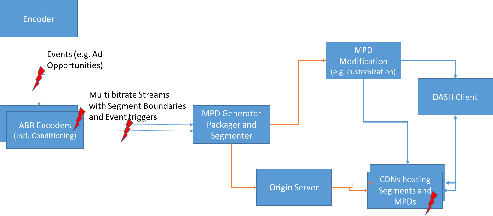
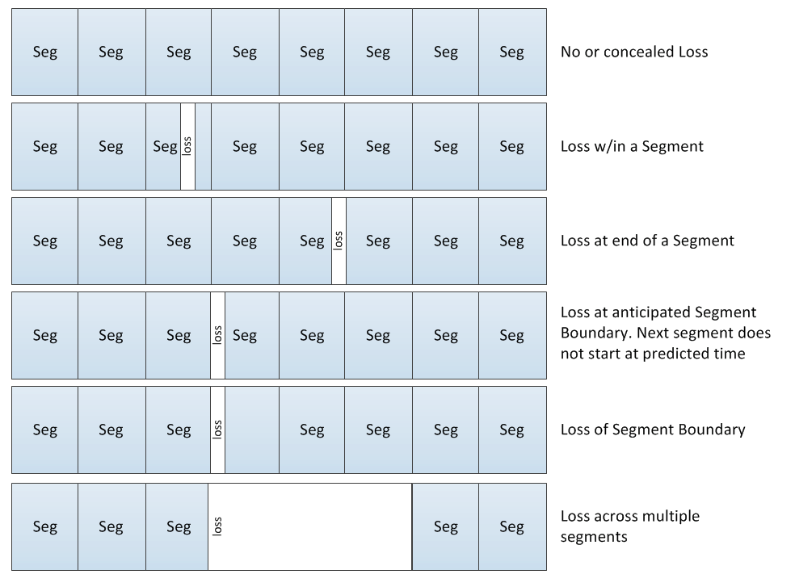
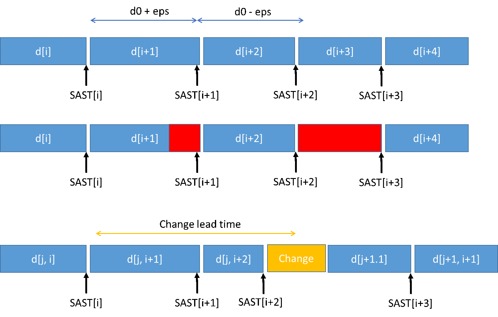

# On-demand services # {#svc-ondemand}

An on-demand service is one that is published with a static [=MPD=] (`MPD@type="static"`).

On-demand services have an infinite [=availability window=] and [[#timing|have no fixed mapping to real time]] - clients may present any part at any time and may use [[#trickmode|trick mode]] support to alter the playback rate.

Note: An on-demand service may be created by transforming what was previously a [[#svc-live|live service]] into an on-demand service for viewing as a catch-up presentation or a recording. See [[#live-to-ondemand]].

On-demand services MAY use any [=addressing mode=] or even a combination of multiple [=addressing modes=].

[=MPD=] elements or attributes only relevant for dynamic [=MPDs=] SHALL NOT be present in [=MPDs=] of on-demand services. Clients SHALL ignore any such elements or attributes if present.

## Surviving transforming boxes and other adaptation middleboxes ## {#avoid-surprise-transformation}

A number of video transcoding proxies (aka "middleboxes") are deployed on the Internet that may silently transcode DASH presentations. Specifically, a middlebox may see a `video/mp4` HTTP response, transcode that video into a different format (perhaps using a lower bitrate or a different codec), then forward the transcoded video to the DASH client. This will break byte range based operations, as byte ranges from the original video are not valid in the transcoded video.

If such a threat is encountered, the following options may prevent proxies from transcoding DASH presentations:

* Serve DASH presentations using an authenticated transport that prevents interception (HTTPS).
* Serve DASH presentations using encryption that prevents tampering.
* Serve DASH presentations with the `Cache-Control: no-transform` header.

Issue: insert reference to encryption.

In all cases the operational impacts on caching and implementations should be considered when using any of the above technologies. The same methods may also need to be applied to prevent middleboxes manipulating the [=MPD=].

# Live services # {#svc-live}

A live service is one that is published with a dynamic [=MPD=] (`MPD@type="dynamic"`).

Live services have a [[#timing|strict mapping between the MPD timeline and real time]] and are often [=available=] only for a limited time. The [=MPD=] of a live service [[#timing-mpd-updates|may change over time]], for example as more content is appended and expired content is removed. Clients are forced into a timed schedule for the playout, such that they follow the schedule as desired by the content author (with some amount of [[#timing-timeshift|client-controlled time-shift]] allowed).

A live service has a <dfn>live edge</dfn>, which is the most recent moment on the [=MPD timeline=] for which the [=MPD=] guarantees that [=media segments=] are [=available=] for all [=representations=]. See [[#live-edge-calculation]].

Live services MAY use either [=explicit addressing=] or [=simple addressing=] or a combination of the two. [=Indexed addressing=] is not meaningful in a live service context.

Note: In previous versions of [=IOP=] a distinction was made between "simple live" and "main live" services. The latter simply refers to live services that signal [[#inband|MPD updates using in-band events]].

There are multiple different types of live services:

: Scheduled playback of prepared content
:: The content is prepared in advance but playback is scheduled for a specific time span in real time.

: MPD-controlled live service
:: The content is generated on the fly and the [=MPD=] receives constant updates to reflect the latest state of the service offering. The DASH client behavior is driven solely by the [=MPD=] contents, which it regularly refreshes.

: MPD- and segment-controlled live service
:: The content is generated on the fly and clients are kept informed of [=MPD=] validity by [[#inband|in-band events]] in the [=media segments=]. [=MPD=] downloads are only initiated when the need for updates is detected. Services can signal the need for updates on short notice.

For initial access to the service and joining the service, an [=MPD=] is required. [=MPDs=] may be accessed at join time or may have been provided earlier, for example along with an Electronic Service Guide. An [[#mpd-anchors|MPD anchor]] MAY be used when referencing the [=MPD=] to specify an initial time-shift that clients are expected to apply.

Note: Support for [[#mpd-anchors|MPD anchors]] is an optional client feature - a service should consider clients that lack an implementation.

The initial [=MPD=] or join [=MPD=] is accessed and processed by the client and, [[#clock-sync|having an accurate clock that is synchronized with the server]], the client can analyze the [=MPD=] and extract suitable information in order to initiate playback of the service. This includes, but is not limited to:

* Identifying the currently active [=periods=] in the service and the [=period=] that contains the [=live edge=].
* Selecting the suitable media components by selecting one or multiple [=adaptation sets=]. Within each [=adaptation set=] selecting an appropriate [=representation=] and identifying the live edge segment in each [=representation=]. The client then issues requests for the [=media segments=].

The [=MPD=] may be updated on the server based on certain rules and clients consuming the service are expected to update [=MPDs=] based on certain triggers. The triggers may be provided by the [=MPD=] itself or by information included in [=media segments=]. See [[#timing-mpd-updates]] and [[#inband]].

## Selecting the time shift buffer size ## {#live-timeshiftbuffer}

Recommended configuration for [=time shift buffer=] size:

: If playback should only occur near the [=live edge=], without significant time shift possibility.
:: `MPD@timeShiftBufferDepth` SHOULD be short but with a lower limit of 4 times [=media segment=] duration or 6 seconds (whichever is largest). This gives the client some opportunity to time-shift for buffering purposes, to overcome difficult network conditions.

: If playback is not limited to near-live-edge.
:: `MPD@timeShiftBufferDepth` MAY have an arbitrarily large value, including a value greater than the total duration of [=periods=] in the presentation.

## Selecting the suggested presentation delay ## {#live-presentationdelay}

Recommended configuration for [=presentation delay=]:

: If the service wishes to explicitly synchronize playback of different clients.
:: `MPD@suggestedPresentationDelay` SHOULD be set to the desired [=presentation delay=] but with a lower limit of 4 seconds or 2-4 times the [=media segment=] duration (whichever is largest).

: If the service does not wish to explicitly synchronize playback of different clients.
:: Omit `MPD@suggestedPresentationDelay` and let each client determine the optimal [=presentation delay=] based on its own heuristics (which may lead different clients to choosing a different [=presentation delay=]).

The limitations imposed by the following factors SHOULD be considered when selecting the value for the [=presentation delay=]:

* The desired end-to-end latency.
* The typical amount of buffering that must be performed by clients.
* [[#minbuffertime-feature|The minimum buffer time]].
* The [=time shift buffer=] size.

## Selecting the media segment duration ## {#live-segmentduration}

The [=media segment=] duration SHOULD be between 1 and 10 seconds. The duration influences the end-to-end latency but also the switching and random access granularity as in DASH-264/AVC each [=media segment=] starts with a stream access point which can also be used as a [[#seamless-switching|switching point]]. The service provider should set the value taking into account at least the following:

* The desired end-to-end latency.
* The desired compression efficiency.
* The start-up latency.
* The desired switching granularity.
* The desired amount of HTTP requests per second.
* The variability of the expected network conditions.

## Safety margins in availability timing ## {#live-safety-margins}

There exists unavoidable jitter and occur occasional delays in most content delivery architectures. A DASH client SHOULD avoid being too aggressive in requesting [=media segments=] as soon as they become [=available=]. If a DASH client observes issues, such as 404 responses, it SHOULD back up slightly in the requests.

Services SHALL be published so that all timing promises made by the [=MPD=] hold under normal operating conditions. Services MAY indicate an [=availability window=] that includes a safety margin. However, such a safety margin will lead to increased end-to-end latency, so it is a balance to be taken into account.

If a service wishes to impose a safety margin of N seconds, it SHOULD offset `MPD@availabilityStartTime` into the future by N seconds when starting the presentation.

## Selecting the minimum update period ## {#live-mup}

The minimum update period signals that `MPD@minimumUpdatePeriod` worth of future [=media segments=] are guaranteed to become [=available=] over that time span after retrieving the [=MPD=].

Setting the value of the minimum update period primarily affects two main aspects of a service:

* A short minimum update period results in the ability to change and announce new content in the [=MPD=] on shorter notice.
* However, by offering the [=MPD=] with a small minimum update period, the client requests an update of the [=MPD=] more frequently, potentially resulting in increased uplink and downlink traffic.

The downside of a small minimum update period is that a large number of [=MPD=] download requests will be made by clients. This overhead can be minimized by [[#conditional-mpd-downloads-feature|conditional GET requests]] and/or [[#inband|in-band MPD update signaling]].

If [[#inband|in-band MPD validity signaling]] is used, `MPD@minimumUpdatePeriod` SHALL be 0.

## Robust and seamless period transitions ## {#live-multiperiod}

Multilanguage live services are likely to encounter experience transitions from one [=period=] to another. For example, due to changes in the set of available audio/text languages or due to ad insertion.

To ensure robust client operation at period transitions, ensure that all the requirements of the [[#timing|timing model]] are satisfied. In particular, periods must be fully covered by [=media segment=] references and media samples, including immediately before/after a period transition. No gaps can occur in any [=representation=]!

In many of these cases, some [=adaptation sets=] are likely to continue seamlessly across period boundaries, in which case they SHOULD be marked as [[#timing-connectivity|period-connected or period-continuous]].

## Determining the live edge ## {#live-edge-calculation}

If a service does not declare a suggested [=presentation delay=] or if the client chooses to ignore it, the client will likely want to know the position of the [=live edge=] in order to perform its own [=presentation delay=] calculations.

The [=live edge=] is affected by the following factors:

* The [=time shift buffer=] determines the set of [=media segments=] that a client may present.
* However, not all [=media segments=] may be available yet, even if they are within the [=time shift buffer=]!
* Furthermore, different [=representations=] may have different [=availability windows=] (due to `@availabilityTimeOffset`).
* And finally, different [=representations=] may have different [=media segment=] lengths (even within the same [=representation=]), which is important because [=media segments=] only become [=available=] once their **end point** is within the [=availability window=].

Accordingly, the [=live edge=] can be calculated as follows:

1. Determine the maximum [=media segment=] length <var>segment_length_max</var> for each [=representation=].
    * With [=indexed addressing=], the index segment provides the exact length of every [=media segment=].
    * With [=simple addressing=], the [=MPD=] defines a constant length but remember that [[#addressing-simple-inaccuracy|simple addressing allows for segment length deviation up to 200% of nominal length]].
    * With [=explicit addressing=], every [=media segment=] may have a unique length and either `MDP@maxSegmentDuration` (if present) or custom heuristics should be used.
1. Determine the [=availability window=] end position <var>availability_end</var> for each representation.
1. Determine the minimum guaranteed start of the most recent [=available=] [=media segment=] <var>available_segment_start</var> for each representation as <var>available_segment_start</var> = <var>availability_end</var> - <var>segment_length_max</var>.
1. The [=live edge=] is <code>min(<var>available_segment_start</var>)</code>.

A client MAY exclude some [=representations=] from live edge calculation if it considers them optional for successful playback. For example, [[#trickmode|trick mode]] [=representations=] may become [=available=] in a delayed fashion and would needlessly delay the live edge. See also [[#trickmode-live]].

Note: When determining the [=presentation delay=] a client should also consider other aspects besides the [=live edge=] such as clock synchronization accuracy, expected network performance jitter and desired buffer size.

See also [[#live-safety-margins]].

## Trick mode for live services ## {#trickmode-live}

If trick mode is to be supported for [[#svc-live|live services]], the trick mode [=representations=] SHOULD be offered using the same [=media segment=] duration as in the main [=adaptation set=] or each [=media segment=] duration should aggregate an integer multiple of the [=media segments=] in the main [=adaptation set=].

The content author needs to find a balance between the [=media segment=] duration affecting the amount of requests in fast forward or fast rewind and the [=available|availability=] timing of trick mode [=media segments=]. Longer [=media segment=] durations for the trick mode [=representation=] delay the [=available|availability=] time of such [=media segments=] by the duration of the [=media segment=] - i.e. at the [=live edge=] the trick mode may not be fully supported.

Based on this it is a content author's decision to provide one or more of the following alternatives for trick mode for live services:

* Provide one trick mode [=adaptation set=] that generates a [=media segment=] for every [=media segment=] in the main [=adaptation set=]. Note that if this [=adaptation set=] is used, it may result in increased amount of HTTP requests when the player does a fast forward or fast rewind.
* Provide one trick mode [=adaptation set=] that generates a [=media segment=] only after several [=media segments=] in the main [=adaptation set=] have been generated and aggregate the trick mode samples in a single [=media segment=] of longer duration. As a result, it is possible that no trick mode samples are available at the [=live edge=] or that some clients consider the [=live edge=] to be where the trick mode [=media segments=] become [=available=].
* Provide multiple trick mode [=adaptation sets=] with different [=media segment=] durations, enabling trick mode aware clients to choose the desired tradeoff between efficiency and delay.
* Provide trick mode [=adaptation sets=] using [=indexed addressing=]. This requires an entire [=period=] worth of data to be published simultaneously, so is only possible for [=periods=] that have a fixed end point and for which all data already exists.

Combinations of different alternatives are possible.

If a client wants to access a trick mode [=adaptation set=] in a live service, it SHOULD attempt to minimize the amount of requests to the network by preferring [=media segments=] with longer duration (if multiple choices are provided).

If a service is [[#live-to-ondemand|converted from live to on-demand]], trick mode [=adaptation sets=] SHOULD be converted to use [=indexed addressing=].

## DVB-DASH alignment ## {#dvb-dash}

For alignment with [[DVB-DASH]], the following should be considered:

* Reasonable requirements on players around responding to response codes are provided in [[DVB-DASH]] in section 10.8.6.
* Further guidelines on live edge aspects are provided in [[DVB-DASH]] section 10.9.2.

[[DVB-DASH]] also provides recommendations in order to apply weights and priorities to different networks in a multi-BaseURL offering in section 10.8.2.1.

## Converting a live service to an on-demand service ## {#live-to-ondemand}

The major difference between live and on-demand services is that live services have their timeline mapped to a real time clock and have an MPD that may change. This behavior is signaled by `MPD@type="dynamic"`. To transform a live service to an on-demand service, it may often be sufficient to set `MPD@type="static"` and to remove any signaling in the [=MPD=] that is restircted to dynamic MPDs.

There is no need to alter [=media segments=] when transforming a live service to an on-demand service.

Consider the time span of available content. A live service has a [=time shift buffer=] that may only allow a recent time span of content to be presented as a live service. If you wish to publish a larger time span as a recording, creating a separate on-demand variant of the [=MPD=] in parallel with the on-demand variant may be sensible.

A live service MAY be converted to an on-demand service without changing the URL, by simply replacing the dynamic MPD with a static MPD. Maintaining the same URLs for [=media segments=] might be beneficial in terms of CDN efficiency.

See also [[#timing-mpd-updates-theend]].

## Reliable and consistent-delay live service ## {#live-deployment}

Issue: This and everything below needs to be updated to conform to timing model

Issue: Needs proper Bikeshed formatting and references

A service provider wants to run a live DASH service according to the below Figure 8. As an example, a generic encoder for a 24/7 linear program or a scheduled live event provides aproduction encoded stream. Such streams typically includ inband events to signal program changes, ad insertion opportunities and other program changes. An example for such signalling are SCTE-35 [54]  messages. The stream is then provided to one or more Adaptive Bitrate (ABR) encoders, which transcodes the incoming stream into multiple bitrates and also conditions the stream for segmentation and program changes. These multiple encoders may be used for increased ABR stream density and/are then distributed downstream for redundancy purposes. The resultant streams are received by theDASH generation engines that include: MPD generator, packager and segmenter.Typically the following functions are applied by the MPD packager:

* Segmentation based on in-band information in the streams produced by the ABR encoders
* Encapsulation into ISO BMFF container to generate DASH segments
* Dynamic MPD generation with proper customization options downstream
* Event handling of messages
* Any other other DASH related adaptation

Downstream, the segments may be hosted on a single origin server, or in one or multiple CDNs. The MPD may even be further customized downstream, for example to address specific receivers. Customization may include the removal of certain Adaptation Sets that are not suitable for the capabilities of downstream clients. Specific content may be spliced based on regional services, targeted ad insertion, media blackouts or other information. Events carried from the main encoder may be interpreted and removed by the MPD packager, or they may be carried through for downstream usage. Events may also added as MPD events to the MPD.

In different stages of the encoding and distribution, errors may occur (as indicated by lightning symbols in the diagram), that for itself need to be handled by the MPD Generator and packager, the DASH client, or both of them. The key issue for this section is the ability for the DASH Media Presentation Generator as shown in to generate services that can handle the incoming streams and provide offerings such that DASH clients following DASH-IF IOPs can support.

Hence this section primarily serves to provide guidelines for implementation on MPD Generators and Packagers.

<figure>
    
    <figcaption>Example live service deployment architecture.</figcaption>
</figure>

The following scenarios are considered in the service setup:

* The distribution latency should be consistent, typically what is observed for broadcast TV services. This means that the MPD Generator should add minimum delay, and the service should be setup such that the delay between MPD generator and DASH client playout is consistent, and preferably small.
* Program events may occur for different reasons, for example Program changes, switches from Programs to Advertisements or vice versa, media blackouts or other program changes. If [[MPEG2TS]] is used at broadcast origination points, the Program Map Table (PMT) typically indicates such changes. Typically, these changes also result in discontinuities for in the media timeline. Such changes are typically anticipated only on short notice, i.e. within a few seconds. In the following we refer to the time that changes are announced as change lead time. The service should also provide a minimum change lead time, i.e. the smallest time in media time between the change being announced in the stream and the time between the change occurs. Changes may for example include one or more of the following:
    * Number of source audio languages or formats can change. For example:
        * Programming with English and Spanish to other content with only English
        * Descriptive audio may disappear / reappear
        * Programming with 5.1 E-AC-3 and AAC Stereo content to other content with only Stereo AAC
    * Resolution or format of source video content can change, e.g. HD to/from SD, HDR to/from SDR, etc.
    * Codecs may change, or at least the profile or level of the codecs
    * The number of Representations in an Adaptation Set may change
    * A distribution network may be changed, added or removed.
* The segmentation is determined by the ABR encoders. This encoding may result in occasional slight variations in segment durations during a period (as compared to the last segment in a period) due to encoding optimizations around scene changes near the segment duration point (for example: making a segment slightly shorter or longer to align segment IDR to a scene change).
* Unanticipated losses and operational failures or outages, possibly happen just for a single encoding (typically at the input of the encoder, but also possibly also downstream packaging).
    * Examples are
        * An encoder for one or more Representations or the output of an encoder fails for some time and does not produce content.
        * An encoder or the input to the encoder or the output of the encoder fails for a media component/Adaptation Set for some time and do not produce content.
        * All encoding or the input to the encoder fails for some time.
    * In all cases an MPD can still be written and the MPD is up and running.  Also in the distribution, single Segments may be lost for different reasons and the client typically gets 404.
* MPD updates should be minimized, whereby MPD updates includes the following aspects for every MPD request
    * Client sending uplink requests for MPDs
    * Sending full MPD with every request from the server to the client
    * Parsing and processing of MPD at the client
    * Writing a new MPD on the server if the MPD is changed

Issue: Check and align references in original text.

The subchapters here outline some possibilities for solving the above challenges.

### Consistent latency ### {#live-deployment-latency}

The scenario does not ask for very low latency, but for consistent latency. Latency can primarily be controlled by the following means:

* Segment duration: the segment duration typically directly impacts the end-to-end latency. Smaller segment sizes provide improved latency and segments of 1-2 seconds may be chosen, if latency is an important aspect. However, too small segments may result in issues, as compression efficiency decreases due to more frequent closed GOPs in the elementary stream. In addition, the number of files/requests to be handled is higher, and finally, with shorter segments, TCP throughput may be such that not the full available capacity on the link can be exploited. Annex B.4 and clause 4.3.3.2.2 provide some guidelines on this.
* If files are available in chunks on the origin, for example due to specific encoding or delivery matters, chunked delivery may be supported. If this feature is offered, then the @availabilityTimeOffset attribute may be provided to announce how much earlier than the nominal segment availability the segment can be accessed.
* In order to provide tight synchronization between client and server, and therefore providing the receiver the ability to request the segment at the actual segment availability time, the availability time synchronization as defined in clause 4.7 should be provided and signalled in the MPD. Typically support for http-xsdate is sufficient for consistent latency support. Accurate NTP synchronization is recommended, but not required for the MPD packager or the DASH client as long as the time synchronization API is provided.
* It is proposed that a client consistently implements and joins at a segment that is slightly offset (e.g. 4 segments earlier) from the live edge segment. The exact number depends on the distribution system (for example in a fully managed environment, the offset may be smaller in contrast to best effort networks). The MPD author may support consistency by providing a suggested presentation delay in the service offering. For details on joining at the live edge, please refer to clause 4.3.4.4.2.

### Unanticipated new periods ### {#live-deployment-surprise-periods}

An [=MPD=] has a certain duration after download during which the service guarantees that the information within remains valid, signaled by `MPD@minimumUpdatePeriod`. To avoid that the clients take future segment existence for granted even if a sudden change on the service offering is necessary, the MPD service provider must set to the `MPD@minimumUpdatePeriod` to a low value.

In the most conservative case, [[#live-mup-zero|the MPD author sets the `MPD@minimumUpdatePeriod` to 0]]. Then no promise for future segments is provided. The DASH client is forced to revalidate the MPD prior to any new Segment request.

For controlling future MPD validity, basically two options exist:

1. Client downloads a fresh MPD before every Segment request (or batch of requests), preferably using a [[#conditional-mpd-downloads-feature|conditional GET]] in order to avoid unnecessary downlink traffic and processing in the client.

1. Client relies on [[#inband|MPD validity expiration events in event messages]], if content provider announces those in the MPD and by this, it can revalidate.

The two methods are not mutually exclusive.

### Media segment duration variations ### {#live-deployment-duration-variation}

Variable [=media segment=] durations need to be correctly signed in the [=MPD=]. The mechanism depends on the [=addressing mode=]:

1. [=Simple addressing=] allows for [[#addressing-simple-inaccuracy|a deviation of up to 50% segment duration]] in segment start points, allowing for some drift to be compensated.
    * If the DASH packager receives a segment stream such that the drift can no longer be compensated, then a new [=period=] SHALL be started, adjusting the addressing parameters to compensate. The [=representations=] SHOULD also be signaled as [[#timing-connectivity|period-connected or period-continuous]].
1. [=Explicit addressing=] allows the duration of each [=media segment=] to be defined explicitly.

[=Media segments=] SHALL NOT have a duration greater than `MPD@maxSegmentDuration` in any situation.

### Losses and operational failures ### {#live-deployment-losses}

One of the most complex aspects are occasional operational issues, such as losses, outages, failovers of input streams, encoders, packagers and distribution links. Section 4.8 provides detailed overview on available tools that should be used by network service offering and clients in order to deal with operational issues. Several types of losses may occur:

<figure>
    
    <figcaption>Examples of different types of data loss.</figcaption>
</figure>

Losses may occur in the middle of a Segment, at the end of a Segment, at the start of a new Segment. At the elementary stream level, losses may be within a compressed access unit (AU), producing a syntactically corrupt bitstream, or may be the result of the ABR encoder simply not encoding a source frame in which case the duration of the prior AU is extended producing a conforming bitstreams. Losses may impact an entire Segment or may just impact a part of the Segment. Typically, service oriented losses will occur until the next Random access point, i.e. a loss is to be signaled from the start of the lost sample up to the next random access point, typically coinciding with the start of a new Segment.

[=IOP=] defines some basic constraints in the [[#timing|timing model]]:

* [=Periods=] are covered by [=media segments=] in their entirety.
* [=Periods=] are covered by media samples in their entirety.

Deviation from these constraints is not allowed, even in case of data loss. This means that theer are basically two options:

1. A service MAY replace lost data with padding data.
1. A service MAY start a new period when the data loss starts and ends, removing the affected [=representations=] for the duration of the loss.

Of course, it is not possible for a service to compensate for data loss in the CDN layer. Clients are expected to survive arbitrary 404 errors that occur due to CDN faults, either by retrying, switching to another CDN (base URL), switching to another [=representation=] or automatically seeking forward.

Issue: Is there something that goes into more depth about 404s? These statements need a better home.

### Minimizing MPD updates ### {#live-deployment-minimal-updates}

MPD updates, the frequency of MPD updates and the actions included in MPD updates are different ones, and their effects may have different impacts on deployments.  To avoid confusion on the generally overloaded term, some more details are discussed in the following section. In non-DASH adaptive streaming solutions, MPD updates result in the following additional processing and delivery overhead:

1. The client sends an uplink requests for the MPD. At least from a CDN perspective, this is issue is considered less critical, typically the bounds of operation are reached by throughout, not by the number of requests.
1. The server needs to send a full MPD with every request, which for itself causes overhead from all the way of the origin server to the client. This is in particular relevant if the manifest contains a list of URLs, and some timeshift buffer is maintained.
1. Yet another aspect is the regular parsing and processing of the manifest in the client. Whereas the processing is likely less of a burden, the consistency across two parsing instances is relevant and requires to keep state.
1. MPD updates may also result in writing a new MPD on the server. This may be less problematic for certain cases, especially for unicast, but it results in significant overhead if DASH formats are used for broadcast.

DASH-IF IOP provides different means to avoid one or the more of the above issues. Assuming that the MPD@minimumUpdatePeriod is set to a low value for reasons documented above, then issues mentioned above can be addressed by the following means in DASH-IF IOP:

1. Client Requests: can be avoided by signalling inband that an MPD is has expired. The most obvious tool is the use of Inband Events with MPD expiry. However, this requires inband events being added during packaging.
1. Sending Full MPD: Instead of requesting the full MPD, the client can support this operation by issuing a conditional GET. If the MPD has not changed, no MPD needs to be sent and the downlink rate is small. However, this requires the usage of @duration or SegmentTimeline with @r=-1.
1. MPD Parsing and Processing: This can be avoided by using either of the solutions documented above.
1. MPD writing on server: This goes hand-in-hand with 2, i.e. the usage of @duration or SegmentTimeline with @r=-1.

Generally, DASH-IF IOP provide several tools to address different aspects of minimizing MPD updates. Based on the deployment scenario, the appropriate tools should be used. However, it is preferable that DASH clients support different tools in order to provide choices for the service offering.

### Proposed service configuration and MPD generation logic ### {#live-delivery-logic}

The core concept is the availability of a segment stream at the input to a packager. The segment stream may be made available as individual segments or as boundary markers in a continuous stream. In addition, the stream may contain information that is relevant for the packager, such as program changes. The segment stream determines for each segment the earliest presentation time, the presentation duration, as well as boundaries in program offerings.

Furthermore, it is assumed that multiple bitrates may exist that are switchable. In the following we focus on one segment stream, but assume that in the general case multiple bitrates are available and the encoding and segment streams are generated such that they can be switched.

The high-level assumptions for the service are summarized in 4.11.2. Based on these assumptions, a more detailed model is provided.

* A segment stream is provided for each Representation. The segmentation is the same for Representations that are included in one Adaptation Set. Each segment i has assigned a duration d[i] and an earliest presentation time ept[i]. In addition, the segment stream has a nominal segment duration d0 that the ABR encoders attempts to maintain. However, variation may occur for different reasons, documented above.
* Losses may occur in the segment stream, spanning a part of a segment, multiple segments, a full segment and so on. The loss may be in one Representation or in multiple Representations at the same time (see above for more discussions).
* The latency of the time that the segment is made available to the DASH packager and that it is offered as an available segment in the MPD should be small, i.e. the segment availability time should be shortly after the time when the full segment is received in the DASH packager. Any permitted delay by the MPD Packager can be view as additive to change lead time and may therefore improve efficiency and robustness, but may at the same time increase the end-to-end latency.
* Changes in the program setup may occur, that signal changes as discussed in 4.11.2. A change is possibly announced with a time referred to as change lead time. Note that signal changes such as SCTE-35 only indicate where a change may occur, it does not indicate what type of change will occur.

The different scenarios are summarized in Figure 10. For the third part, it shows the notion of the change lead time. Segment of Period with index j are provided. In this case, at the start of segment (j, i+1) (i.e. its earliest presentation time) an indication is provided that the media will change after segment (j, i+2), i.e. the change lead time is d[j, i+1] + d[j, i+2]. A new Period j+1 is generated that starts with a new segment numbering.

<figure>
    
    <figcaption>Different properties of a segment stream.</figcaption>
</figure>

Based on the discussions in 4.11.2, proposed service configuration for such a service are proposed. The service configuration differentiates two deployment scenarios:

1. Clients implementing the simple live client, i.e. no emsg support and no segment parsing is implemented.
1. Clients implementing the main client, i.e. emsg is supported and segment parsing is implemented.

#### Service configuration for simple live #### {#live-delivery-simple}

Assuming that the input stream is a segment stream with the properties documented above is received by the DASH packager.

The DASH packager may operate as follows:

* The @minimumUpdatePeriod is set to a value that is equal or smaller than the change lead time provided by the segment stream.
* The @timescale of the Adaptation Set is set to the timescale of the included media
* The @duration attribute is set such that the nominal duration d0 is documented in the MPD for this Adaptation Set.
* $Number$ is used of segment templating.
* With incoming segments of the segment stream, a new segment is generated by the DASH packager and the DASH packager checks the validity of the MPD offering. If still valid, no changes to MPD are done. Only if changes are done that are no longer valid, a new MPD is written. Specifically,
    * The MPD start time of the next segment must be in the range of EPT - PTO - 0.5*DUR and EPT - PTO + 0.5*DUR with DUR the value of @duration.
    * If this is not fulfilled a new Period is written that includes the following:
        * The Period@start is set such that the MPD start time is correct.
        * The @presentationTimeOffset is set to the EPT of the first segment
        * The @startNumber is set to the first segment in the new Period.
        * The Adaptation Sets are continued by providing Period continuity signallng with each Adaptation Set.
* when an encoder fails for one or more specific Representations to generate the next segment, then the DASH content generator
    * terminates the Segment with the last sample in the segment, (which is possibly corrupted)
    * generates a new MPD as follows:
        * The @minimumUpdatePeriod is set to 0.
        * If all or at least many Representations fail, the Period@duration is set to the value of the media time in the Period that is still available.
        * If only a subset of the Representations fail, the @presentationDuration for the last segment is set to the value of the last presentation time in the Representation that is still available.
        * By doing so, the content provider basically informs the DASH client that for the duration of the Segment as announced, no media is available. The DASH client revalidates this after every Segment duration. The MPD is not changed on the server until either the decoder resumes or the Media Presentation is terminated.
        * If the @minimumUpdatePeriod is long, then the client may request non-existent segments, which itself may then trigger that the DASH client revalidates the MPD. If the DASH client has the possibility, it should add the ‘lmsg’ brand as a compatibility brand to the last generated segment. In addition, when the segment is distributed over HTTP, the HTTP header should signal the content type of the segment including the compatibility brand ‘lmsg’. If the DASH client can identify this, it is expected to refetch the MDP and may by this means observe the early terminated Period or Representations.
    * Only after the encoder resumes, a new MPD is written as follows:
        * A new Period is provided with Period@start according to the value of the new Period. The @presentationTimeoffset of the Representation of the Period shall match the the earliest presentation time of the newly generated Segment. If appropriate, Period connectivity should be signaled.
        * The @minimumUpdatePeriod is set again to the minimum change lead time.
* when a program change is announced, generates a new MPD as follows:
    * The @minimumUpdatePeriod is set to 0.
* When the program change occurs
    * Write a new MPD with all the parameters
    * Reset the @minimumUpdatePeriod is set to a value that is equal or smaller than the change lead time provided

#### Service configuration for main live #### {#live-delivery-main}

Assuming that the input stream is a segment stream with the properties documented above is received by the DASH packager.

The DASH packager may operate as follows:

* The @minimumUpdatePeriod is set to 0.
* The @timescale of the Adaptation Set is set to the timescale of the included media
* The segment timeline is used. Addressing may used: $Number$ or $Time$.
* The MPD is assigned an MPD@publishTime
* With incoming segments of the segment stream, following the rules in 4.5.2.2 the DASH Packager uses the Segment Timeline to accurately signal the different segment durations. If the segment duration changes, then the @r attribute of the last S element in the Segment timeline is terminated and a new S element is added to the MPD with the new segment duration. The values @t and @d need to be set correctly:
    * @r of the last segment element may be set to -1. In this case a new MPD is only written if the segment duration changes
    * @r of the last segment element may be set to the actual published number of segments. In this case a new MPD is written for each new segment
* Whenever a new MPD is written, the MPD@publishTime is updated.
* when an encoder fails for one or more specific Representations to generate the next segment, then the DASH packager
    * terminates the Segment with the last sample in the segment (may be corrupt)
    * adds emsg to this last generated segment. The MPD validity expiration is set to the duration of the current segment or smaller. This emsg may be added to all Representation that have observed this failure, to all Representations in the Adaptation Set or to all Representations in the MPD. The content author should be aware that if the emsg is not signaled with all Representations, then there exist cases that a switch to the erroneous Representation causes a request to a nonexisting Segment. That loss would be signaled in the MPD, but the client is not aware that an update of the MPD is necessary.
    * The emsg shall be added to all Representations that announce that they carry the message as an inband stream.
    * The MPD is updated on the server such that the last generated segment is documented in the Segment timeline and no new S element is added to the timeline.
    * Only after the Representation(s) under loss resumes, a new S element is written with S@t matching the earliest presentation time of the newly generated Segment. The DASH client with it next update will resume and possibly take into account again this Representation.
    * If the encoder does not resume for a specific Representation over a longer time, it is recommended to terminate this Period and remove this Representation at least temporarily until the encoder resumes again. Period continuity should be signaled.
* when the program change occurs
    * adds emsg to this last generated segment. The MPD validity expiration is set to the duration of the current segment or smaller. This emsg shall be added to all Representations that announce the Inband Event stream for the MPD validity expiration.
    * Write a new MPD with all the parameters
* Whenever a new MPD is written, the MPD@publishTime is updated.

The DASH client having received an MPD that signals gaps is expected to either look for alternative Representations that are not affected by the loss, or if not possible, do some appropriate error concealment. The DASH client also should go back regularly to check for MPD updates whether the Representation gets available again.