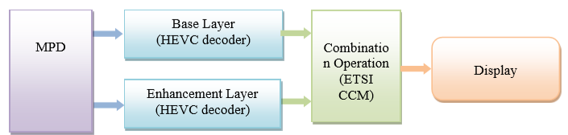

# Media coding technologies # {#codecs}

This chapter describes the constraints that apply to media codecs when used in interoperable services.

Services SHALL use only the media codecs described in this chapter, in conformance with the requirements defined here.

Clients MAY support any set of codecs described in this chapter and SHALL NOT attempt to play back [=representations=] for which they do not have codec support.

## H.264 (AVC) ## {#codecs-h264}

The H.264 (AVC) codec [[!MPEGAVC]] MAY be used by services for [=video adaptation sets=]. Clients SHOULD support this codec.

For [=representations=] up to 1280x720p resolution and up to 30 fps, the H.264 (AVC) Progressive High Profile Level 3.1 decoder SHALL be used.

For [=representations=] up to 1920x1080p resolution and up to 30 fps, the H.264 (AVC) Progressive High Profile Level 4.0 decoder SHALL be used.

The encapsulation of H.264 data in DASH containers SHALL conform to [[!iso14496-15]].

Clients SHALL support SPS/PPS storage both in the [=initialization segment=] (sample entry `avc1`) and inband storage (sample entry `avc3`). Services MAY use either form.

Note: Use of `avc3` is one of the factors that enables [[#bitstream-switching|bitstream switching]].

The below table lists examples of `@codecs` strings for H.264 (AVC) that match the decoders defined in this chapter.

<figure>
    <table class="data">
        <thead>
            <tr>
                <th>Profile
                <th>Level
                <th>`@codecs`
        <tbody>
            <tr>
                <td rowspan="2">H.264 (AVC) Progressive High Profile
                <td>3.1
                <td>`avc1.64Y01F`<br/>
                `avc3.64Y01F`
            <tr>
                <td>4.0
                <td>`avc1.64Y028`<br/>
                `avc3.64Y028`
    </table>
    <figcaption>Example `@codecs` strings for H.264 (AVC)</figcaption>
</figure>

Note: Other `@codecs` strings may also be compatible (a higher level decoder can typically decode content intended for a lower level decoder).

For a detailed description on how to derive the signaling for the codec profile for H.264/AVC, see [[DVB-DASH]] section 5.1.3.

## H.265 (HEVC) ## {#codecs-h265}

The H.265 (HEVC) codec [[!MPEGHEVC]] MAY be used by services for [=video adaptation sets=].

For [=representations=] up to 1280x720p at up to 30 fps, the HEVC Main Profile Main Tier Level 3.1 decoder SHALL be used.

For [=representations=] up to 2048x1080 at up to 60 fps at 8-bit frame depth, the HEVC Main Profile Main Tier Level 4.1 decoder SHALL be used.

For [=representations=] up to 2048x1080 at up to 60 fps at 10-bit frame depth, the HEVC Main10 Profile Main Tier Level 4.1 decoder SHALL be used.

The encapsulation of H.265 data in DASH containers SHALL conform to [[!iso14496-15]].

Clients SHALL support VPS/SPS/PPS storage both in the [=initialization segment=] (sample entry `hvc1`) and inband storage (sample entry `hev1`). Services MAY use either form.

Note: Use of `hev1` is one of the factors that enables [[#bitstream-switching|bitstream switching]].

Issue: Where does UHD fit? Why is it in a separate chapter? We should unify.

The [[!ISOBMFF]] sync sample signaling and [[!MPEGDASH]] SAP type signaling SHALL be derived from the following table.

<figure>
    <table class="data">
        <thead>
            <tr>
                <th>NAL unit type
                <th>[[!ISOBMFF]] sync sample flag
                <th>[[!MPEGDASH]] SAP type
        <tbody>
            <tr>
                <td>IDR_N_LP
                <td>true
                <td>1
            <tr>
                <td>IDR_W_RADL
                <td>true
                <td>2 (if the IRAP has associated RADL pictures)<br/>
                1 (if the IRAP has no associated RADL pictures)
            <tr>
                <td>BLA_N_LP
                <td>true
                <td>1
            <tr>
                <td>BLA_W_RADL
                <td>true
                <td>2 (if the IRAP has associated RADL pictures)<br/>
                1 (if the IRAP has no associated RADL pictures)
            <tr>
                <td rowspan="3">BLA_W_LP
                <td>false
                <td>3 (if the IRAP has associated RASL pictures)
            <tr>
                <td>true
                <td>2 (if the IRAP has no associated RASL pictures but has associated RADL pictures
            <tr>
                <td>true
                <td>1 (if the IRAP has no associated leading pictures)
            <tr>
                <td rowspan="3">CRA
                <td>false
                <td>3 (if the IRAP has associated RASL pictures)
            <tr>
                <td>true
                <td>2 (if the IRAP has no associated RASL pictures but has associated RADL pictures)
            <tr>
                <td>true
                <td>1 (if the IRAP has no associated leading pictures)
            <tr>
    </table>
    <figcaption>Signaling dependent on HEVC IRAP pictures in [[!ISOBMFF]] and [[!MPEGDASH]].</figcaption>
</figure>

Advisement: [=IOP=] requires that each [=media segment=] start with SAP type 1 or 2. If the above table indicates SAP type 3, the content is not conforming to [=IOP=].

When the table above lists multiple possible values for a given NAL unit type and the entity creating the signaling is not able to determine correctly which values to use, it SHALL use the first value listed in the table for that NAL unit type.

The below table lists examples of `@codecs` strings for H.265 (HEVC) that match the decoders defined in this chapter.

<figure>
    <table class="data">
        <thead>
            <tr>
                <th>Profile
                <th>Level
                <th>`@codecs`
        <tbody>
            <tr>
                <td rowspan="2">HEVC Main
                <td>3.1
                <td>`hev1.1.2.L93.B0`<br/>
                `hvc1.1.2.L93.B0`
            <tr>
                <td>4.1
                <td>`hev1.1.2.L123.B0`<br/>
                `hvc1.12.L123.B0`
            <tr>
                <td>HEVC Main-10
                <td>4.1
                <td>`hev1.2.4.L123.B0`<br/>
                `hvc1.2.4.L123.B0`
    </table>
    <figcaption>Example `@codecs` strings for H.265 (HEVC)</figcaption>
</figure>

Note: Other `@codecs` strings may also be compatible (a higher level decoder can typically decode content intended for a lower level decoder).

For a detailed description on how to derive the signaling for the codec profile for H.265/HEVC, see [[DVB-DASH]] section 5.2.2.

## Decoder configuration with H.264 and H.265 ## {#codecs-decoder-setup-h264-h265}

This chapter applies only to [=video adaptation sets=] that use H.264 or H.265.

All [=initialization segments=] in the same [=video adaptation set=] SHALL use the same sample description (i.e. no mixing of `avc1` and `avc3` is allowed).

In [=representations=] using `avc1` or `hvc1` sample description:

* All decoding parameter sets referenced by NALs SHALL be indexed to that track’s sample description table and decoder configuration record in the `avcC` or `hvcC` box contained in its [=initialization segment=].
* Edit lists MAY be present.

In [=representations=] using `avc3` or `hev1` sample description:

* All decoding parameter sets referenced by NALs SHALL be indexed to a Sequence Parameter NAL (SPS) and Picture Parameter NAL (PPS) stored prior to the first video sample in the same [=media segment=].
* SPS and PPS stored in each [=media segment=] SHALL be used for decoding and display scaling.
* Every [=initialization segment=] SHALL include an `avcC` or `hvcC` box that SHALL include SPS and PPS NALs that equal the highest Tier, Profile, Level and vertical/horizontal sample count of any SPS in the [=representation=].
    * HEVC Decoder Configuration Records shall also include a VPS NAL.
* SPS and PPS stored in the [=initialization segments=] SHALL be used only for decoder and display initialization.
* Edit lists MAY be present if using [=indexed addressing=]. Edit lists SHALL NOT be present when using any other [=addressing mode=].

## Bitstream switching with H.264 and H.265 ## {#codecs-bs-h264-h265}

This chapter applies only to [=bitstream switching adaptation sets=] that use H.264 or H.265.

All [=representations=] SHALL be encoded using the `avc3` or `hev1` sample description.

The first presented sample's composition time SHALL equal the first decoded sample's decode time, which equals the `baseMediaDecodeTime` in the Track Fragment Decode Time Box (`tfdt`).

Note: This requires the use of negative composition offsets in a v1 Track Run Box (`trun`) for video samples, otherwise video sample reordering will result in a delay of video relative to audio.

Issue: What is the correct scoping for the above requirement? Is the composition time requirement specific to H.264/H.265? Or does it apply to all bitstream switching video? Or does it apply to all bitstream switching, not only video?

## Thumbnail images ## {#codecs-thumbnails}

This chapter defines constraints for [=thumbnail adaptation sets=].

[=Media segments=] SHALL be either JPEG or PNG images, using `@mimeType` of `image/jpeg` or `image/png`.

The [=adaptation set=] SHALL carry an [=essential property descriptor=] with `@schemeIdUri="http://dashif.org/guidelines/thumbnail_tile"`. The `@value` SHALL indicate the numer of thumbnails in each [=media segment=], with the syntax being `HxV`, where:

* `H` is the number of horizontal tiles in the grid.
* `V` is the number of vertical tiles in the grid.

Descriptive attributes on the [=representation=] SHALL describe an entire grid of thumbnails (one [=media segment=]), not an individual thumbnail.

Note: JPEG images have a maximum width and height of 64K pixels.

Thumbnails stored in one grid SHALL be evenly distributed in time across the time span covered by the [=media segment=] on the [=MPD timeline=], from left to right, then top to bottom.

<div class="example">
Thumbnail presentation order for a 3x3 grid:

```
1 2 3
4 5 6
7 8 9
```

</div>

<div class="example">
The following [=thumbnail adaptation set=] defines one [=media segment=] for every 125 seconds, containing a 25x1 image grid (25 columns, 1 row) with each image being 256x180 pixels. The display duration of each thumbnail image is 5 seconds. The single thumbnail [=representation=] requires 10 Kbps of bandwidth on average.

<xmp highlight="xml">
<AdaptationSet mimeType="image/jpeg">
  <SegmentTemplate media="thumbnails_$Number$.jpg" timescale="1" duration="125" />
  <Representation bandwidth="10000" width="6400" height="180">
    <EssentialProperty schemeIdUri="http://dashif.org/guidelines/thumbnail_tile" value="25x1" />
  </Representation>
</AdaptationSet>
</xmp>

Parts of the MPD structure that are not relevant for this chapter have been omitted - this is not a fully functional MPD file.
</div>

## HE-AACv2 audio (stereo) ## {#codecs-heaacv2}

The codec for basic stereo audio support is MPEG-4 High Efficiency AAC v2 Profile, level 2 [[!MPEGAAC]].

Note: HE-AACv2 is also standardized as Enhanced aacPlus in 3GPP TS 26.401.

HE-AACv2 Profile decoder can also decode any content that conforms to:

* MPEG-4 AAC Profile
* MPEG-4 HE-AAC Profile

Therefore, services are free to use any AAC version. Typical clients are expected to play AAC-LC, HE-AAC and HE-AACv2 encoded content.

For content with SBR, i.e. `@codecs=mp4a.40.5` or `@codecs=mp4a.40.29`, `@audioSamplingRate` signals the resulting sampling rate after SBR is applied, e.g. 48 kHz even if the AAC-LC core operates at 24 kHz.

For content with PS, i.e. `@codecs=mp4a.40.29`, the `AudioChannelConfiguration` element signals the resulting channel configuration after PS is applied, e.g. stereo even if the AAC-LC core operates at mono.

The encapsulation of HE-AACv2 data in DASH containers SHALL conform to [[!MP4]].

SAP type SHALL be 1. The `@codecs` string SHALL have a value from the below table.

<figure>
    <table class="data">
        <thead>
            <tr>
                <th>Profile
                <th>`@codecs`
        <tbody>
            <tr>
                <td>MPEG-4 AAC Profile [11]
                <td>`mp4a.40.2`
            <tr>
                <td>MPEG-4 HE-AAC Profile [11]
                <td>`mp4a.40.5`
            <tr>
                <td>MPEG-4 HE-AAC v2 Profile [11]
                <td>`mp4a.40.29`
    </table>
    <figcaption>Permitted HE-AACv2 `@codecs` values.</figcaption>
</figure>

To conform to [[DVB-DASH]], explicit backwards compatible signaling SHALL be used to indicate the use of the SBR and PS coding tools for all HE-AAC and HE-AACv2 bitstreams.

Issue: What does the above requirement actually mean - what does an implementation have to do? Unclear right now.

## HE-AACv2 audio (multichannel) ## {#codecs-heaacv2-multichannel}

This chapter extends HE-AACv2 requirements with multichannel scenarios. All constraints defined for the stereo scenario also apply here.

Support for multichannel content is available in the HE-AACv2 Profile, starting with level 4 for 5.1 and level 6 for 7.1. Decoders implementing MPEG-4 HE-AACv2 multichannel profiles are fully compatible with content encoded in conformance to HE-AACv2 stereo requirements defined in [=IOP=].

The content SHOULD be prepared incorporating loudness and dynamic range information into the bitstream also considering DRC Presentation Mode in [[!iso14496-3-2009-amd4-2013]].

Decoders SHALL support decoding of loudness and dynamic range related information, i.e. `dynamic_range_info()` and `MPEG4_ancillary_data()` in the bitstream.

## CEA-608/708 Digital Television (DTV) Closed Captioning ## {#codecs-cea608}

This chapter defines requirements for interoperable use of CEA-608/708 Digital Television (DTV) Closed Captioning [[!CEA708]] in DASH presentations.

Note: This chapter is compatible with draft SCTE specification DVS 1208 and therefore SCTE URNs are used for the descriptor `@schemeIdUri`.

CEA-608/708 captions SHALL be carried in SEI messages embedded in [=representations=] of a [=video adaptation set=], with the encapsulation as defined in [[!SCTE128-1]], section 8.1. The SEI message `payload_type=4` is used to indicates that Rec. ITU-T T.35 based SEI messages are in use.

Issue: ITU-T T.35 referenced above seems unrelated to the topic. What is the correct reference?

Issue: Is the `payload_type` sentence meant to be a requirement or a description of the referenced spec or what is the utility of this statement in IOP?

Every [=representation=] in the [=video adaptation set=] SHALL have identical CEA-608/708 captions. Both CEA-608 and CEA-708 MAY be present simultaneously in the same [=video adaptation set=].

The presence of CEA-608/708 captions SHALL be signaled by an `Accessibility` descriptor on the [=adaptation set=] level, with `@schemeIdUri="urn:scte:dash:cc:cea-608:2015"` or `@schemeIdUri="urn:scte:dash:cc:cea-708:2015"`, with an optional `@value`.

When present for CEA-608 captions, the `@value` of this descriptor SHALL describe the caption streams and languages in conformance to the ABNF below.

```
@value          = (channel *3 [";" channel]) / (language *3[";" language])
channel         = channel-number "=" language
channel-number  = CC1 | CC2 | CC3 | CC4
language        = 3ALPHA ; language code per ISO 639.2/B [45]
```

Two variants of `@value` syntax for CEA-608 are described above - a variant with plain language codes and a variant with caption channel numbers. Services SHOULD use the variant with channel numbers.

Note: [=IOP=] does not provide the `@value` syntax for CEA-708. See [[SCTE214-1]].

<div class="example">
Signaling of presence of CEA-608 closed caption service in English and German

<xmp highlight="xml">
<Accessibility schemeIdUri="urn:scte:dash:cc:cea-608:2015" value="CC1=eng;CC3=deu"/>
</xmp>
</div>

## Timed Text (IMSC1) ## {#codecs-imsc1}

This chapter defines requirements for using IMSC1 text [61] in DASH presentations.

W3C TTML [[ttml2]] and its various profiles - W3C IMSC1 [[ttml-imsc1.1]] (text and image profiles), SMPTE Timed Text [[SMPTE2052-1-2013]], and EBU Timed Text [[EBU-TT]] - provide a rich feature set for text tracks. Beyond basic subtitles and closed captioning, for example, graphics-based subtitles and closed captioning are also supported by IMSC1.

Advisement: Many clients only implement a subset of IMSC1. The exact feature sets used by clients and services may need careful alignment to ensure mutual compatibility. Do not assume that all of IMSC1 is supported by typical clients - this is unlikely.

Conversion of CEA-608 and CEA-708 into IMSC1 SHALL be done according to [[SMPTE2052-10]] and [[SMPTE2052-11]], respectively.

One of the following storage formats SHALL be used for IMSC1 [=representations=]:

* [[!ISOBMFF]] [=media segments=].
* Stand-alone XML file (one file per [=representation=]).

The ISO BMFF encapsulated form SHOULD be used, as stand-alone XML file storage has significant limitations. See also [[#standalone-text-timing]].

Note: [[DVB-DASH]] only supports the ISO BMFF encapsulated form.

The signaling in the [=MPD=] SHALL conform to the below table.

<figure>
    <table class="data">
        <thead>
            <tr>
                <th>Codec
                <th>Storage
                <th>`@mimeType`
                <th>`@codecs`
        <tbody>
            <tr>
                <td>IMSC1 Timed Text [61]
                <td>Stand-alone XML file
                <td>`application/ttml+xml`
                <td rowspan="2">See W3C TTML Profile Registry [62]
            <tr>
                <td>IMSC1 Timed Text [61]
                <td>ISO BMFF encapsulation<br/>
                [[!ISOBMFF]]<br/>
                [[!iso14496-30]][29]
                <td>`application/mp4`
    </table>
    <figcaption>IMSC1 signaling parameters.</figcaption>
</figure>

## Enhanced AC-3 (Dolby Digital Plus) ## {#codecs-eac3}

The `@codecs` parameter SHALL be `ec-3`. SAP type SHALL be `1`.

The `AudioChannelConfiguration` element SHALL use `@schemeIdUri="tag:dolby.com,2014:dash:audio_channel_configuration:2011"` with `@value` as defined in the [DASH-IF identifier registry](https://dashif.org/identifiers/audio_source_metadata/).

Signaling and encapsulation SHALL conform to [[!ETSI102366]] Annex F.

## Dolby TrueHD ## {#codecs-truehd}

The `@codecs` parameter SHALL be `mlpa`. SAP type SHALL be `1`.

Signaling and encapsulation SHALL conform to [[!Dolby-TrueHD]].

## AC-4 ## {#codecs-ac4}

The `@codecs` parameter SHALL be `ac-4`. SAP type SHALL be `1`.

The `AudioChannelConfiguration` element SHALL use `@schemeIdUri="tag:dolby.com,2014:dash:audio_channel_configuration:2011"` with `@value` as defined in the [DASH-IF identifier registry](https://dashif.org/identifiers/audio_source_metadata/).

Signaling and encapsulation SHALL conform to [[!ETSI103190-1]] Annex E.

## DTS-HD ## {#codecs-dts-hd}

DTS-HD [[!ETSI102114]] comprises a number of profiles optimized for specific applications. More information about DTS-HD and the DTS-HD profiles can be found at https://dts.com/.

For all DTS formats SAP is always 1.

The signaling and encapsulation SHALL conform to [[!DTS9302J81100]], [[!DTS9302K62400]] and to the below table.

<figure>
    <table class="data">
        <thead>
            <tr>
                <th>Codec
                <th>`@codecs`
        <tbody>
            <tr>
                <td>DTS Digital Surround
                <td>`dtsc`
            <tr>
                <td>DTS-HD High Resolution and DTS-HD Master Audio
                <td>`dtsh`
            <tr>
                <td>DTS Express
                <td>`dtse`
            <tr>
                <td>DTS-HD Lossless (no core)
                <td>`dtsl`
    </table>
    <figcaption>DTS `@codecs` values</figcaption>
</figure>

## MPEG Surround ## {#codecs-mpeg-surround}

MPEG Surround [[!iso23003-1]] is a scheme for coding multichannel signals based on a down-mixed signal of the original multichannel signal, and associated spatial parameters. The down-mix SHALL be coded with MPEG-4 High Efficiency AAC v2.

MPEG Surround used in DASH SHALL comply with level 4 of the Baseline MPEG Surround profile.

SAP type SHALL be `1`. `@codecs` SHALL be `mp4a.40.30`.

## MPEG-H 3D Audio ## {#codecs-mpegh-3d}

MPEG-H 3D Audio [[!iso23008-3]] encoded content SHALL comply with Level 1, 2 or 3 of the MPEG-H Low Complexity (LC) Profile.

In addition to the requirements in [[!iso23008-3]], the following constraints SHALL apply to storage of raw MPEG-H audio frames in DASH containers:

* One audio ISO BMFF sample shall consist of a single `mpegh3daFrame()` structure, as defined in [[!iso23008-3]] clause 20.5.
* The parameters carried in the `MHADecoderConfigurationRecord()` shall be consistent with the configuration of the audio bitstream. In particular, the `mpegh3daProfileLevelIndication` shall be set to `0x0B`, `0x0C`, or `0x0D` for MPEG-H Audio LC Profile Level 1, Level 2, or Level 3, respectively.
* The `referenceChannelLayout` field carried in the `MHADecoderConfigurationRecord()`shall be equivalent to what is signaled by `ChannelConfiguration` according to [[!iso23001-8]].
* Each [=media segment=] SHALL start with a SAP of type 1 (e.g. a sync sample). MPEG-H Audio sync samples contain Immediate Playout Frames (IPFs), as specified in [[!iso23008-3]] clause 20.2. For such frames, the raw MPEG-H audio frames shall contain the `AudioPreRoll()` syntax element, as defined in sub-clause 5.5.6 of [[!iso23008-3]], and shall follow the requirements for stream access points as defined in clause 5.7 of [[!iso23008-3]]. The `AudioPreRoll()` syntax element carried in the IPFs shall contain a valid configuration structure (`AudioPreRoll.Config()`) and should contain one pre-roll frame (`AudioPreRoll.numPreRollFrames = 1`).

Note: The `mpegh3daConfig()` structure is expected to be different for each [=representation=] in an [=adaptation set=].

SAP type shall be 1.

ISO BMFF encapsulation SHALL conform to [[!iso23008-3]].

<figure>
    <table class="data">
        <thead>
            <tr>
                <th>Codec
                <th>`@codecs`
        <tbody>
            <tr>
                <td>MPEG-H 3D audio LC profile level 1
                <td>`mhm1.0x0B`
            <tr>
                <td>MPEG-H 3D audio LC profile level 2
                <td>`mhm1.0x0C`
            <tr>
                <td>MPEG-H 3D audio LC profile level 3
                <td>`mhm1.0x0D`
    </table>
    <figcaption>Permitted `@codecs` values</figcaption>
</figure>

## MPEG-D Unified Speech and Audio Coding ## {#codecs-mpegd-speech-and-audio}

MPEG-D Unified Speech and Audio Coding (USAC) has been designed to provide consistently high audio quality with a variety of content that comprises a mixture of audio and speech signals. Using such a codec in a DASH streaming environment enables adaptive switching capability from 12 kbps stereo up to transparency.

[[!iso23000-19-2018-amd2-2019]] defines a media profile `xHE-AAC` for MPEG-D USAC that is suitable for streaming applications.

Usage of USAC in DASH presentations SHALL conform to [[!iso23000-19-2018-amd2-2019]], providing support up to 5.1 multichannel coding.

SAP type SHALL be `1`. `@codecs` SHALL be `mp4a.40.42`.

## UHD HEVC 4K ## {#codecs-hevc-4k}

For the support of broad set of use cases the DASH-IF IOP HEVC 4k Extension is defined. UHD HEVC 4k video encoded with H.265/HEVC is an advanced distribution format for TV services that enables higher resolution experiences in an efficient manner.

This extension describes requirements for content at 4k resolutions up to 60fps, and defines the required codec support as HEVC Main 10 Level 5.1.

The conformance to DASH-IF IOP HEVC 4k may be signaled by a @profile attribute with the value http://dashif.org/guidelines/dash-if-uhd#hevc-4k.

NAL Structured Video streams conforming to this Media Profile SHALL NOT exceed the following coded picture format constraints:

* Maximum encoded horizontal sample count of 3840 samples
* Maximum encoded vertical sample count of 2160 samples
* Maximum frame rate of 60000 / 1000.

Issue: There is a bunch of stuff below with no obvious connection to UHD. Should this not also be in the non-UHD HEVC chapter?

Additional coded picture format constraints:

* [=Representations=] in one [=adaptation set=] SHALL only differ by the following parameters: bitrate, spatial resolution, frame rate.
* The condition of the following SHALL NOT change throughout one HEVC video track:
    * `aspect_ratio_idc`
    * `cpb_cnt_minus1`
    * `bit_rate_scale`
    * `bit_rate_value_minus1`
    * `cpb_size_scale`
    * `cpb_size_value_minus1`
* The following fields SHALL NOT change throughout an HEVC elementary stream.
    * `pic_width_in_luma_samples`
    * `pic_height_in_luma_samples`
* `YCbCr` SHALL be used as the chroma format and `4:2:0` for color sub-sampling.
* The bit depth of the content SHALL be either 8 bit or 10 bit.
* The color primaries SHALL be [[!ITU-R-BT.709]].

The bitstream SHALL comply with the Main10 Tier Main Profile Level 5.1 restrictions as specified in [[!MPEGHEVC]].

UHD HEVC 4k bitstreams SHALL set `vui_parameters_present_flag` to `1` in the active Sequence Parameter Set, i.e. HEVC bitstreams shall contain a Video Usability Information syntax structure.

The sample aspect ratio information shall be signaled in the bitstream using the `aspect_ratio_idc` value in the Video Usability Information (see [[!MPEGHEVC]] table E1). UHD HEVC 4k bitstreams SHALL represent square pixels. Therefore, `aspect_ratio_idc` SHALL be set to 1.

The following restrictions SHALL apply for the fields in the sequence parameter set:

* `vui_parameters_present_flag = 1`
* `sps_extension_flag = 0`
* `fixed_pic_rate_general_flag = 1`
* `general_interlaced_source_flag = 0`

The following restrictions SHALL apply for the fields in the `profile_tier_level` syntax structure in the sequence parameter set:

* `general_tier_flag = 0`
* `general_profile_idc = 2`

UHD HEVC 4k bitstreams shall obey the limits in [[!MPEGHEVC]] table A.1 and table A.2 associated to Level 5.1. `general_level_idc` shall be less than or equal to 153 (level 5.1).

Bitstreams which are compliant with the Main or Main10 profile SHOULD set `general_profile_compatibility_flag[1]` to `1`.

The chromaticity coordinates of the ideal display, opto-electronic transfer characteristic of the source picture and matrix coefficients used in deriving luminance and chrominance signals from the red, green and blue primaries SHALL be explicitly signaled in the encoded HEVC Bitstream by setting the appropriate values for each of the following 3 parameters in the VUI: `colour_primaries`,`transfer_characteristics`, and `matrix_coeffs`.

[[!ITU-R-BT.709]] colorimetry usage SHALL be signaled by setting `colour_primaries` to the value `1`, `transfer_characteristics` to the value `1` and `matrix_coeffs` to the value `1`.

The bitstream MAY contain SEI messages as permitted by [[!MPEGHEVC]] and described in [[!MPEGHEVC]] Annex D.

The `@codecs` parameter SHALL be set to either "hvc1.2.4.L153.B0" or "hev1.2.4.L153.B0" and SHALL NOT exceed the capabilities described by these values.

Bitstreams conforming to this chapter MAY contain one or more sets of optional dynamic metadata. The presence of dynamic metadata is signalled by a [=supplemental property descriptor=] with `@schemeIdUri="http://dashif.org/metadata/hdr"` and `@value` from the following table:

<figure>
    <table class="data">
        <thead>
            <tr>
                <th>Scheme
                <th>@value
        <tbody>
            <tr>
                <td>ETSI TS 103.433 SEI messages
                <td>`TS103433`
    </table>
    <figcaption>HEVC HDR dynamic metadata schemes.</figcaption>
</figure>

### TS 103.433 HDR dynamic metadata ### {#codecs-hdr-ts103433}

This chapter applies to [=video adaptation sets=] that carry a [=supplemental property descriptor=] with `@schemeIdUri="http://dashif.org/metadata/hdr"` and `@value="TS103433"`.

The bitstream SHALL contain one or more SL-HDR Information SEI messages, as defined in clause A.2.2 of [[!ETSI103433-1]], and MAY contain one or more Mastering Display Colour Volume SEI messages, as defined in [[!MPEGHEVC]].

The SL-HDR Information SEI message SHALL be present at least with every SAP type 1 or type 2.

When carried, the Mastering Display Colour Volume SEI message SHALL be present at least with every SAP type 1 or type 2 and SHALL be used as specified in clause A.3 of [[!ETSI103433-1]].

### HEVC UHD compatibility aspects ### {#codecs-uhd-compatibility}

This specification is designed such that UHD content that is authored in conformance to [=IOP=] is expected to conform to the media profile defined by [[DVB-DASH]] and following the 3GPP H.265/HEVC UHD Operation Point in section 5.6 of [[3GPP26.116]]. However, in contrast to DVB and 3GPP, only BT.709 may be used and not BT.2020.

In addition, clients conforming to this extension are expected to be capable of playing content authored as conform to the media profile defined by [[DVB-DASH]] and following the 3GPP H.265/HEVC UHD Operation Point in section 5.6 of [[3GPP26.116]], if BT.709 colour space is used.

## HEVC HDR PQ10 ## {#codecs-hevc-hdr-pq10}

For the support of broad set of use cases addressing higher dynamic range (HDR) and wide colour gamut (WCG), the DASH-IF IOP HEVC HDR Perceptual Quantization (PQ) 10 Extension is defined. This interoperability point allows for additional UHD features including Wide Color Gamut, High Dynamic Range and a new electro-optical transfer curve. These features are in addition to the existing features described in the DASH-IF UHD 4k interoperability point, except that that this profile is designed for HDR, and requires the use of SMPTE ST 2084 [71] and Rec. BT-2020 [74] colour space. Note that this is identical to Rec. BT-2100 [80], PQ transfer function, Y’C’BC’R color difference formats, with 10 bit signal representation and narrow range.

Note that this Extension does not require the use of the maximum values, such as 60fps or 4K resolution. The content author may offer lower spatial and temporal resolutions and may use the regular DASH signalling to indicate the actual format of the source and rendering format. Typical cases may be to use HDR together with an HD 1080p signal. Note also that Adaptation Set Switching as defined in section 3.8 may be used to separate different spatial resolutions in different Adaptation Sets to address different capabilities, but still permit the use of lower resolutions for service continuity of higher resolutions.

The compliance to DASH-IF IOP HEVC HDR PQ10 may be signaled by a @profile attribute with the value http://dashif.org/guidelines/dash-if-uhd#hevc-hdr-pq10.

The same requirements as for UHD HEVC 4k as documented in section 10.2 hold, expect for the changes as detailed below.

The changes in the HEVC HDR PQ10 profile that extend it beyond the HEVC 4K profile include:

* NAL Structured Video Streams conforming to this interoperability point SHALL be encoded using the REC-2020 color parameters as defined in [74].  Clients shall be able to correctly decode content that is encoded using that color space.
* NAL Structured Video Streams conforming to this interoperability point SHALL be encoded using the SMPTE ST 2084 electro-optic transfer function as defined in [71].  Clients shall be able to correctly decode content that is encoded using that electro-optic transfer function. Note that one cannot author a single piece of content that is compliant with both this profile and HEVC 4k profile. However, the content may be offered in one MPD in two different Adaptation Sets.

Optional metadata may be present in form SEI messages defined in ITU-T H.265 /ISO/IEC 230082:2015 [19].

A bitstream conforming to the HEVC HDR PQ10 media profile shall comply with the Main Tier Main10 Profile Level 5.1 restrictions, as specified in Recommendation ITU-T H.265 / ISO/IEC 23008-2 [19].

In addition the requirements in section 10.2.2.2 apply, except that this profile requires the use of Recommendation ITU-R BT.2020 [74] non-constant luminance colorimetry and SMPTE ST 2084 [71].

SMPTE ST 2084 [71] usage shall be signaled by setting colour_primaries to the value 9, transfer_characteristics to the value 16 and matrix_coeffs to the value 9.

The bitstream may contain SEI messages as permitted by the Recommendation ITU-T H.265 / ISO/IEC 23008-2:2015 [19]. Details on these SEI messages are specified in Recommendation ITU-T H.265 / ISO/IEC 23008-2 / Annex D. SEI message may for example support adaptation of the decoded video signals to different display capabilities or more detailed content description, in particular those specified in Recommendation ITU-T H.265 / ISO/IEC 23008-2 / Annex D in relation to HDR. Other SEI Messages defined in ITU-T H.265 / ISO/IEC 23008-2 / Annex D may be present as well.

Receivers conforming to the HEVC HDR PQ10 media profile shall support decoding and displaying HEVC HDR PQ10 bitstreams as defined in section 10.3.2.2.

No additional processing requirements are defined, for example processing of SEI messages is out of scope.

If all Representations in an Adaptation Set conforms to the elementary stream constraints for the Media Profile as defined in clause 10.3.3.2 and the Adaptation Set conforms to the MPD signalling according to clause 10.3.3.2 and 10.3.3.4, and the Representations conform to the file format constraints in clause 10.3.3.3, then the @profiles parameter in the Adaptation Set may signal conformance to this operation point by using "http://dashif.org/guidelines/dashif-uhd#hevc-hdr-pq10".

The MPD shall conform to DASH-IF HEVC Main IOP as defined with the additional constraints defined in clause 10.3.3.4. The @codecs parameter shall not exceed and should be set to either "hvc1.2.4.L153.B0" or "hev1.2.4.L153.B0".

Content authored according to this extensions is expected to be interoperable with the HDR10 profile defined in the DECE CFF Content Specification v2.2 [78], although it should be noted that the DECE CFF profile may have additional constraints, such as bitrate restrictions and required metadata.

Content authored according to this extensions is expected to be interoperable with the PQ10 package defined in the UHD Forum Guidelines phase A [79].

### HEVC PQ10 HDR dynamic metadata ### {#codecs-hevc-hdr-pq10-dynamic-metadata}

Bitstreams conforming to the HEVC HDR PQ10 media profile may contain one or more sets of optional dynamic metadata.  Details of the various metadata schemes are detailed below.

The presence of dynamic metadata is signalled by a Supplemental Descriptor with @schemeIdUri set to "http://dashif.org/metadata/hdr", the @value set to once of the values in the following table:

<figure>
    <table class="data">
        <thead>
            <tr>
                <th>Scheme
                <th>@value
        <tbody>
            <tr>
                <td>SMPTE 2094-10 SEI messages
                <td>`SMPTE2094-10`
            <tr>
                <td>SMPTE 2094-40 SEI messages
                <td>`SMPTE2094-40`
            <tr>
                <td>TS 103.433 SEI messages
                <td>`TS103433`
    </table>
    <figcaption>HEVC HDR PQ10 dynamic metadata schemes</figcaption>
</figure>

### SMPTE 2094-10 HDR dynamic metadata ### {#codecs-hevc-hdr-smpte209410}

When the Adaptation Set contains a Supplemental Descriptor with @schemeIdUri set to "http://dashif.org/metadata/hdr" and @value set to "SMPTE2094-10",   then the bitstream shall contain SMPTE 2094-10 [83] metadata, provided as a Supplemental Enhancement Information (SEI) message containing a DM_data() message (as defined in SMPTE 2094-10 [83] Annex C- Display Management Message) in accordance with “User data registered by Recommendation ITU-T T.35 SEI message” syntax element.

In addition to the Bitstream Requirements defined above in Section 10.3.2.2, when ST2094-40 dynamic metadata is carried, exactly one ST 2094-10 SEI message shall be sent for every access unit of the bitstream.

### SMPTE 2094-40 HDR dynamic metadata ### {#codecs-hevc-hdr-smpte209440}

When the Adaptation Set contains a Supplemental Descriptor with @schemeIdUri set to "http://dashif.org/metadata/hdr" and @value set to "SMPTE2094-40", then the bitstream shall contain SMPTE ST 2094-40 [89] metadata, provided as a Supplemental Enhancement Information (SEI) message (as defined in CTA861-G [90]) in accordance with “User data registered by Recommendation ITU-T T.35 SEI message” syntax element.

This SEI message provides information to enable colour volume transformation of the reconstructed colour samples of the output pictures. The input to the indicated colour volume transform process is the linearized RGB colour components of the source content. The semantics and usage of the dynamic metadata shall be in conformance with the specifications in SMPTE ST 2094-40 [89].

In addition to the Bitstream Requirements defined above in clause 10.3.2.2, when ST2094-40 dynamic metadata is carried, exactly one ST 2094-40 SEI message shall be present with every SAP of type 1 or type 2.

## UHD Dual-Stream (Dolby Vision) ## {#codecs-dolbyvision}

[[!DolbyVision-ISOBMFF]]

Note: This This extension is designed to be compatible with the “Dolby Vision Media Profile Definition” in DECE “Common File Format & Media Formats Specification” Version 2.2. The name of the DASH-IF extension is inherited from the DECE document in order to indicate the compatibility with this DECE Media Profile.

For the support of broad set of backward compatible use cases the DASH-IF IOP Dual-Stream (Dolby Vision) Interoperability Point is defined. Backward Compatible refers to a simple method for one delivery format to satisfy both an HDR client and an SDR client. This Interoperability Point allows for two interlocked video streams, as described in the clause 10.4.2 below (restrictions to Enhancement Layers and Annex D 1.1). These two layers are known as the Base and Enhancement layers, where the Base Layer fully conforms to previous non-UHD or UHD DASHIF Interoperability point. The EL provides additional information, which combined with the BL in a composition process produces a UHD output signal, including Wide Color Gamut and High Dynamic Range signal at the client.

The compliance to DASH-IF IOP Dual-Stream (Dolby Vision) may be signaled by a @profile attribute on the Enhancement Layer with the value http://dashif.org/guidelines/dash-if-uhd#dvduallayer

The dual-stream solution includes two video streams, known as the Base Layer and the Enhancement Layer. The high-level overview of the dual-stream process is shown in Figure 26 Overview of Dual-stream System.

<figure>
    
    <figcaption>Overview of dual-stream system.</figcaption>
</figure>

The MPD includes at least two Adaptation Sets as described below, including a Base Layer Adaptation Set and an Enhancement Layer Adaptation Set.

The Base Layer shall conform to the requirements of one of the following Interoperability Points: the DASH-IF IOP Main Interoperability Point, the DASH-IF IOP UHD 4k Interoperability point or the DASH-IF IOP UHD HDR10 Interoperability point.  Any client that is able to play DASHIF IOP Main content, DASH-IF IOP UHD 4k content, or DASH-IF IOP UHD HDR10 content as appropriate will be able to play the content from the Base Layer track as determined by the client capabilities. To be clear, the Base Layer is 100% conforming, with no changes or additional information, to the profile definition.  A client that plays content conforming to the Base Layer profile will be able to play the Base Layer content with no modification and no knowledge of the Enhancement Layer or and Dolby Vision specific information. See Annex E, Sample MPD, for an example dual-layer MPD.

In addition, The Enhancement Layer shall conform to H.265/HEVC Main10 Profile Main Tier as defined in Recommendation ITU-T H.265 / ISO/IEC 23008-2, Level 5.1 or lower The Enhancement Layer shall conform to the following additional requirements:

* The Frame Rate is identical to the Base Layer video track.
* The EL DPB (Decoded Picture Buffer) shall support the same number of maximum frames as the maximum number of frames supported by the BL’s DPB.
* If the Base layer sample contains an IDR picture, the Enhancement Layer sample must have an IDR picture at the same presentation time.
* Fragment durations and Presentation times are identical to the Base Layer video track.  To clarify, “Presentation times are identical” means that for each picture at one layer, there shall be a picture at the other layer with the same presentation time.
* Each Enhancement Layer track has one and only one associated Base Layer video track (i.e. tracks are paired 1:1).

The client - may either play the Base Layer alone, in which case it complies with the requirements of those interoperability points, or the client plays the Base Layer and Enhancement Layer together, decoding both layers and combining them to produce a 12 bit enhanced HDR signal which conforms to REC.2020 color parameters and SMPTE-2084 electro-optical transfer function. The details of this combination operation are detailed in ETSI Specification “Compound Content Management” [85].

Content shall only be authored claiming conformance to this IOP if a client can properly play the content through the method of combining the Base Layer and Enhancement layers to produce an enhanced HDR output. Note that clients who conform to the profile associated with the Base Layer alone may play the Base Layer alone, with no information (and no knowledge) of the Enhancement Layer. In addition, the content shall follow the mandatory aspects and should take into account the recommendations and guidelines for content authoring documented in sections 8 and 10and HEVC-related issues in this section.

The dual-stream delivery of Dolby Vision asset uses two tracks; the Base Layer is written into one track according to the profile of the Base Layer, and the Enhancement Layer exists in a second track, per the [TBD Reference on integration, 12] specification and the details in Annex C and Annex D. In particular, details about required mp4 Boxes and sample entries are detailed in Annex C, “Dolby Vision Streams Within the ISO Base Media File Format” The Enhancement Layer is identified by an additional parameter, @dependencyId, which identifies the Base layer which is the match for the Enhancement Layer as described in clause 10.4.2.3.

If all Representations in an Adaptation Set conforms to the elementary stream constraints for the Media Profile as defined in clause 10.4.2.1 and the Adaptation Set conforms to the MPD signaling according to clause 10.4.3.2 and 10.4.3.3, and the Representations conform to the file format constraints in clause 10.4.3.4, then the @profiles parameter in the Adaptation Set may signal conformance to this operation point by using “http://dashif.org/guidelines/dash-ifuhd#dvduallayer on the Enhancement Layer (the Base Layer uses the normal signaling of the layer as defined in the profile of the Base Layer).

The MPD shall conform to DASH-IF HEVC Main IOP as defined with the additional constraints defined in clause 10.4.2.

When the Dual-Stream Dolby Vision asset is delivered as two files, the Enhancement Layer is identified by an additional parameter, @dependencyId, which identifies the Base Layer that is the match for the Enhancement Layer. The Base Layer Representation element must have an @id attribute, and the @dependencyId attribute on the Enhancement Layer Representation shall refer to that @id, to indicate to a client that these two representations are linked.  Note that in this case, the @codecs attribute for the Base Layer will have only the Base Layer codec. In this example, the Base Layer @codecs might be: `codecs="hvc1.1.0.L120.00"` And the Enhancement Layer @codecs would be:  `codecs="dvhe.dtr.uhd30"` For both the Base Layer and the Enhacncement Layer, HEVC decoders are used in accordance with the @codecs signaling on each layer.  The syntax and semantics of the @codecs signaling on the enhancement layer is detailed in Annex D. The output of the decoders are combined by the method detailed in ETSI Specification “Compound Content Management” [85].

Content shall only be authored claiming conformance to this IOP if a client can properly play the content. In addition, the content shall follow the mandatory aspects and should take into account the recommendations and guidelines for content authoring documented in clause 8 and 10 and HEVC-related issues in clause 6.2.

### Requirements for enhancement layer ### {#codecs-dolbyvision-enhancement-layer}

The sample aspect ratio information shall be signaled in the bitstream using the aspect_ratio_idc value in the Video Usability Information (see values of aspect_ratio_idc in Recommendation ITU-T H.265 / ISO/IEC 23008-2:2013 [19], table E1).

In addition to the provisions set forth in Recommendation ITU-T H.265 / ISO/IEC 23008-2:2013 [19], the following restrictions shall apply for the fields in the sequence parameter set:

* bit_depth_luma_minus8 shall be set to “2”.
* aspect_ratio_idc shall be set to “1”.
* general_interlaced_source_flag shall be set to “0”.

In addition to the requirements imposed in clause 10.4.2.2, the following additional specifications shall apply to the Enhancement Layer encoding: HEVC Enhancement Layer Bitstreams shall contain the following SEI messages:

* User data registered by Recommendation ITU-T T.35 SEI message containing the message CM_data() (named composing metadata SEI message), as described in clause 10.4.2.3.3.
* User data registered by Recommendation ITU-T T.35 SEI message containing the message DM_data() (named display management SEI Message), as described in clause 10.4.2.3.4.
* Mastering display colour volume SEI message as specified in Recommendation ITU-T H.265 / ISO/IEC 23008-2 Annex D with the following constraints: o A valid number shall be set for the following syntax elements: display_primaries_x[c], display_primaries_y[c], white_point_x, white_point_y, max_display_mastering_luminance and min_display_mastering_luminance.

CM_data() messages and DM_data() messages are carried in the enhancement layer video elementary stream as Supplemental Enhancement Information in HEVC’s “User data registered by Recommendation ITU-T T.35 SEI message” syntactic element. The syntax of the composing metadata SEI message and the display management SEI message is defined in Table 31.

<figure>
    <table class="data">
        <thead>
            <tr>
                <th>Field
                <th>Type
                <th>Usage
        <tbody>
            <tr>
                <td colspan="3">user_data_registered_itu_t_t35( payloadSize ) {
            <tr>
                <td>itu_t_t35_country_code
                <td>b(8)
                <td>This 8-bit field shall have the value 0xB5.
            <tr>
                <td>itu_t_t35_provider_code
                <td>u(16)
                <td>This 16-bit field shall have the value 0x0031.
            <tr>
                <td>user_identifier
                <td>u(32)
                <td>This 32-bit code shall have the value 0x47413934 ("GA94").
            <tr>
                <td>user_data_type_code
                <td>u(8)
                <td>An 8-bit value that indentifies the type of user data to follow in the user_data_type_structure(). The values are defined in Table 32.
            <tr>
                <td colspan="2">user_data_type_structure()
                <td>This is a variable length set of data defined by the value of user_data_type_code and table C.1 (DM_data()) or table D.1 (CM_data()).
            <tr>
                <td colspan="3">}
    </table>
    <figcaption>Compound Content Management SEI message: HEVC (prefix SEI NAL unit with nal_unit_type = 39, payloadType=4)</figcaption>
</figure>

<figure>
    <table class="data">
        <thead>
            <tr>
                <th>user_data_type_code
                <th>user_data_type_structure()
        <tbody>
            <tr>
                <td>0x00 to 0x07
                <td>Reserved
            <tr>
                <td>0x08
                <td>CM_data()
            <tr>
                <td>0x09
                <td>DM_data()
            <tr>
                <td>0x0A to 0xFF
                <td>Reserved
    </table>
    <figcaption>User identifier</figcaption>
</figure>

The composing metadata SEI message is a “user data registered by Recommendation ITU-T T.35 SEI message” containing a CM_data() message, as specified in Annex F. HEVC Enhancement Layer Bitstreams shall contain composing metadata SEI messages with the following constraints:

* It shall be sent for every access unit of the HEVC Enhancement Layer Bitstream.
* Bitstreams shall conform to ETSI Profile 1 as defined in Annex A of [85] and the value of the syntax element ccm_profile shall be set to “1”.
* The value of the syntax element ccm_level shall be set to “0”.
* The value of BL_bit_depth_minus8 shall be set to “2”.
* The value of EL_bit_depth_minus8 shall be set to to “2”.
* The value of the syntax element hdr_bit_depth_minus8 shall be set to “2” or “4”.

The display management SEI message is a “user data registered by Recommendation ITU-T T.35 SEI message” containing a DM_data() message, as specified in Annex C. HEVC Enhancement Layer Bitstreams shall contain display management SEI messages with the following constraints:

* It shall be sent for every access unit of the HEVC Enhancement Layer Bitstream.
* app_identifier shall be set equal to “1”.
* app_version shall be set equal to “1”.
* The number of extension blocks with ext_block_level equal to “1” shall be constrained to be equal to “1”.
* The number of extension blocks with ext_block_level equal to “2” shall be constrained to be less than or equal to “16”.
* The number of extension blocks with ext_block_level equal to “5” shall be constrained to be equal to “0” or “1”.

## VP9 ## {#codecs-vp9}

VP9 [86] is an alternative video codec is which may be used for SD, HD, and UHD spatial resolutions, as well as HDR10 and HDR12 bit depths (HDR + WCG); and frame rates of 24fps and higher. This codec provides significant bandwidth savings at equivalent qualities with respect to AVC/H.264. While not meant to replace AVC and HEVC, DASH presentations may include additional VP9 representations for playback on clients which support it.

For the integration in the context of DASH, the following applies for VP9:

* The encapsulation of VP9 video data in ISO BMFF is defined in the VP Codec ISOBMFF Binding specification [87]. Clients shall support both sample entries containing `vp09` and `vpcC` boxes, i.e. inband storage for VPCodecConfigurationBox + VPCodecConfigurationRecord.
* For delivery to consumer devices, only VP9 profile 0 (4:2:0 chroma subsampling and 8bit pixel depth), and profile 1 (4.2.0 chroma subsampling and 10- or 12-bit pixel depths) shall be used.
* Stream Access Points shall coincide with the beginning of key frames (uncompressed header field frame_type = 0) as defined in the VP9 Bitstream Specification [86] section 7.2.  Only type-1 SAPs are supported. Fragmentation and segmentation shall occur only at these points.
* Codec and codec configuration signaling in the MPD shall occur using the codec string defined in the VP Codec Binding Specification [87], DASH Application section.
* Encryption shall be signaled by the same mechanisms as defined in Common Encryption for ISO-BMFF Containers 3rd edition. Subsample encryption is required as per the VP Codec ISO Media File Format Binding spec [87].

For VP9 video streams, if the @bitstreamSwitching flag is set to true, then the following additional constraints shall apply:

* Edit lists shall not be used to synchronize video to audio and presentation timelines.
* Video Media Segments shall set the first presented sample’s composition time equal to the first decoded sample’s decode time, which equals the baseMediaDecodeTime in the Track Fragment Decode Time Box (‘tfdt’).
    * This requires the use of negative composition offsets in a v1 Track Run Box (‘trun’) for video samples, otherwise video sample reordering will result in a delay of video relative to audio.
* The @presentationTimeOffset attribute shall be sufficient to align audio, video, subtitle, and presentation timelines at presentation a Period’s presentation start time. Any edit lists present in Initialization Segments shall be ignored. It is strongly recommended that the Presentation Time Offset at the start of each Period coincide with the first frame of a Segment to improve decoding continuity at the start of Periods.
* All representations within the Adaptation set shall have the same picture aspect ratio.
* All VP9 decoders are required to support dynamic video resolutions, however pixel bitdepths may not vary within an adaptation set.  Because of this the encoding Profile must remain constant, but the Level may vary.
* All Representations within a video Adaptation Set shall include an Initialization Segment containing an ‘vpcC’ Box containing a Decoder Configuration Record with the highest, , Level, vertical and horizontal resolutions of any Media Segment in the Representation.
* The AdaptationSet@codecs attribute shall be present and contain the maximum  level of any Representation contained in the Adaptation Set.
* The Representation@codecs attribute may be present and in that case shall contain the maximum level of any Segment in the Representation.

The scope of the DASH-IF VP9-HD extension interoperability point is basic support of highquality video distribution over the top based on VP9 up to 1080p with 8-bit pixel depth and up to 30fps. Both, live and on-demand services are supported.

The compliance to DASH-VP9 main may be signaled by a @profiles attribute with the value "http://dashif.org/guidelines/dashif#vp9"

### HD ### {#codecs-vp9-hd}

A DASH client conforms to this extension IOP by supporting at least the following features:

* All DASH-related features as defined in clause 3 of this document.
* The requirements and guidelines in section 4.9.2 for simple live operation.
* The requirements and guidelines in section 5.6.1 for server-based ad insertion.
* Content protection based on common encryption and key rotation as defined in section 7. And specifically, the client supports MPD-based parsing parameters for common encryption.
* All VP9 DASH IF IOP requirements in clause 11.2.
* VP9 Profile 0 up to level 4.1.

### UHD ### {#codecs-vp9-uhd}

The scope of the DASH-IF VP9-UHD extension interoperability point is basic support of highquality video distribution over the top based on VP9 up to 2160p with 8-bit pixel depth and up to 60fps. Both, live and on-demand services are supported.  The compliance to DASH-VP9 main may be signaled by a @profiles attribute with the value "http://dashif.org/guidelines/dash-if-uhd#vp9"

A DASH client conforms to this extension IOP by supporting at least the following features:

* All features supported by DASH-IF VP9-HD defined in clause 11.3.1.
* VP9 Profile 0 up to level 5.1.

### HDR ### {#codecs-vp9-hdr}

The scope of the DASH-IF VP9-HDR extension interoperability point is basic support of highquality video distribution over the top based on VP9 up to 2160p with 10-bit pixel depth and up to 60fps. Both, live and on-demand services are supported.

The compliance to DASH-VP9 main may be signaled by a @profiles attribute with the value http://dashif.org/guidelines/dashif#vp9-hdr (up to HD/1080p resolution), or http://dashif.org/guidelines/dash-if-uhd#vp9-hdr (up to 4K resolution).

A DASH client conforms to this extension IOP by supporting at least the following features:

* All features supported by DASH-IF VP9-UHD defined in clauses 11.3.2.
* VP9 profile 2 up to level 5.1.
* Pixel depths of 10 bits.