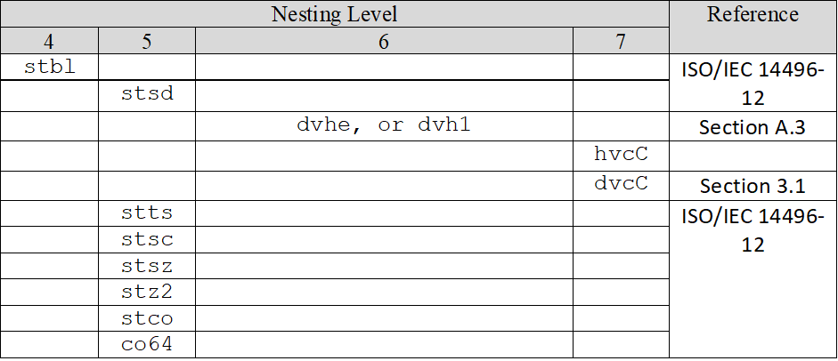
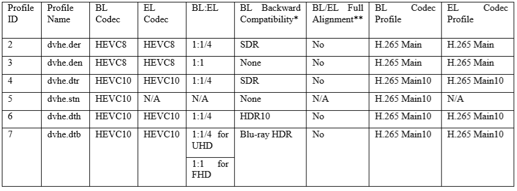
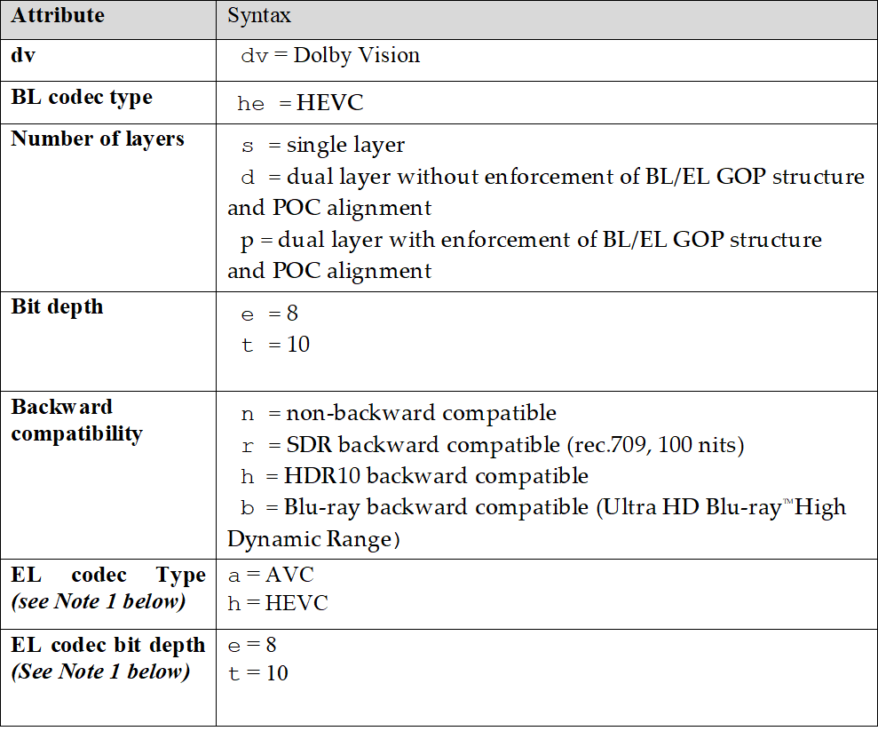
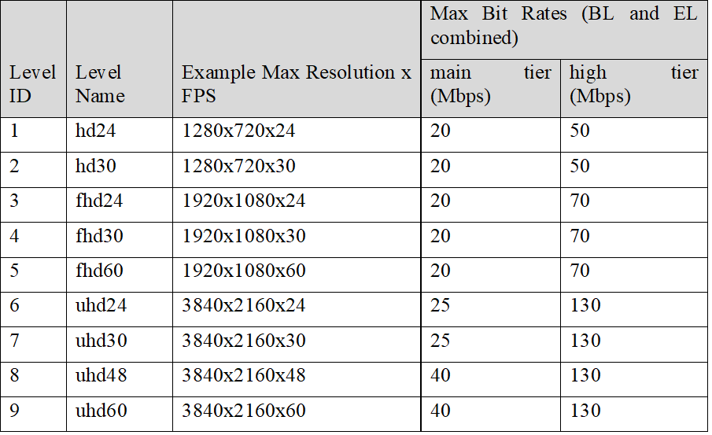
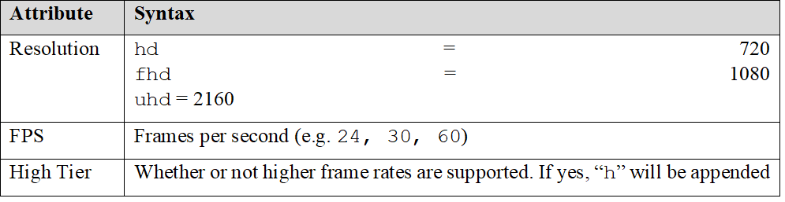
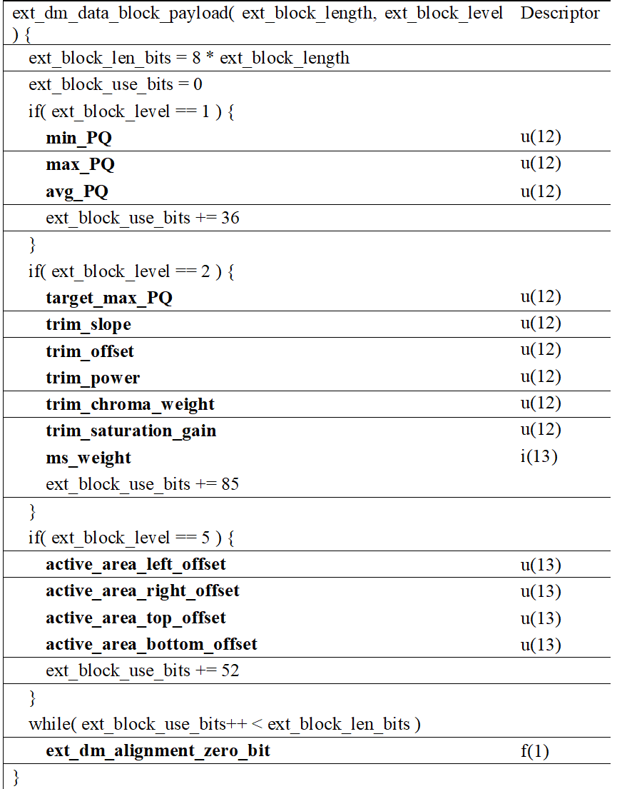
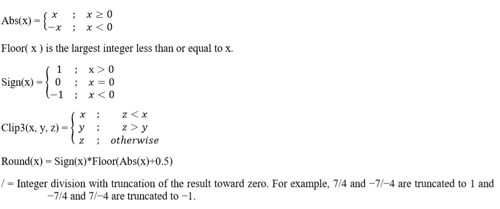
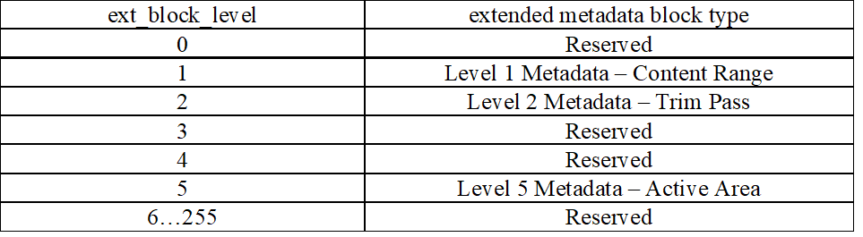
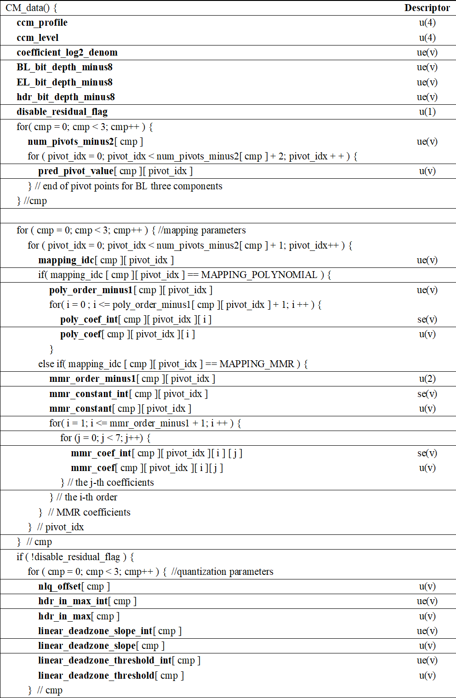

# Annex B # {#annexb}

Issue: Merge Annex B from 4.3 to live services chapter (if not already duplicated).

# Annex: Dolby Vision streams within ISO BMFF # {#annex-dolbyvision-in-isobmff}

Issue: Where is this used? Why is it an annex? Consider restructuring to improve usefulness.

This Annex defines the structures for the storage of Dolby Vision video streams in a file format compliant with the ISO base media file format (ISOBMFF). Example file formats derived from the ISOBMFF include the Digital Entertainment Content Ecosystem (DECE) Common File Format (CFF) and Protected Interoperable File Format (PIFF). Note, that the file format defined here is intended to be potentially compliant with the DECE media specifications as appropriate.

The Dolby Vision decoder configuration record provides the configuration information that is required to initialize the Dolby Vision decoder.

The Dolby Vision Configuration Box contains the following information:

```
Box Type ‘dvcC’

Container  DolbyVisionHEVCSampleEntry( ‘dvhe’), or DolbyVisionHVC1SampleEntry( ‘dvh1’), or

Mandatory Yes

Quantity Exactly One
```

The syntaxes of the Dolby Vision Configuration Box and decoder configuration record are described below.

```
align(8) class DOVIDecoderConfigurationRecord
{
    unsigned int (8) dv_version_major;
    unsigned int (8) dv_version_minor;
    unsigned int (7) dv_profile;
    unsigned int (6) dv_level;
    bit (1) dv_metadata_present_flag;
    bit (1) el_present_flag;
    bit (1) bl_present_flag;
    const unsigned int (32)[5] reserved = 0;
}

class DOVIConfigurationBox extends Box(‘dvcC’)
{
    DOVIDecoderConfigurationRecord() DOVIConfig;
}
```

The semantics of the Dolby Vision decoder configuration record is described as follows.

dv_version_major - specifies the major version number of the Dolby Vision specification that the stream complies with. A stream compliant with this specification shall have the value 1.

dv_version_minor - specifies the minor version number of the Dolby Vision specification that the stream complies with. A stream compliant with this specification shall have the value 0.

dv_profile – specifies the Dolby Vision profile. Valid values are Profile IDs as defined in Table B.1 of Signaling Dolby Vision Profiles and Levels, Annex B.

dv_level – specifies the Dolby Vision level. Valid values are Level IDs as defined in Table B.2 of Signaling Dolby Vision Profiles and Levels, Annex B.

dv_metadata_present_flag – if 1 indicates that this track contains the supplemental enhancement information as defined in clause 10.4.2.2.

el_present_flag – if 1 indicates that this track contains the EL HEVC video substream.

bl_present_flag – if 1 indicates that this track contains the BL HEVC video substream.

Note: The settings for these semantic values are specified in Section A.7.1 Constraints on EL Track.

This section describes the Dolby Vision sample entries. It is used to describe tracks that contain substreams that cannot necessarily be decoded by HEVC compliant decoders.

The Dolby Vision sample entries contain the following information:

```
Box Type 	 ‘dvhe’, ’dvh1’

Container 	Sample Description Box (‘stsd’)

Mandatory 	Yes

Quantity 		One or more sample entries of the same type may be present
```

The syntax for the Dolby Vision sample entries are described below.

```
class DolbyVisionHEVCSampleEntry() extends HEVCSampleEntry(‘dvhe’)
{
    DOVIConfigurationBox() config;
}

class DolbyVisionHVC1SampleEntry() extends HEVCSampleEntry(‘dvh1’)
{
    DOVIConfigurationBox() config;
}
```

A Dolby Vision HEVC sample entry shall contain a Dolby Vision Configuration Box as defined in C.2.2.

config - specifies the configuration information required to initialize the Dolby Vision decoder for a Dolby Vision EL track encoded in HEVC.

Compressorname in the base class VisualSampleEntry indicates the name of the compressor used, with the value “\013DOVI Coding” being recommended (\013 is 11, the length of the string “DOVI coding” in bytes).

The brand ‘dby1’ SHOULD be used in the compatible_brands field to indicate that the file is compliant with all Dolby Vision UHD Extension as outlined in this document. The major_brand shall be set to the ISO-defined brand,e.g. ‘iso6’.

A Dolby Vision video stream can be encapsulated in a single file as a dual-track file containing separate BL and EL tracks. Each track has different sample descriptions.

For the visual sample entry box in an EL track a `DolbyVisionHEVCVisualSampleEntry` (`dvhe`) or `DolbyVisionHVC1VisualSampleEntry` (`dvh1`) SHALL be used.

The visual sample entries SHALL contain an HEVC Configuration Box (`hvcC`) and a Dolby Vision Configuration Box (`dvcC`).

The EL track shall meet the following constraints:

* In the handler reference box, the handler_type field shall be set to ’vide’.
* The media information header box shall contain a video media header box.
* The dependency between the Dolby Vision base and enhancement track shall be signaled by the `tref` box in the enhancement track.. The reference_type shall be set to `vdep`.
* The dv_profile field in the Dolby Vision Configuration Box (`dvcC`) shall be set according the encoded Dolby Vision profile.
* The dv_level field in the Dolby Vision Configuration Box (`dvcC`) shall be set according the encoded Dolby Vision level.
* The dv_metadata_present_flag shall be set to 1.
* The el_present_flag shall be set to 0 or 1.
* The bl_present_flag shall be set to 0.

The following table shows the box hierarchy of the EL track.

<figure>
    
    <figcaption>Sample table box hierarchy for the EL track of a dual-track Dolby Vision file</figcaption>
</figure>

Note: This is not an exhaustive list of boxes.

For a dual-track file, the movie fragments carrying the BL and EL shall meet the following constraints:

* The adjacent movie fragments (`moof` and `mdat`) for the base and enhancement track shall be interleaved with BL followed by EL. BL and EL samples shall be placed in separate Movie Fragments and that each BL Movie Fragment shall be immediately followed by an EL movie fragment containing the same number of samples with identical composition timestamps.

The track fragment random access box (`tfra`) for the base and enhancement track shall conform to the ISO/IEC 14496-12 (section 8.8.10) and meet the following additional constraint:

* The value of the time field in the track fragment random access box indicates the presentation time of a random accessible sample. This time value shall be identical for every corresponding random accessible sample in the base and enhancement track.

# Annex: Signaling Dolby Vision profiles and levels # {#annex-dolbyvision-signaling}

Issue: Where is this used? Why is it an annex? Consider restructuring to improve usefulness.

This Annex defines the detailed list of Dolby Vision profile/levels and how to represent them in a string format. This string can be used for identifying Dolby Vision device capabilities and identifying the type of the Dolby Vision streams presented to device through various delivery mechanisms such as HTML 5.0 and MPEG-DASH.

The Dolby Vision codec provides a rich feature set to support various ecosystems such as Over the Top streaming, Broadcast television, Blu-Ray discs, and OTT streaming. The codec also supports many different device implementation types such as GPU accelerated software implementation, full-fledged hardware implementation, and hardware plus software combination. One of the Dolby Vision codec features allows choosing the type of backward compatibility such as non-backward compatible or backward compatible with SDR. A Dolby Vision capable device may not have all the features or options implemented, hence it is critical the device advertises the capabilities and content server provides accurate Dolby vision stream type information.

Following are the currently supported Dolby Vision profiles:

<figure>
    
    <figcaption>Dolby Vision profiles</figcaption>
</figure>

Legend:

: BL:EL
:: ratio of Base Layer resolution to Enhancement Layer resolution (when applicable)
: BL/EL Full alignment
:: The Enhancement Layer (EL) GOP and Sub-GOP structures are fully aligned with Base Layer (BL), i.e. the BL/EL IDRs are aligned, BL/EL frames are fully aligned in decode order such that skipping or seeking is possible anywhere in the stream not only limited to IDR. BL AU and EL AU belonging to the same picture shall have the same POC (picture order count)

Encoder Recommendations

* Dolby Vision Encoders should only use baseline profile composer for profiles which are non-backward compatible, i.e. the BL Backward Compatibility = None.
* Encoders producing Dolby Vision dual layer streams should generate BL/EL with full GOP/Sub-GOP structure alignment for all the profiles listed in Table 4.

The following is the profile string naming convention: `dv[BL codec type].[number of layers][bit depth][backward compatibility] [EL codec type][EL codec bit depth]`

<figure>
    
    <figcaption>Components of a Dolby Vision `@codecs` string.</figcaption>
</figure>

Notes:

1. `[EL codec type]` and `[EL codec bit depth]` shall only be present if the EL codec type is different from the BL codec.
1. Interlaced: There is no support for interlaced video at this time.
1. Codecs other than HEVC or AVC may be supported in future.

The Dolby Vision level indicates the maximum frame rate and resolution supported by the device for a given profile. Typically there is a limit on the maximum number of pixels the device can process per second in a given profile; the level indicates the maximum pixels and the maximum bitrate supported in that profile. Since maximum pixels per second is a constant for given level, the resolution can be reduced to get higher frame rate and vice versa. Following are the possible levels:

<figure>
    
    <figcaption>Dolby Vision levels.</figcaption>
</figure>

The following is the level string naming convention: `[resolution][fps][high tier]`

<figure>
    
    <figcaption>Components of a Dolby Vision level string.</figcaption>
</figure>

The profile and level string is recommended to be joined in the following manner:
Format: `[Profile String].[Level String]`

Examples

: `dvav.per.fhd30`
:: dual layer avc 8 bit with enforcement of BL/EL GOP Structure and POC alignment, rec709 backwards compatible, 1920x1080@30fps
: `dvhe.stn.uhd30`
:: single layer hevc 10 bit non-backwards compatible, 3840x2160@30fps

The device capabilities can be expressed in many ways depending on the protocol used by the streaming service or VOD service. The device could maintain a list of supported capabilities in an array:

```
String capabilities [] = {“dvhe.dtr.uhd24”, “dvhe.stn.uhd30”}
```

After receiving the manifest the Player could iterate over the stream types and check whether a stream type is supported by searching the `capabilities[]`.

When using HTTP, the device could send the capabilities via the user agent string in HTTP request in following manner:

```
Opera/9.80 (Linux armv71) Presto/2.12.407 Version/12.51 Model-UHD+dvhe.dtr.uhd24+dvhe.stn.uhd30/1.0.0 (Manufacturer name, Model)
```

A server program can search for `+dv` to determine whether Dolby Vision is supported and further identify the profiles and level supported by parsing the characters following the `+dv`. Multiple profiles/level pairs can be listed with `+` beginning each profile/level pair.

# Annex: Display management message # {#annex-display-management}

Issue: Where is this used? Why is it an annex? Consider restructuring to improve usefulness.

A display management (DM) message contains metadata in order to provide dynamic information about the colour volume of the video signal. This metadata can be employed by the display to adapt the delivered HDR imagery to the capability of the display device. The information conveyed in this message is intended to be adequate for purposes corresponding to the use of Society of Motion Picture and Television Engineers ST 2094-1 and ST 2094-10.

The syntax and semantics for `DM_data()` are defined in clause C.2.

<figure>
    
    <figcaption>`DM_data()`</figcaption>
</figure>

<figure>
    
    <figcaption>`ext_dm_data_block()`</figcaption>
</figure>

<figure>
    
    <figcaption>`ext_dm_data_block_payload()`</figcaption>
</figure>

This clause defines the semantics for DM_data().

For the purposes of the present clause, the following mathematical functions apply:



: app_identifier
:: identifies an application in the ST 2094 suite.
: app_version
:: specifies the application version in the application in the ST 2094 suite.
: metadata_refresh_flag
:: when set equal to 1 cancels the persistence of any previous extended display mapping metadata in output order and indicates that extended display mapping metadata follows. The extended display mapping metadata persists from the coded picture to which the SEI message containing DM_data() is associated (inclusive) to the coded picture to which the next SEI message containing DM_data() and with metadata_refresh_flag set equal to 1 in output order is associated (exclusive) or (otherwise) to the last picture in the coded video seqeunce (inclusive). When set equal to 0 this flag indicates that the extended display mapping metadata does not follow.
: num_ext_blocks
:: specifies the number of extended display mapping metadata blocks. The value shall be in the range of 1 to 254, inclusive.
: dm_alignment_zero_bit
:: shall be equal to 0
: ext_block_length[ i ]
:: is used to derive the size of the i-th extended display mapping metadata block payload in bytes. The value shall be in the range of 0 to 1023, inclusive.
: ext_block_level[ i ]
:: specifies the level of payload contained in the i-th extended display mapping metadata block. The value shall be in the range of 0 to 255, inclusive. The corresponding extended display mapping metadata block types are defined in Table E.1.4. Values of ext_block_level[ i ] that are ATSC reserved shall not be present in the bitstreams conforming to this version of ATSC specification. Blocks using ATSC reserved values shall be ignored.

When the value of ext_block_level[ i ] is set equal to 1, the value of ext_block_length[ i ] shall be set equal to 5.

When the value of ext_block_level[ i ] is set equal to 2, the value of ext_block_length[ i ] shall be set equal to 11.

When the value of ext_block_level[ i ] is set equal to 5, the value of ext_block_length[ i ] shall be set equal to 7.

<figure>
    
    <figcaption>Definition of extended display mapping metadata block type.</figcaption>
</figure>

When an extended display mapping metadata block with ext_block_level equal to 5 is present, the following constraints shall apply:

* An extended display mapping metadata block with ext_block_level equal to 5 shall be preceded by at least one extended display mapping metadata block with ext_block_level equal to 1 or 2.
* Between any two extended display mapping metadata blocks with ext_block_level equal to 5, there shall be at least one extended display mapping metadata block with ext_block_level equal to 1 or 2.
* No extended display mapping metadata block with ext_block_level equal to 1 or 2 shall be present after the last extended display mapping metadata block with ext_block_level equal to 5
* The metadata of an extended display mapping metadata block with ext_block_level equal to 1 or 2 shall be applied to the active area specified by the first extended display mapping metadata block with ext_block_level equal to 5 following this block.

When the active area defined by the current extended display mapping metadata block with ext_block_level equal to 5 overlaps with the active area defined by preceding extended display mapping metadata blocks with ext_block_level equal to 5, all metadata of the extended display mapping metadata blocks with ext_block_level  equal to 1 or 2 associated with the current extended display mapping metadata block with ext_block_level equal to 5 shall be applied to the pixel values of the overlapping area.

**min_PQ** specifies the minimum luminance value of the current picture in 12-bit PQ encoding. The value shall be in the range of 0 to 4095, inclusive. Note that the 12-bit min_PQ value with full range is calculated as follows:

```
min_PQ = Clip3(0, 4095, Round(Min * 4095))
```

where Min is MinimumPqencodedMaxrgb as defined in clause 6.1.3 of SMPTE ST 2094-10.

**max_PQ** specifies the maximum luminance value of current picture in 12-bit PQ encoding.  The value shall be in the range of 0 to 4095, inclusive. Note that the 12-bit max_PQ value with full range is calculated as follows:

```
max_PQ = Clip3(0, 4095, Round(Max * 4095))
```

where Max is MaximumPqencodedMaxrgb as defined in clause 6.1.5 of SMPTE ST 2094-10.

**avg_PQ** specifies the midpoint luminance value of current picture in 12-bit PQ encoding. The value shall be in the range of 0 to 4095, inclusive. Note that the 12-bit avg_PQ value with full range is calculated as follows:

```
avg_PQ = Clip3(0, 4095, Round(Avg * 4095))
```

where Avg is AveragePqencodedMaxrgb as defined in section 6.1.4 of SMPTE ST 2094-10.

**target_max_PQ** specifies the maximum luminance value of a target display in 12-bit PQ encoding. The value shall be in the range of 0 to 4095, inclusive. The target_max_PQ is the PQ encoded value of TargetedSystemDisplayMaximumLuminance as defined in clause 10.4 of SMPTE ST 2094-1.

If there is more than one extended display mapping metadata block with ext_block_level equal to 2, those blocks shall have no duplicated target_max_PQ.

**trim_slope** specifies the slope metadata. The value shall be in the range of 0 to 4095, inclusive. If trim_slope is not present, it shall be inferred to be 2048. Note that the 12-bit slope value is calculated as follows:

```
𝑡𝑟𝑖𝑚_𝑠𝑙𝑜𝑝𝑒 = Clip3(0, 4095, Round((𝑆-0.5) * 4096))
```

where S is the ToneMappingGain as defined in clause 6.2.3 of SMPTE ST 2094-10.

**trim_offset** specifies the offset metadata. The value shall be in the range of 0 to 4095, inclusive. If trim_offset is not present, it shall be inferred to be 2048. Note that the 12-bit offset value is calculated as follows:

```
𝑡𝑟𝑖𝑚_𝑜𝑓𝑓𝑠𝑒𝑡 = Clip3(0, 4095, Round((𝑂+0.5) * 4096))
```

where O is the ToneMappingOffset as defined in clause 6.2.2 of SMPTE ST 2094-10.

**trim_power** specifies the power metadata. The value shall be in the range of 0 to 4095, inclusive. If trim_power is not present, it shall be inferred to be 2048. Note that the 12-bit power value is calculated as follows:

```
𝑡𝑟𝑖𝑚_𝑝𝑜𝑤𝑒𝑟 = Clip3(0, 4095, Round((𝑃-0.5) * 4096))
```

where P is the ToneMappingGamma as defined in clause 6.2.4 of SMPTE ST 2094-10.

**trim_chroma_weight** specifies the chroma weight metadata. The value shall be in the range of 0 to 4095, inclusive. If trim_chroma_weight is not present, it shall be inferred to be 2048. Note that the 12-bit chroma weight value is calculated as follows:

```
𝑡𝑟𝑖𝑚_𝑐ℎ𝑟𝑜ma_𝑤𝑒𝑖𝑔ℎ𝑡 = Clip3(0, 4095, Round((𝐶𝑊+0.5) * 4096))
```

where CW is the ChromaCompensationWeight as defined in clause 6.3.1 of SMPTE ST 2094-10.

**trim_saturation_gain** specifies the saturation gain metadata. The value shall be in the range of 0 to 4095, inclusive. If trim_saturation_gain is not present, it shall be inferred to be 2048. Note that the 12-bit saturation gain value is calculated as follows:

```
𝑡𝑟𝑖𝑚_𝑠𝑎𝑡𝑢𝑟𝑎𝑡𝑖𝑜𝑛_𝑔𝑎𝑖𝑛 = Clip3(0, 4095, Round((𝑆𝐺+0.5) * 4096))
```

where SG is the SaturationGain as defined in clause 6.3.2 of SMPTE ST 2094-10.

**ms_weight** specifies the multiscale weight metadata. The value shall be in the range of -1 to 4095, inclusive. If ms_weight is not present, it shall be inferred to be 2048. Where ms_weight is equal to -1, the bit stream indicates ms_weight is unspecified. The 13-bit multiscale weight value is calculated as follows:

```
𝑚𝑠_𝑤𝑒𝑖𝑔ℎ𝑡 = -1 OR Clip3(0, 4095, Round(𝑀S * 4096))
```

where MS is the ToneDetailFactor as defined in clause 6.4.2 of SMPTE ST 2094-10.

**active_area_left_offset**, **active_area_right_offset**, **active_area_top_offset**, **active_area_bottom_offset** specify the active area of current picture, in terms of a rectangular region specified in picture coordinates for active area.  The values shall be in the range of 0 to 8191, inclusive. See also UpperLeftCorner and LowerRightCorner definitions in ST 2094-1.

If active_area_left_offset, active_area_right_offset, active_area_top_offset, active_area_bottom_offset are not present, they shall be inferred to be 0.

The coordinates of top left active pixel is derived as follows:

<figure>
X<sub>top_left</sub> = active_area_left_offset

Y<sub>top_left</sub> = active_area_top_offset
</figure>

The coordinates of top left active pixel are defined as the UpperLeftCorner in clause 9.2 of SMPTE ST.2094-1.

With Xsize is the horizontal resolution of the current picture and Ysize is the vertical resolution of current picture, the coordinates of bottom right active pixel are derived as follows:

<figure>
X<sub>bottom_right</sub> = XSize - 1 - active_area_right_offset

Y<sub>bottom_right</sub> = YSize - 1 - active_area_bottom_offset
</figure>

where X<sub>bottom_right</sub> greater than X<sub>top_left</sub> and Y<sub>bottom_right</sub> greater than Y<sub>top_left</sub>.

The coordinates of bottom right active pixel are defined as the LowerRightCorner in clause 9.3 of SMPTE ST.2094-1.

**ext_dm_alignment_zero_bit** shall be equal to 0.

# Annex: Composing metadata message # {#annex-composing-metadata}

Issue: Where is this used? Why is it an annex? Consider restructuring to improve usefulness.

A composing metadata (CM) message contains the metadata which is needed to apply the post-processing process as described in the ETSI ETCCM specification to recreate the HDR UHDTV pictures.

The syntax for CM_data() is shown in table D.1. The number of bits “v” used to represent each of the syntax elements of CM_data(), for which the parsing process is specified by the descriptor u(v), is defined in table D.2.

<figure>
    
    <figcaption>`CM_data()`</figcaption>
</figure>

<figure>
    
    <figcaption>Specification of number of bits "v" for CM_data() syntax elements with descriptor u(v)</figcaption>
</figure>

The definitions of the header parameter values are contained in ETCCM, Section 5.3.2, “CM Header Parameter Definitions”.

The definitions of the mapping parameter values are contained in ETCCM, Section 5.3.3, “CM Mapping Parameter Definitions”.

Parameter `cm_alignment_zero_bit` shall be equal to 0.

# Annex: Sample Dual-layer MPD # {#annex-dual-layer-mpd}

Issue: Where is this used? Why is it an annex? Consider restructuring to improve usefulness.

Below is an example dual-layer MPD, with dual adaptation sets – both a Base layer and an Enhancement Layer.  Items of note are highlighted:

<xmp highlight="xml">
<Period>
    <!-- Video -->
    <AdaptationSet subsegmentAlignment="true"  subsegmentStartsWithSAP="1" frameRate="24000/1001">
      <Representation mimeType="video/mp4" codecs=" hvc1.2.100000000.L150.B0" id="base-layer"
          bandwidth="14156144" width="3840" height="2160">
        <BaseURL>BL_dual_track_BC.mp4</BaseURL>
        <SegmentBase indexRange="795-1210">
         <Initialization range="0-794"/>
        </SegmentBase>
      </Representation>
      <Representation mimeType="video/mp4" codecs="dvhe.dtr" id="enhancement-layer"
          	dependencyId="base-layer" bandwidth="3466528" width="1920" height="1080">
        <BaseURL>EL_dual_track_BC.mp4</BaseURL>
        <SegmentBase indexRange="704-1119">
         <Initialization range="0-703"/>
        </SegmentBase>
      </Representation>
    </AdaptationSet>
    <!-- Audio -->
    <AdaptationSet mimeType="audio/mp4" codecs="ec-3" lang="und"
        subsegmentAlignment="true" subsegmentStartsWithSAP="1">
      <Representation id="2" bandwidth="192000">
        <AudioChannelConfiguration
          schemeIdUri="tag:dolby.com,2014:dash:audio_channel_configuration:2011" value="F801"/>
        <BaseURL>audio.mp4</BaseURL>
        <SegmentBase indexRange="652-875">
         <Initialization range="0-651"/>
        </SegmentBase>
      </Representation>
    </AdaptationSet>
  </Period>
</MPD>
</xmp>