# Document editing notes # {#introduction-editing}

Documentation: https://dashif.org/DocumentAuthoring/

Example document repository: https://dashif.org/DocumentAuthoring/

Live discussion in #document-authoring on Slack.

# Chapter 1 # {#chapter1-the-real-intro}

Placeholder text. This document will eventually contain IOP v5.

# Timing and addressing # {#timing}

This chapter describes an interoperable view of DASH presentation timing and segment addressing. This interpretation is considerably narrower than afforded by [[MPEGDASH]], constraining services to a specific set of reasonably flexible behaviors that are highly interoperable with modern client platforms. Services conforming to this document SHALL use this timing model.

The presentation manifest or MPD defines the <dfn>MPD timeline</dfn> which serves as the baseline for all scheduling decisions made during DASH presentation playback.

The playback of a static MPD SHALL NOT depend on the mapping of the MPD timeline to real time. A client MAY play any part of the presentation at any time.

The MPD timeline of a dynamic MPD SHALL have a fixed mapping to real time, with each point on the timeline corresponding to a point in real time. Clients MAY introduce an additional offset with respect to real time [[#timing-timeshift|to the extent allowed by the time shift signaling in the MPD]].

Note: In addition to mapping the content to real time, [[#timing-mpd-updates|a dynamic MPD can be updated during the presentation]]. Updates may add new periods and remove or modify existing ones, though some restrictions apply. See [[#timing-mpd-updates]].

The zero point in the MPD timeline of a dynamic MPD SHALL be mapped to the point in real time indicated by `MPD@availabilityStartTime`. This value SHALL NOT change between MPD updates.

The ultimate purpose of the MPD is to enable the client to obtain media samples for playback. The following data structures are most relevant to locating and scheduling the samples:

1. The MPD consists of consecutive [=periods=] which map data onto the MPD timeline.
1. Each period contains of one or more [=representations=], each of which provides media samples inside a sequence of [=media segments=].
1. Representations within a period are grouped in [=adaptation sets=], which associate related representations and decorate them with metadata.

<figure>
	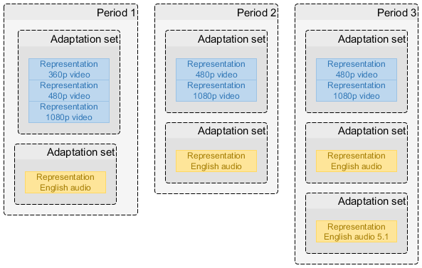
	<figcaption>The primary elements described by an MPD.</figcaption>
</figure>

The chapters below explore these relationships in detail.

## Periods ## {#timing-period}

An MPD SHALL define an ordered list of one or more consecutive <dfn title="period">periods</dfn>. A period is both a time span on the [=MPD timeline=] and a definition of the data to be presented during the period. Period timing is relative to the zero point of the [=MPD timeline=].

<figure>
	
	<figcaption>An MPD is a collection of consecutive periods.</figcaption>
</figure>

Common reasons for defining multiple periods are:

* Assembling a presentation from multiple self-contained pieces of content.
* Inserting ads in the middle of existing content and/or replacing spans of existing content with ads.
* Adding/removing certain representations as the nature of the content changes (e.g. a new title starts with a different set of offered languages).
* Updating period-scoped metadata (e.g. codec configuration or DRM signaling).

Periods are self-contained - a service SHALL NOT require a client to know the contents of another period in order to correctly present a period. Knowledge of the contents of different periods MAY be used by a client to achieve seamless period transitions, especially when working with [[#timing-connectivity|period-connected representations]].

All periods SHALL be consecutive and non-overlapping. A period MAY have a duration of zero.

Note: A period with a duration of zero might, for example, be the result of ad-insertion logic deciding not to insert any ad.

The below MPD example consists of two 20-second periods. The duration of the first period is calculated using the start point of the second period. The total duration is also listed, as it is required for static MPDs.

<xmp highlight="xml">
<MPD xmlns="urn:mpeg:dash:schema:mpd:2011" type="static" mediaPresentationDuration="PT40S">
	<Period>
		...
	</Period>
	<Period start="PT20S" duration="PT20S">
		...
	</Period>
</MPD>
</xmp>

Parts of the MPD structure that are not relevant for this chapter have been omitted - this is not a fully functional MPD file.

In a static MPD, the first period SHALL start at the zero point of the [=MPD timeline=]. In a dynamic MPD, the first period SHALL start at or after the zero point of the [=MPD timeline=].

In a static MPD, the last period SHALL have a `Period@duration`. In a dynamic MPD, the last period MAY have a `Period@duration`, in which case it is considered to have a fixed duration. If without `Period@duration`, the last period in a dynamic MPD SHALL be considered to have an unlimited duration.

Note: In a dynamic MPD, a period with an unlimited duration may be converted to fixed-duration by an MPD update. Periods in a dynamic MPD may also be shortened or removed entirely under certain conditions. See [[#timing-mpd-updates]].

`MPD@mediaPresentationDuration` MAY be present. If present, it SHALL accurately match the duration between the zero point on the MPD timeline and the end of the last period. Clients SHALL calculate the total duration of a static MPD by adding up the durations of each [=period=] and SHALL NOT rely on the presence of `MPD@mediaPresentationDuration`.

Note: This calculation is necessary because the durations of xlink periods can only be known after the xlink is resolved. Therefore it is impossible to always determine the total MPD duration on the service side as only the client is guaranteed to have access to all the required knowledge.

## Representations ## {#timing-representation}

A <dfn>representation</dfn> is a sequence of <dfn>segment references</dfn> and a description of the samples within the referenced [=media segments=]. Each representation belongs to exactly one [=adaptation set=] and to exactly one [=period=], although [[#timing-connectivity|a representation may be connected with a representation in another period]].

Each segment reference addresses a [=media segment=] that corresponds to a specific time span on the [=sample timeline=]. Each [=media segment=] contains samples for a specific time span on the [=sample timeline=].

Note: [=Simple addressing=] allows the actual time span of samples within a [=media segment=] to deviate from the nominal time span described in the MPD. All timing-related clauses in this document refer to the nominal timing described in the MPD unless otherwise noted.

The exact mechanism used to define segment references depends on the [=addressing mode=] used by the representation. All representations in the same [=adaptation set=] SHALL use the same [=addressing mode=].

In a static MPD, a representation SHALL contain enough [=segment references=] to cover the entire time span of the [=period=].

<figure>
	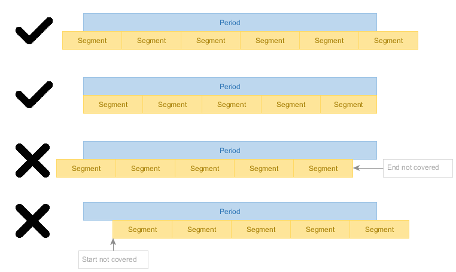
	<figcaption>In a static MPD, the entire period must be covered with [=media segments=].</figcaption>
</figure>

In a dynamic MPD, a representation SHALL contain enough segment references to cover the time span of the [=period=] that intersects with the [=time shift window=].

Note: [=Media segments=] only become [=available=] when their end point is within the [=availability window=]. It is a valid situation that a [=media segment=] is required to be referenced but is not yet [=available=].

<figure>
	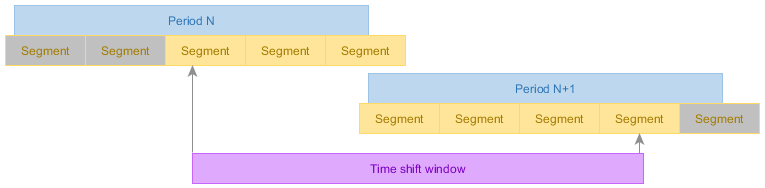
	<figcaption>In a dynamic MPD, the [=time shift window=] determines the set of required segment references in each representation. [=Media segments=] filled with gray need not be referenced due to falling outside the [=time shift window=], despite falling within the bounds of a [=period=].</figcaption>
</figure>

Advisement: A dynamic MPD must remain valid for its entire validity duration after publishing. In other words, a dynamic MPD SHALL supply enough segment references to allow the [=time shift window=] to extend to `now + MPD@minimumUpdatePeriod`.

An unnecessary segment reference is one that is not defined as required by this chapter.

In a static MPD, a representation SHALL NOT contain unnecessary segment references, except when using [=indexed addressing=] in which case such segment references MAY be present.

In a dynamic MPD, a representation SHALL NOT contain unnecessary segment references, except when any of the following applies to a segment reference:

1. The segment reference is for future content and will eventually become necessary.
1. The segment reference is defined via [=indexed addressing=].
1. Removal of the segment reference is not allowed by [[#timing-mpd-updates-remove-content|content removal constraints]].

There SHALL NOT be gaps or overlapping [=media segments=] in a representation.

Clients SHALL NOT present any samples from [=media segments=] that are entirely outside the [=period=], even if such [=media segments=] are referenced.

<figure>
	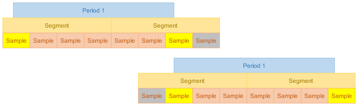
	<figcaption>[=Media segments=] and samples need not align with [=period=] boundaries. Some samples may be entirely outside a [=period=] (marked gray) and some may overlap the [=period=] boundary (yellow).</figcaption>
</figure>

[=Media segment=] start/end points MAY be unaligned with [=period=] start/end points except when using [=simple addressing=], which requires the first [=media segment=] start point to match the [=period=] start point.

Note: Despite constraints on first [=media segment=] alignment, [=simple addressing=] allows the media samples within the first [=media segment=] to be unaligned with the [=period=] start point, allowing for synchronization of different reprensetations.

If a [=media segment=] overlaps a [=period=] boundary, clients SHOULD NOT present the samples that lie outside the [=period=] and SHOULD present the samples that lie either partially or entirely within the [=period=].

Note: In the end, which samples are presented is entirely up to the client. It may sometimes be impractical to present [=media segments=] only partially, depending on the capabilties of the client platform, the type of media samples involved and any dependencies between samples.

## Sample timeline ## {#timing-sampletimeline}

<figure>
	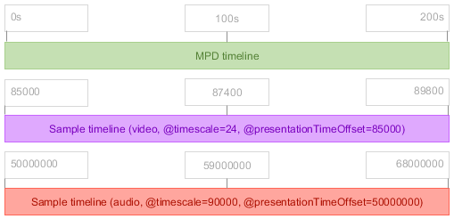
	<figcaption>Sample timelines are mapped onto the [=MPD timeline=] based on parameters defined in the MPD.</figcaption>
</figure>

The samples within a [=representation=] exist on a linear <dfn>sample timeline</dfn> defined by the encoder that created the samples. One or more sample timelines are mapped onto the [=MPD timeline=] by metadata stored in or referenced by the MPD.

Note: A sample timeline is linear - encoders are expected to use an appropriate timescale and sufficiently large timestamp fields to avoid any wrap-around. If wrap-around does occur, a new [=period=] must be started in order to establish a new sample timeline.

The sample timeline is formed after applying any [[!ISOBMFF]] edit lists.

A sample timeline SHALL be shared by all [=representations=] in the same [=adaptation set=]. [=Representations=] in different [=adaptation sets=] MAY use different sample timelines.

The sample timeline is measured in <dfn>timescale units</dfn> defined as a number of units per second. This value SHALL be present in the MPD as `SegmentTemplate@timescale` or `SegmentBase@timescale` (depending on the [=addressing mode=]).

Note: While optional in [[!MPEGDASH]], the presence of the `@timescale` attribute is required by the interoperable timing model because the default value of 1 is unlikely to match any real-world content and is far more likely to indicate an unintentional content authoring error.

<figure>
	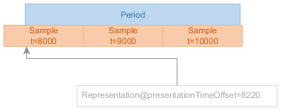
	<figcaption>`@presentationTimeOffset` is the key component in establishing the relationship between the [=MPD timeline=] and a sample timeline.</figcaption>
</figure>

The point on the sample timeline indicated by `@presentationTimeOffset` SHALL be equivalent to the [=period=] start point on the [=MPD timeline=]. The value is provided by `SegmentTemplate@presentationTimeOffset` or `SegmentBase@presentationTimeOffset`, depending on the [=addressing mode=], and has a default value of 0 timescale units.

Note: To transform a sample timeline position `SampleTime` to an [=MPD timeline=] position, use the formula `MpdTime = Period@start + (SampleTime - @presentationTimeOffset) / @timescale`.

`@presentationTimeOffset` SHALL NOT change between updates of a dynamic MPD.

## Media segments ## {#timing-mediasegment}

A <dfn>media segment</dfn> is an HTTP-addressable data structure that contains one or more media samples.

[=Media segments=] SHALL contain one or more consecutive media samples. Consecutive [=media segments=] in the same [=representation=] SHALL contain consecutive media samples.

[=Media segments=] SHALL contain the media samples that exactly match the time span on the [=sample timeline=] that is assigned to the [=media segment=] by the MPD, except when using [=simple addressing=] in which case a certain amount of inaccuracy MAY be present as defined in [[#timing-addressing-inaccuracy]].

Advisement: Even when using [=simple addressing=], the [=media segment=] that starts at or overlaps the [=period=] start point SHALL contain a media sample that starts at or overlaps the [=period=] start point and the [=media segment=] that ends at or overlaps the [=period=] end point SHALL contain a media sample that ends at or overlaps the [=period=] end point.

## Segment addressing modes ## {#timing-addressing}

This section defines the <dfn title="addressing mode">addressing modes</dfn> that can be used for referencing [=media segments=] and [=initialization segments=] in interopreable DASH presentations.

Addressing modes not defined in this chapter SHALL NOT be used by DASH services. Clients SHOULD support all addressing modes defined in this chapter.

You SHOULD choose the addressing mode based on the nature of the content:

<dl class="switch">

: Content generated on the fly
:: Use [=explicit addressing=].

: Content generated in advance of publishing
:: Use [=explicit addressing=] or [=indexed addressing=].

</dl>

A service MAY use [=simple addressing=] which enables the packager logic to be very simple. This simplicity comes at a cost of reduced applicability to multi-period scenarios and reduced client compatibility.

All [=representations=] in the same [=adaptation set=] SHALL use the same addressing mode. [=Representations=] in different [=adaptation sets=] MAY use different addressing modes. [[#timing-connectivity|Period-connected representations]] SHALL use the same addressing mode in every [=period=].

### Indexed addressing ### {#timing-addressing-indexed}

A representation that uses <dfn>indexed addressing</dfn> consists of an [[!ISOBMFF]] track file containing an index segment, an [=initialization segment=] and a sequence of [=media segments=].

Clauses in section only apply to [=representations=] that use indexed addressing.

Note: [[MPEGDASH]] makes a distinction between "segment" (HTTP-addressable entity) and "subsegment" (byte range of an HTTP-addressable entity). This document does not make such a distinction and has no concept of subsegments.

<figure>
	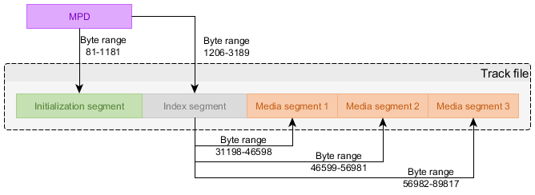
	<figcaption>Indexed addressing is based on an index segment that references all [=media segments=].</figcaption>
</figure>

The MPD defines the byte range of the track file that contains the index segment. The index segment informs the client of all the [=media segments=] that exist, the time spans they cover on the [=sample timeline=] and their byte ranges.

Multiple representations SHALL NOT be stored in the same track file.

At least one `Representation/BaseURL` element SHALL be present in the MPD and SHALL contain a reference to the track file. See [[#timing-urls-and-http]] for details on URL handling.

The `SegmentBase@indexRange` attribute SHALL be present in the MPD and SHALL reference the byte range of the segment index in the track file. The value SHALL be formatted as a `byte-range-spec` as defined in [[!RFC7233]], referencing a single range of bytes.

The `SegmentBase@timescale` attribute SHALL be present and its value SHALL match the value of the `timescale` field in the index segment.

The `AdaptationSet@subsegmentStartsWithSAP` attribute SHALL be present in the MPD and SHALL have a value of `1` or `2`, depending on the sample structure of the [=media segments=].

Issue: We need to clarify how to determine the right value. [#235](https://github.com/Dash-Industry-Forum/DASH-IF-IOP/issues/235)

The `SegmentBase/Initialization@range` attribute SHALL reference the byte range of the [=initialization segment=] in the track file. The value SHALL be formatted as a `byte-range-spec` as defined in [[!RFC7233]], referencing a single range of bytes. The `Initialization@sourceURL` attribute SHALL NOT be used.

Below is an example of common usage of the indexed addressing mode.

The example defines a timescale of 48000 units per second, with the period starting at position 8100 (or 0.16875 seconds) on the [=sample timeline=]. The client can use the index segment referenced by `indexRange` to determine where the [=media segment=] containing position 8100 (and all other [=media segments=]) can be found. The byte range of the [=initialization segment=] is also referenced.

<xmp highlight="xml">
<MPD xmlns="urn:mpeg:dash:schema:mpd:2011">
	<Period>
		<AdaptationSet subsegmentStartsWithSAP="1">
			<Representation>
				<BaseURL>showreel_audio_dashinit.mp4</BaseURL>
				<SegmentBase timescale="48000" presentationTimeOffset="8100" indexRange="848-999">
					<Initialization range="0-847"/>
				</SegmentBase>
			</Representation>
		</AdaptationSet>
	</Period>
</MPD>
</xmp>

Parts of the MPD structure that are not relevant for this chapter have been omitted - this is not a fully functional MPD file.

#### Structure of the index segment #### {#timing-addressing-indexed-indexstructure}

The index segment SHALL consist of a single Segment Index Box (`sidx`) as defined by [[!ISOBMFF]]. The field layout is as follows:

<xmp>
aligned(8) class SegmentIndexBox extends FullBox('sidx', version, 0) {
	unsigned int(32) reference_ID;
	unsigned int(32) timescale;

	if (version==0) {
		unsigned int(32) earliest_presentation_time;
		unsigned int(32) first_offset;
	}
	else {
		unsigned int(64) earliest_presentation_time;
		unsigned int(64) first_offset;
	}

	unsigned int(16) reserved = 0;
	unsigned int(16) reference_count;

	for (i = 1; i <= reference_count; i++)
	{
		bit (1)              reference_type;
		unsigned int(31)     referenced_size;
		unsigned int(32)     subsegment_duration;
		bit(1)               starts_with_SAP;
		unsigned int(3)      SAP_type;
		unsigned int(28)     SAP_delta_time;
	}
}
</xmp>

The values of the fields SHALL be as follows:

: `reference_ID`
:: The `track_ID` of the track that contains the data of this [=representation=].

: `timescale`
:: Same as the `timescale` field of the Media Header Box and same as the `SegmentBase@timescale` attribute in the MPD.

: `earliest_presentation_time`
:: The start timestamp of the first [=media segment=] on the [=sample timeline=], in [=timescale units=].

: `first_offset`
:: Distance from the anchor point to the first [=media segment=].

: `reference_count`
:: Total number of [=media segments=] referenced by the index segment.

: `reference_type`
:: `0`

: `referenced_size`
:: Size of the [=media segment=] in bytes. [=Media segments=] are assumed to be consecutive, so this is also the distance to the start of the next [=media segment=].

: `subsegment_duration`
:: Duration of the [=media segment=] in [=timescale units=].

: `starts_with_SAP`
:: `1`

: `SAP_type`
:: Either `1` or `2`, depending on the sample structure in the [=media segment=].

: `SAP_delta_time`
:: `0`

#### Moving the period start point (indexed addressing) #### {#timing-addressing-indexed-startpoint}

When splitting periods in two or performing other types of editorial timing adjustments, a service might want to start a period at a point after the "natural" start point of the [=representations=] within.

For [=representations=] that use [=indexed addressing=], perform the following adjustments to set a new [=period=] start point:

1. Update `SegmentBase@presentationTimeOffset` to indicate the desired start point on the [=sample timeline=].
1. Update `Period@duration` to match the new duration.

### Explicit addressing ### {#timing-addressing-explicit}

A representation that uses <dfn>explicit addressing</dfn> consists of a set of [=media segments=] accessed via URLs constructed using a template defined in the MPD, with the exact time span covered by each [=media segment=] described in the MPD.

Clauses in section only apply to [=representations=] that use explicit addressing.

<figure>
	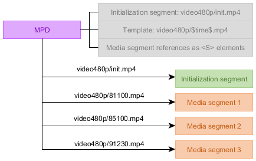
	<figcaption>Explicit addressing uses a segment template that is combined with explicitly defined time spans for each [=media segment=] in order to reference [=media segments=].</figcaption>
</figure>

The MPD SHALL contain a `SegmentTemplate/SegmentTimeline` element that contains a set of [=segment references=] which satisfies the requirements defined in this document. The references exist as a sequence of `S` elements, each of which references one or more [=media segments=] with start time `S@t` and duration `S@d` in `SegmentTemplate@timescale` units on the [=sample timeline=]. The `SegmentTemplate@duration` attribute SHALL NOT be present.

To enable concise reference definitions, an `S` element may be a repeating [=segment reference=] that indicates a number of repeated consecutive [=media segments=] with the same duration. The value of `S@r` SHALL indicate the number of additional consecutive [=media segments=] that exist.

Note: Only additional references are counted, so `S@r=5` indicates a total of 6 consecutive [=media segments=] with the same duration.

The start time of a [=media segment=] SHALL be calculated from the start time and duration of the previous [=media segment=] if not specified by `S@t`. There SHALL NOT be any gaps or overlap between [=media segments=].

The value of `S@r` SHALL be nonnegative, except for the last `S` element which MAY have a negative value in `S@r`, indicating that the repeated references continue indefinitely up to a [=media segment=] that either ends at or overlaps the period end point.

[[#timing-mpd-updates|Updates to a dynamic MPD]] MAY add more `S` elements, remove expired `S` elements, add the `S@t` attribute to the first `S` element or increase the value of `S@r` on the last `S` element but SHALL NOT otherwise modify existing `S` elements.

The `SegmentTemplate@media` attribute SHALL contain the URL template for referencing [=media segments=], using the `$Time$` template variable to unique identify [=media segments=]. The `SegmentTemplate@initialization` attribute SHALL contain the URL template for referencing [=initialization segments=]. URL construction rules are defined in [[#timing-urls-and-http]].

Below is an example of common usage of the explicit addressing mode.

The example defines 225 [=media segments=] starting at position 900 on the [=sample timeline=] and lasting for a total of 900.225 seconds. The period ends at 900 seconds, so the last 0.225 seconds of content is clipped (out of bounds samples may also simply be omitted from the last [=media segment=]). The [=period=] starts at position 900 which matches the start position of the first [=media segment=] found at the relative URL `video/900.m4s`.

<xmp highlight="xml">
<MPD xmlns="urn:mpeg:dash:schema:mpd:2011">
	<Period duration="PT900S">
		<AdaptationSet>
			<Representation>
				<SegmentTemplate timescale="1000" presentationTimeOffset="900"
						media="video/$Time$.m4s" initialization="video/init.mp4">
					<SegmentTimeline>
						<S t="900" d="4001" r="224" />
					</SegmentTimeline>
				</SegmentTemplate>
			</Representation>
		</AdaptationSet>
	</Period>
</MPD>
</xmp>

Parts of the MPD structure that are not relevant for this chapter have been omitted - this is not a fully functional MPD file.

Below is an example of the explicit addressing mode used in a scenario where different [=media segments=] have different durations (e.g. due to encoder limitations).

The example defines a sequence of 11 [=media segments=] starting at position 120 on the [=sample timeline=] and lasting for a total of 95520 units at a timescale of 1000 units per second (which results in 95.52 seconds of data). The [=period=] starts at position 810, which is within the first [=media segment=], found at the relative URL `video/120.m4s`. The fifth [=media segment=] repeats once, resulting in a sixth [=media segment=] with the same duration.

<xmp highlight="xml">
<MPD xmlns="urn:mpeg:dash:schema:mpd:2011">
	<Period>
		<AdaptationSet>
			<Representation>
				<SegmentTemplate timescale="1000" presentationTimeOffset="810"
						media="video/$Time$.m4s" initialization="video/init.mp4">
					<SegmentTimeline>
						<S t="120" d="8520"/>
						<S d="8640"/>
						<S d="8600"/>
						<S d="8680"/>
						<S d="9360" r="1"/>
						<S d="8480"/>
						<S d="9080"/>
						<S d="6440"/>
						<S d="10000"/>
						<S d="8360"/>
					</SegmentTimeline>
				</SegmentTemplate>
			</Representation>
		</AdaptationSet>
	</Period>
</MPD>
</xmp>

Parts of the MPD structure that are not relevant for this chapter have been omitted - this is not a fully functional MPD file.

#### Moving the period start point (explicit addressing) #### {#timing-addressing-explicit-startpoint}

When splitting periods in two or performing other types of editorial timing adjustments, a service might want to start a period at a point after the "natural" start point of the [=representations=] within.

For [=representations=] that use [=explicit addressing=], perform the following adjustments to set a new [=period=] start point:

1. Update `SegmentTemplate@presentationTimeOffset` to indicate the desired start point on the [=sample timeline=].
1. Update `Period@duration` to match the new duration.
1. Remove any unnecessary segment references.

Note: See [[#timing-representation]] and [[#timing-mpd-updates-remove-content]] to understand the constraints that apply to [=segment reference=] removal.

### Simple addressing ### {#timing-addressing-simple}

Issue: Once we have a specific `@earliestPresentationTime` proposal submitted to MPEG we need to update this section to match. See [#245](https://github.com/Dash-Industry-Forum/DASH-IF-IOP/issues/245).

A representation that uses <dfn>simple addressing</dfn> consists of a set of [=media segments=] accessed via URLs constructed using a template defined in the MPD, with the nominal time span covered by each [=media segment=] described in the MPD.

Advisement: Simple addressing defines the nominal time span of each [=media segment=] in the MPD. The true time span covered by samples within the [=media segment=] can be slightly different than the nominal time span. See [[#timing-addressing-inaccuracy]].

Clauses in section only apply to [=representations=] that use simple addressing.

<figure>
	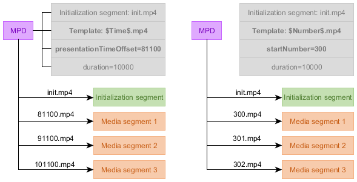
	<figcaption>Simple addressing uses a segment template that is combined with approximate first [=media segment=] timing information and an average [=media segment=] duration in order to reference [=media segments=], either by start time or by sequence number.</figcaption>
</figure>

The `SegmentTemplate@duration` attribute SHALL define the nominal duration of a [=media segment=] in [=timescale units=].

The set of [=segment references=] SHALL consist of the first [=media segment=] starting exactly at the [=period=] start point and all other [=media segments=] following in a consecutive series of equal time spans of `SegmentTemplate@duration` [=timescale units=], ending with a [=media segment=] that ends at or overlaps the [=period=] end time.

The `SegmentTemplate@media` attribute SHALL contain the URL template for referencing [=media segments=], using either the `$Time$` or `$Number$` template variable to uniquely identify [=media segments=]. The `SegmentTemplate@initialization` attribute SHALL contain the URL template for referencing [=initialization segments=]. URL construction rules are defined in [[#timing-urls-and-http]].

Below is an example of common usage of the simple addressing mode.

The example defines a [=sample timeline=] with a timescale of 1000 units per second, with the [=period=] starting at position 900. The average duration of a [=media segment=] is 4001. [=Media segment=] numbering starts at 800, so the first [=media segment=] is found at the relative URL `video/800.m4s`. The sequence of [=media segments=] continues to the end of the period, which is 900 seconds long, making for a total of 225 defined [=segment references=].

<xmp highlight="xml">
<MPD xmlns="urn:mpeg:dash:schema:mpd:2011">
	<Period duration="PT900S">
		<AdaptationSet>
			<Representation>
				<SegmentTemplate timescale="1000" presentationTimeOffset="900"
						media="video/$Number$.m4s" initialization="video/init.mp4"
						duration="4001" startNumber="800" />
			</Representation>
		</AdaptationSet>
	</Period>
</MPD>
</xmp>

Parts of the MPD structure that are not relevant for this chapter have been omitted - this is not a fully functional MPD file.

#### Inaccuracy in media segment timing when using simple addressing #### {#timing-addressing-inaccuracy}

When using [=simple addressing=], the samples contained in a [=media segment=] MAY cover a different time span on the [=sample timeline=] than what is indicated by the nominal timing in the MPD, as long as no constraints defined in this document are violated by this deviation.

<figure>
	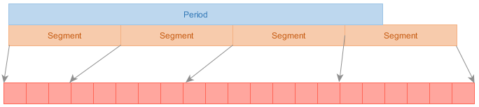
	<figcaption>Simple addressing relaxes the requirement on [=media segment=] contents matching the [=sample timeline=]. Red boxes indicate samples.</figcaption>
</figure>

The allowed deviation is defined as the maximum offset between the edges of the nominal time span (as defined by the MPD) and the edges of the true time span (as defined by the contents of the [=media segment=]). The deviation is evaluated separately for each edge.

Advisement: This allowed deviation does not relax any requirements that do not explicitly define an exception. For example, [=periods=] must still be covered with samples for their entire duration, which constrains the flexibility allowed for the first and last [=media segment=] in a [=period=].

The deviation SHALL be no more than 50% of the nominal [=media segment=] duration and MAY be in either direction.

Note: This results in a maximum true duration of 200% (+50% outward extension on both edges) and a minimum segment duration of 1 sample (-50% inward from both edges would result in 0 but empty segments are not allowed).

Allowing inaccurate timing is intended to enable reasoning on the [=sample timeline=] using average values for [=media segment=] timing. If the addressing data says that a [=media segment=] contains 4 seconds of data on average, a client can predict with reasonable accuracy which samples are found in which [=media segments=], while at the same time the service is not required to publish per-segment timing data in the MPD. It is expected that the content is packaged with this contraint in mind (i.e. **every** segment cannot be inaccurate in the same direction - a shorter segment now implies a longer segment in the future to make up for it).

Consider a [=media segment=] with a nominal start time of 8 seconds from period start and a nominal duration of 4 seconds, within a [=period=] of unlimited duration.

The following are all valid contents for such a [=media segment=]:

* samples from 8 to 12 seconds (perfect accuracy)
* samples from 6 to 14 seconds (maximally large segment allowed by drift tolerance, 50% increase from both ends)
* samples from 9.9 to 10 seconds (near-minimally small segment; while drift tolerance allows 50% decrease from both ends, resulting in zero duration, every segment must still contain at least one sample)
* samples from 6 to 10 seconds (maximal drift toward zero point at both ends)
* samples from 10 to 14 seconds (maximal drift away from zero point at both ends)

Near [=period=] boundaries, all the constraints of timing and addressing must still be respected. Consider a [=media segment=] with a nominal start time of 0 seconds from [=period=] start and a nominal duration of 4 seconds.

If such a [=media segment=] contained samples from 1 to 5 seconds (drift of 1 second away from zero point at both ends, which is within acceptable limits) it would be non-conforming because of the requirement in [[#timing-mediasegment]] that the first [=media segment=] contain a media sample that starts at or overlaps the [=period=] start point.

#### Moving the period start point (simple addressing) #### {#timing-addressing-simple-startpoint}

When splitting periods in two or performing other types of editorial timing adjustments, a service might want to start a period at a point after the "natural" start point of the [=representations=] within.

[=Simple addressing=] is challenging to use in such scenarios. You SHOULD convert [=simple addressing=] representations to use [=explicit addressing=] before adjusting the [=period=] start point or splitting a [=period=]. See [[#timing-addressing-simple-to-explicit]].

The rest of this chapter provides instructions for situations where you choose <em>not</em> to convert to [=explicit addressing=].

To move the period start point, for [=representations=] that use [=simple addressing=]:

* Every [=simple addressing=] [=representation=] in the [=period=] must contain a [=media segment=] that starts at the new period start point.
* [=Media segments=] starting at the new period start point must contain a sample that starts at or overlaps the new period start point.

Note: If you are splitting a [=period=], also keep in mind [[#timing-mediasegment|the requirements on period end point sample alignment]] for the [=period=] that remains before the split point.

Finding a suitable new start point that conforms to the above requirements can be very difficult. If inaccurate timing is used, it may be altogether impossible. This is a limitation of [=simple addressing=].

Having ensured conformance to the above requirements for the new period start point, perform the following adjustments:

1. Update `SegmentTemplate@presentationTimeOffset` to indicate the desired start point on the [=sample timeline=].
1. If present, increment `SegmentTemplate@startNumber` by the number of [=media segments=] removed from the beginning of the [=representation=].
1. Update `Period@duration` to match the new duration.

#### Converting simple addressing to explicit addressing #### {#timing-addressing-simple-to-explicit}

It may sometimes be desirable to convert a presentation from [=simple addressing=] to [=explicit addressing=]. This chapter provides an algorithm to do this.

Advisement: [=Simple addressing=] allows for inaccuracy in [=media segment=] timing. No inaccuracy is allowed by [=explicit addressing=]. The mechanism of conversion described here only applies when there is no inaccuracy. If the nominal time spans in original the MPD differ from the true time spans of the [=media segments=], re-package the content from scratch using [=explicit addressing=] instead of converting.

To perform the conversion, execute the following steps:

1. Calculate the number of [=media segments=] in the representation as `SegmentCount = Ceil(AsSeconds(Period@duration) / ( SegmentTemplate@duration / SegmentTemplate@timescale))`.
1. Assign a zero-based `SegmentIndex` value to each [=media segment=] in the representation, incrementing by one per segment.
1. If using `$Number$` placeholders in `SegmentTemplate@media`:
	1. Replace `$Number$` placeholders with equivalent `$Time$` placeholders.
	1. Rename segment files to match new template. Calculate the value for `$Time$` as `SegmentStartTime = SegmentTemplate@presentationTimeOffset + SegmentIndex * SegmentTemplate@duration`.
1. Update the MPD.
	1. Remove `SegmentTemplate@startNumber` if present.
	1. Add a single `SegmentTemplate/SegmentTimeline` element.
	1. Add a single `SegmentTimeline/S` element.
	1. Set `S@t` to equal `SegmentTemplate@presentationTimeOffset`.
	1. Set `S@d` to equal `SegmentTemplate@duration`.
	1. Remove `SegmentTemplate@duration`.
	1. Set `S@r` to `SegmentCount - 1`.

Below is an example of a [=simple addressing=] [=representation=] before conversion.

<xmp highlight="xml">
<MPD xmlns="urn:mpeg:dash:schema:mpd:2011">
	<Period duration="PT900S">
		<AdaptationSet>
			<Representation>
				<SegmentTemplate timescale="1000" presentationTimeOffset="900"
						media="video/$Number$.m4s" initialization="video/init.mp4"
						duration="4001" startNumber="800" />
			</Representation>
		</AdaptationSet>
	</Period>
</MPD>
</xmp>

As part of the conversion, we calculate `SegmentCount = Ceil(900 / (4001 / 1000)) = 225`. We also rename files to time-based addressing, with the first segment file `800.m4s` getting the value `SegmentStartTime = 900 + 0 * 4001 = 900` which will later be resolved to the path `video/900.m4s` by clients.

After conversion, we arrive at the following result.

<xmp highlight="xml">
<MPD xmlns="urn:mpeg:dash:schema:mpd:2011">
	<Period duration="PT900S">
		<AdaptationSet>
			<Representation>
				<SegmentTemplate timescale="1000" presentationTimeOffset="900"
						media="video/$Time$.m4s" initialization="video/init.mp4">
					<SegmentTimeline>
						<S t="900" d="4001" r="224" />
					</SegmentTimeline>
				</SegmentTemplate>
			</Representation>
		</AdaptationSet>
	</Period>
</MPD>
</xmp>

Parts of the MPD structure that are not relevant for this chapter have been omitted - the above are not fully functional MPD files.

## Resolving URLs and performing HTTP requests ## {#timing-urls-and-http}

Issue: Determine appropriate content for this section.

## Segment alignment ## {#timing-segmentalignment}

[=Media segments=] are said to be aligned if the start/end points of all [=media segments=] on the [=sample timeline=] are equal in all [=representations=] that belong to the same [=adaptation set=].

[=Media segments=] SHALL be aligned. When using [=simple addressing=] or [=explicit addressing=], this means `AdaptationSet@segmentAlignment=true` in the MPD. When using [=indexed addressing=], this means `AdaptationSet@subsegmentAlignment=true` in the MPD.

Equivalent aligned [=media segments=] in different [=representations=] SHALL contain samples for the same true time span, even if using [=simple addressing=] with [[#timing-addressing-inaccuracy|inaccurate media segment timing]].

## Period connectivity ## {#timing-connectivity}

In certain circumstances content may be offered such that a [=representation=] is technically compatible with the content of a [=representation=] in a previous [=period=]. Such [=representations=] are <dfn>period-connected</dfn>.

[=Initialization segments=] of period-connected [=representations=] SHALL be functionally equivalent (i.e. the [=initialization segment=] from any period-connected [=representation=] can be used to initialize playback of any period-connected [=representation=]).

Note: Connectivity is generally achieved by using the same encoder to encode the content of multiple [=periods=] using the same settings. Keep in mind, however, that decryption is also a part of the client media pipeline - it is not only the codec parameters that are configured by the [=initialization segment=].

Such content SHOULD be signaled in the MPD as period-connected. This is expected to help clients ensure seamless playback across [=period=] transitions. Any subset of the [=representations=] in a [=period=] MAY be period-connected with their counterparts in a future or past [=period=]. Period connectivity MAY be chained across any number of [=periods=].

<figure>
	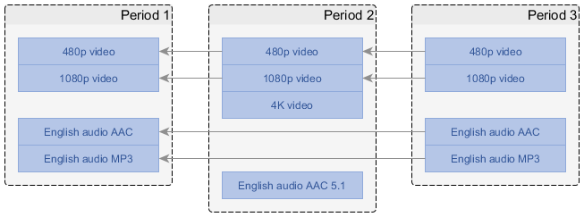
	<figcaption>[=Representations=] can be signaled as period connected, enabling client optimizations. Arrows on diagram indicate direction of connectivity reference (from future to past), with the implied message being "the client can use the same decoder it used where the arrow points to".</figcaption>
</figure>

An MPD MAY contain unrelated [=periods=] between [=periods=] that contain period-connected [=representations=].

The [=sample timelines=] of period-connected [=representations=] MAY be mutually discontinuous (e.g. due to skipping some content, encoder clock wrap-around or editorial decisions).

The following signaling SHALL be used to identify period-connected [=representations=] across two [=periods=]:

* `Representation@id` is equal.
* `AdaptationSet@id` is equal.
* The [=adaptation set=] in the second [=period=] has a supplemental property with:
	* `@shemeIdUri` set to `urn:mpeg:dash:period-connectivity:2015`.
	* `@value` set to the `Period@id` of the first period.

Note: Not all [=representations=] in an [=adaptation set=] need to be period-connected. For example, if a new [=period=] is introduced to add a [=representation=] that contains a new video quality level, all other [=representations=] will likely be connected but not the one that was added.

<figure>
	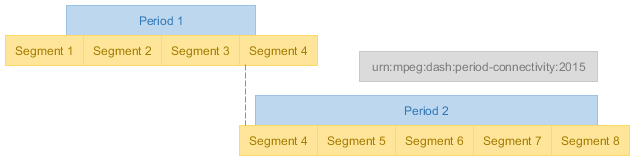
	<figcaption>The same [=media segment=] will often exist in two periods at a period-connected transition. On the diagram, this is segment 4.</figcaption>
</figure>

As a [=period=] may start and/or end in the middle of a [=media segment=], the same [=media segment=] MAY simultaneously exist in two period-connected [=representations=], with one part of it scheduled for playback during the first [=period=] and the other part during the second [=period=]. This is likely to be the case when no [=sample timeline=] discontinuity is introduced by the transition.

Clients SHOULD NOT present a [=media segment=] twice when it occurs on both sides of a period transition in a period-connected [=representation=].

Clients SHOULD ensure seamless playback of period-connected [=representations=] in consecutive [=periods=].

Note: The exact mechanism that ensures seamless playback depends on client capabilities and will be implementation-specific. Any shared [=media segment=] overlapping the [=period=] boundary may need to be detected and deduplicated to avoid presenting it twice.

### Period continuity ### {#timing-connectivity-continuity}

In addition to [[#timing-connectivity|period connectivity]], [[!MPEGDASH]] defines period continuity, which is a special case of period connectivity where the two samples on the boundary between the connected [=representations=] are consecutive on the same [=sample timeline=].

Note: The above can only be true if the sample boundary exactly matches the period boundary.

Period continuity MAY be signaled in the MPD when the above condition is met, in which case period connectivity SHALL NOT be simultaneously signaled on the same [=representation=]. Continuity implies connectivity.

The signaling of period continuity is the same as for [[#timing-connectivity|period connectivity]], except that the value to use for `@schemeIdUri` is `urn:mpeg:dash:period-continuity:2015`.

Clients MAY take advantage of any platform-specific optimizations for seamless playback that knowledge of period continuity enables; beyond that, clients SHALL treat continuity the same as connectivity.

## Dynamic MPDs ## {#timing-dynamic}

This section only applies to dynamic MPDs.

Dynamic MPDs have two main factors that differentiate them from static MPDs:

1. Dynamic MPDs may change over time, with clients retrieving new snapshots of the MPD when the validity duration of the previous snapshot expires.
1. Playback of a dynamic MPD is synchronized to a real time clock (with some amount of client-chosen time shift allowed).

Advisement: A dynamic MPD must conform to the constraints in this document not only at its moment of initial publishing but through the entire validity duration of the MPD (as defined by `MPD@minimumUpdatePeriod`).

### Real time clock synchronization ### {#timing-sync}

It is critical for dynamic MPDs to synchronize the clocks of the service and the client. The time indicated by the clock does not necessarily need to match some universal standard as long as the two are mutually synchronized.

A dynamic MPD SHALL include at least one `UTCTiming` element that defines a clock synchronization mechanism.

A client presenting a dynamic MPD SHALL synchronize its local clock according to the `UTCTiming` elements in the MPD and SHALL emit a warning or error to application developers when clock synchronization fails, no `UTCTiming` elements are defined or none of the referenced clock synchronization mechanisms are supported by the client.

Note: The use of a "default time source" is not compatible with the interoperable timing model. The mechanism of time synchronization must always be explicitly defined in the MPD by every service and interoperable clients cannot assume a default time source.

The set of time synchronization mechanisms SHALL be restricted to the following schemes defined in [[!MPEGDASH]]:

* urn:mpeg:dash:utc:http-xsdate:2014
* urn:mpeg:dash:utc:http-iso:2014
* urn:mpeg:dash:utc:http-ntp:2014
* urn:mpeg:dash:utc:ntp:2014
* urn:mpeg:dash:utc:http-head:2014
* urn:mpeg:dash:utc:direct:2014

### Availability ### {#timing-availability}

A segment is <dfn>available</dfn> if an HTTP request to acquire it can be successfully performed to completion by a client. In a dynamic MPD, new [=media segments=] continuously become available and stop being available with the passage of time.

An <dfn>availability window</dfn> is a time span on the [=MPD timeline=] that determines which [=media segments=] are available. Each [=representation=] has its own availability window.

The availability window is calculated as follows:

1. Let `now` be the current time according to [[#timing-sync|the synchronized clock]].
1. Let `TotalAvailabilityTimeOffset` be the sum of all `@availabilityTimeOffset` values that apply to the [=representation=] (those directly on the `Representation` element and any of its ancestors).
1. The availability window is the time span from `now - MPD@timeShiftBufferDepth` to `now + TotalAvailabilityTimeOffset`.

<figure>
	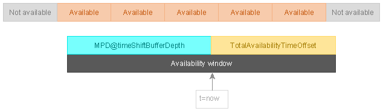
	<figcaption>The availability window determines which [=media segments=] are available, based on where their end point lies.</figcaption>
</figure>

A service SHALL ensure that all [=media segments=] that have their end point inside or at the end of the availability window are available.

Advisement: It is the responsibility of the service to ensure that [=media segments=] are available to clients when they are described as available by the MPD. To define proper availability timing, one must consider the entire publishing flow through the CDN, not only when the origin server makes data available to the CDN.

Clients MAY attempt to acquire any available [=media segment=]. Clients SHALL NOT attempt to acquire [=media segments=] that are not available.

Clients SHOULD NOT assume that [=media segments=] described by the MPD as available are always available at the correct moment in time and SHOULD implement appropriate retry behavior.

### Time shift window ### {#timing-timeshift}

The <dfn>time shift window</dfn> is a time span on the [=MPD timeline=] that defines a baseline for content that a client can present at the current moment in time (`now`).

The following additional factors further constrain the set of [=media segments=] that can be presented at the current time:

1. [[#timing-availability]] - not every [=media segment=] in the time shift window is guaranteed to be [=available=].
1. [[#timing-delay]] - the service may define a delay that forbids the use of a section of the time shift window.

The time shift window extends from `now - MPD@timeShiftBufferDepth` to `now`.

<figure>
	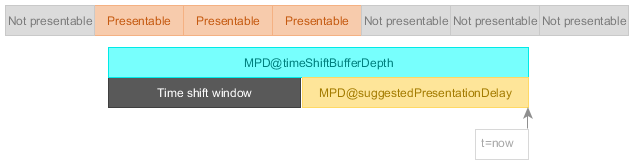
	<figcaption>[=Media segments=] overlapping the time shift window may potentially be presented by a client, if other constraints do not forbid it.</figcaption>
</figure>

Clients MAY present samples from [=media segments=] that overlap the time shift window, assuming no other constraints forbid it. Clients SHALL NOT present samples from [=media segments=] that are entirely outside the time shift window (whether in the past or the future).

The start of the time shift window MAY be before the start of the first [=period=].

A dynamic MPD SHALL contain a [=period=] that ends at or overlaps the end point of the time shift window, except when reaching [[#timing-mpd-updates-theend|the end of live content]] in which case the last [=period=] MAY end before the end of the time shift window.

Clients SHALL NOT allow seeking into regions of the time shift window that are not covered by [=periods=].

### Presentation delay ### {#timing-delay}

There is a natural conflict between the [=availability window=] and the [=time shift window=]. It is legal for a client to present [=media segments=] as soon as they overlap the [=time shift window=], yet such [=media segments=] might not yet be [=available=].

Furthermore, the delay between [=media segments=] entering the [=time shift window=] and becoming [=available=] might be different for different [=representations=] that use different segment durations. This difference may also change over time if a [=representation=] does not use a constant segment duration.

The `MPD@suggestedPresentationDelay` attribute pushes the effective end point of the [=time shift window=] into the past to account for this effect and define a range that is safe for seeking and within which [=media segments=] can be expected to be available.

The <dfn>effective time shift window</dfn> is the time span from `now - MPD@timeShiftBufferDepth` to `now - MPD@suggestedPresentationDelay`.

<figure>
	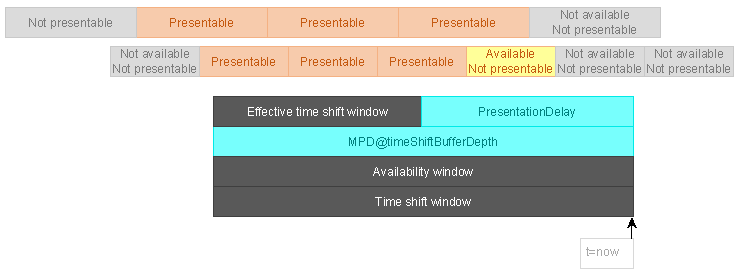
	<figcaption>[=Media segments=] that overlap the effective time shift window are the ones that may be presented at time `now`. Two [=representations=] with different segment lengths are shown.</figcaption>
</figure>

Clients SHALL constrain seeking to the [=effective time shift window=]. Clients SHALL NOT attempt to present [=media segments=] that fall entirely outside the [=effective time shift window=].

Services SHALL provide a suitable value for `MPD@suggestedPresentationDelay` to ensure that [=media segments=] that overlap the [=effective time shift window=] are [=available=].

### MPD updates ### {#timing-mpd-updates}

Dynamic MPDs MAY change over time. The nature of the change is not restricted unless such a restriction is explicitly defined.

Some common reasons to make changes in dynamic MPDs:

* Adding new [=segment references=] to an existing [=period=].
* Adding new [=periods=].
* Converting unlimited-duration [=periods=] to fixed-duration [=periods=] by adding `Period@duration`.
* Removing [=segment references=] and/or [=periods=] that have fallen out of the [=time shift window=].
* Shortening an existing [=period=] when changes in content scheduling take place.
* Removing `MPD@minimumUpdatePeriod` to signal that MPD will no longer be updated (even though it may remain a dynamic MPD).
* Converting the MPD to a static MPD to signal that a live service has become available on-demand as a recording.

The following basic restrictions are defined here for MPD updates:

* `MPD@id` SHALL NOT change.
* `MPD@availabilityStartTime` SHALL NOT change.
* `Period@id` SHALL NOT change.
* `Period@start` SHALL NOT change.
* `Period@duration` SHALL NOT change except when explicitly allowed by other statements in this document.
* The [=adaptation sets=] present in a [=period=] (i.e. the set of `AdaptationSet@id` values) SHALL NOT change.
* The [=representations=] present in an [=adaptation set=] (i.e. the set of `Representation@id` values) SHALL NOT change.
* The functional behavior of a [=representation=] (identified by a matching `Representation@id` value) SHALL NOT change, neither in terms of metadata-driven behavior (including metadata inherited from [=adaptation set=] level) nor in terms of [=media segment=] timing. In particular:
	* `SegmentTemplate@presentationTimeOffset` SHALL NOT change.
	* `SegmentTemplate@startNumber` SHALL NOT change.
	* `SegmentBase@presentationTimeOffset` SHALL NOT change.

Advisement: Additional restrictions on MPD updates are defined by other parts of this document.

Clients SHOULD use `@id` to track [=period=], [=adaptation set=] and [=representation=] identity across MPD updates.

The presence or absence of `MPD@minimumUpdatePeriod` SHALL be used by a service to signal whether the MPD might be updated (with presence indicating potential for future updates). The value of this field indicates the validity duration of the present snapshot of the MPD, starting from the moment it was retrieved.

Clients SHALL process state changes that occur during the MPD validity duration. For example new [=media segments=] will become [=available=] over time if they are referenced by the MPD and old ones become unavailable, even without an MPD update.

Note: A missing `MPD@minimumUpdatePeriod` attribute indicates an infinite validinity period (the MPD will never be updated). The value 0 indicates that the MPD has no validity after the moment it was retrieved. In such a situation, the client will have to acquire a new MPD whenever it wants to make new [=media segments=] available (no "natural" state changes will occur).

In practice, clients will also require some time to download and process an MPD update - a service SHOULD NOT assume perfect update timing. Conversely, a client SHOULD NOT assume that it can get all updates in time (it may already be attempting to buffer some [=media segments=] that were removed by an MPD update).

In addition to signaling that clients are expected to poll for regular MPD updates, a service MAY publish in-band events to schedule MPD updates at moments of its choosing.

#### Adding content to the MPD #### {#timing-mpd-updates-add-content}

There are two mechanisms for adding content:

* Additional [=segment references=] MAY be added to the last [=period=].
* Additional [=periods=] MAY be added to the end of the MPD.

Multiple content adding mechanisms MAY be combined in a single MPD update.

<figure>
	
	<figcaption>MPD updates can add both [=segment references=] and [=periods=] (additions highlighted in blue).</figcaption>
</figure>

[=Segment references=] SHALL NOT be added to any [=period=] other than the last [=period=]. An MPD update MAY combine adding [=segment references=] to the last period with adding of new [=periods=].

Note: The duration of the last [=period=] cannot change as a result of adding [=segment references=]. A live service will generally use a [=period=] with an unlimited duration to continuously add new references.

When using [=simple addressing=] or [=explicit addressing=], it is possible for a period to define an infinite sequence of [=segment references=] that extends to the end of the [=period=] (e.g. using `SegmentTemplate@duration` or `r="-1"`). Such self-extending reference sequences SHALL be considered equivalent to explicitly defined reference sequences that extend to the end of the [=period=] and clients MAY obtain new references from such sequences even between MPD updates.

An MPD update that adds content MAY be combined [[#timing-mpd-updates-remove-content|with an MPD update that removes content]].

#### Removing content from the MPD #### {#timing-mpd-updates-remove-content}

Removal of content is only allowed if the content to be removed is not yet [=available=] to clients and will not become [=available=] until clients receive the MPD update. See [[#timing-availability]].

Let `EarliestRemovalPoint` be `availability window end + MPD@minimumUpdatePeriod`.

Note: As each [=representation=] has its own [=availability window=], so does each [=representation=] have its own `EarliestRemovalPoint`.

[=Media segments=] that overlap or end before `EarliestRemovalPoint` might be considered by clients to be [=available=] at the time the MPD update is processed and therefore cannot be removed.

<figure>
	
	<figcaption>MPD updates can remove both [=segment references=] and [=periods=] (removals highlighted in red).</figcaption>
</figure>

An MPD update removing content MAY remove any [=segment references=] to [=media segments=] that start after `EarliestRemovalPoint` at the time the update is published but SHALL NOT remove any other [=segment references=].

The following mechanisms exist removing content:

* The last [=period=] MAY change from unlimited duration to fixed duration.
* The duration of the last [=period=] MAY be shortened.
* One or more [=periods=] MAY be removed entirely from the end of the MPD.

Multiple content removal mechanisms MAY be combined in a single MPD update.

The above mechanisms can be used in any extent as long as no constraints defined in this document are violated. In particular, consider the constraints on invalidating [=segment references=] defined in this chapter.

Clients SHALL NOT fail catastrophically if an MPD update removes already buffered data but MAY incur unexpected time shift or a visible transition at the point of removal. It is the responsibility of the service to avoid removing data that may already be in use.

In addition to editorial removal from the end of the MPD, content naturally expires due to the passage of time. Expired content also needs to be removed:

* Explicitly defined [=segment references=] (`S` elements) SHALL be removed when they have expired (i.e. the [=media segment=] end point has fallen out of the [=time shift window=]).
	* A repeating explicit [=segment reference=] (`S` element with `@r != 0`) SHALL NOT be removed until all repetitions have expired.
* Periods with their end points before the time shift window SHALL be removed.

Note: When using [=indexed addressing=] or [=simple addressing=], removal of [=segment references=] only requires changing `Period@duration`.

An MPD update that removes content MAY be combined [[#timing-mpd-updates-add-content|with an MPD update that adds content]].

#### Update signaling via in-band events #### {#timing-mpd-updates-inband}

Services MAY signal the MPD validity duration by embedding in-band messages into [=representations=] instead of specifying a fixed validity duration in the MPD. This allows services to trigger MPD refreshes at exactly the desired time.

The rest of this chapter only applies to services and clients that make use of in-band MPD validity signaling.

Services SHALL define `MPD@minimumUpdatePeriod=0` and add an in-band event stream to every audio [=representation=] or, if no audio [=representations=] are present, to every video [=representation=]. Optionally, the in-band event stream MAY be added to other [=representations=], as well. The in-band event stream SHALL be identical in every [=representation=] where it is present.

The in-band event stream SHALL be signaled on the [=adaptation set=] level by an `InbandEventStream` element with `@scheme_id_uri="urn:mpeg:dash:event:2012"` and a `@value` of 1 or 3, where:

* A value of 1 indicates that in-band events only extend the MPD validity duration.
* A value of 3 indicates that in-band events also contain the updated MPD snapshot when updates occur.

Note: For a detailed definition of the mechanism and the event message data structures, see [[!MPEGDASH]]. This chapter is merely a high level summary of the most important aspects relevant to interoperability.

<figure>
	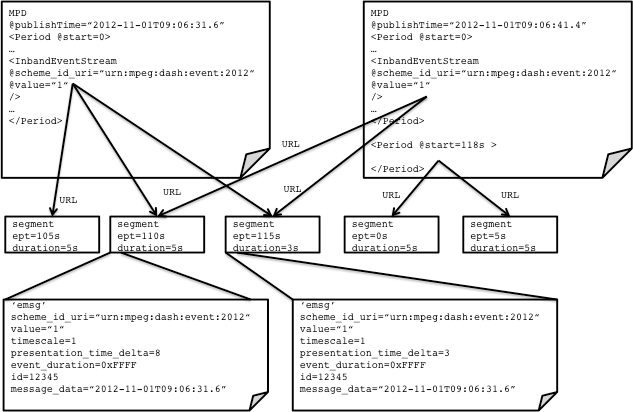
	<figcaption>Illustration of MPD expiration signaling using in-band events.</figcaption>
</figure>

Services SHALL emit in-band events as [[!MPEGDASH]] `emsg` boxes to signal the validity duration using the following logic:

* Lack of an in-band MPD validity event in a [=media segment=] indicates that an MPD that was valid at the start of the [=media segment=] remains valid up to the end of the [=media segment=] (mapped to wall clock time).
* The presence of an in-band MPD validity event in a [=media segment=] indicates that the MPD with `MPD@publishTime` equal to the event's `publish_time` field remains valid up to the event start time (mapped to wall clock time).

The in-band events used for signaling MPD validity duration SHALL have `scheme_id_uri` and `value` matching the `InbandEventStream` element.

In-band events with `value=3` SHALL provide an updated MPD in the event's `mpd` field as UTF-8 encoded text without a byte order mark.

Multiple [=media segments=] MAY signal the same validity update event (identified by matching `id` field on event), enabling the signal to be delivered several segments in advance of the MPD expiration.

#### End of live content #### {#timing-mpd-updates-theend}

Live services can reach a point where no more content will be produced - existing content will be played back by clients and once they reach the end, playback will cease.

Services SHALL define a fixed duration for the last [=period=], remove the `MPD@minimumUpdatePeriod` attribute and cease performing MPD updates to signal that no more content will be added to the MPD. The `MPD@type` MAY be changed to `static` at this point or later if the service is to be converted to a static MPD for on-demand viewing.

## Leap seconds ## {#timing-leapseconds}

This section is intentionally left blank to indicate that the leap seconds topic is out of scope of this proposal.

## Forbidden techniques ## {#timing-nonos}

Some aspects of [[!MPEGDASH]] are not compatible with the interoperable timing model defined in this document. In the interest of clarity, they are explicitly listed here:

* The `@presentationDuration` attribute SHALL NOT be used.

## Examples ## {#timing-examples}

This section is informative.

### Offer content with imperfectly aligned tracks ### {#timing-examples-not-same-length}

It may be that for various content processing workflow reasons, some tracks have a different duration from others. For example, the audio track might start a fraction of a second before the video track and end some time before the video track ends.

<figure>
	
	<figcaption>Content with different track lengths, before packaging as DASH.</figcaption>
</figure>

You now have some choices to make in how you package these tracks into a DASH presentation that conforms to this document. Specifically, there exists the requirement that every [=representation=] must cover the entire [=period=] with media samples.

<figure>
	
	<figcaption>Content may be cut (indicated in black) to equalize track lengths.</figcaption>
</figure>

The simplest option is to define a single [=period=] that contains [=representations=] resulting from cutting the content to match the shortest common time span, thereby covering the entire [=period=] with samples. Depending on the nature of the data that is removed, this may or may not be acceptable.

<figure>
	
	<figcaption>Content may be padded (indicated in green) to equalize track lengths.</figcaption>
</figure>

If you wish to preserve track contents in their entirety, the most interoperable option is to add padding samples (e.g. silence or black frames) to all tracks to ensure that all [=representations=] have enough data to cover the entire [=period=] with samples. This may require customization of the encoding process, as the padding must match the codec configuration of the real content and might be impractical to add after the real content has already been encoded.

<figure>
	
	<figcaption>New periods may be started at any change in the set of available tracks.</figcaption>
</figure>

Another option that preserves track contents is to [[#timing-examples-splitperiod|split the content]] into multiple [=periods=] that each contain a different set of [=representations=], starting a new [=period=] whenever a track starts or ends. This enables you to ensure every [=representations=] covers its [=period=] with samples. The upside of this approach is that it can be done easily, requiring only manipulation of the MPD. The downside is that some clients may be unable to seamlessly play across every [=period=] transition.

<figure>
	
	<figcaption>You may combine the different approaches, cutting in some places (black), padding in others (green) and defining multiple [=periods=] as needed.</figcaption>
</figure>

You may wish to combine the different approaches, depending on the track, to achieve the optimal result.

Some clients are known to fail when transitioning from a period with audio and video to a period with only one of these components. You should avoid such transitions unless you have exact knowledge of the capabilities of your clients.

### Split a period ### {#timing-examples-splitperiod}

There exist scenarios where you would wish to split a [=period=] in two. Common reasons would be:

* to insert an ad [=period=] in the middle of an existing [=period=].
* parameters of one [=adaptation set=] change (e.g. KID or display aspect ratio), requiring a new [=period=] to update signaling.
* some [=adaptation sets=] become available or unavailable (e.g. different languages).

This example shows how an existing [=period=] can be split in a way that clients capable of [[#timing-connectivity|seamless period-connected playback]] do not experience interruptions in playback among [=representations=] that are present both before and after the split.

Our starting point is a presentation with a single period that contains an audio [=representation=] with short samples and a video [=representation=] with slightly longer samples, so that [=media segment=] start points do not always overlap.

<figure>
	
	<figcaption>Presentation with one period, before splitting. Blue is a segment, yellow is a sample. Duration in arbitrary units is listed on samples. Segment durations are taken to be the sum of sample durations. `presentationTimeOffset` may have any value - it is listed because will be referenced later.</figcaption>
</figure>

Note: [=Periods=] may be split at any point in time as long as both sides of the split remain in conformance to this document (e.g. each contains at least 1 [=media segment=]). Furthermore, period splitting does not require manipulation of the segments themselves, only manipulation of the MPD.

Let's split this period at position 220. This split occurs during segment 3 for both [=representations=] and during sample 8 and sample 5 of the audio and video [=representation=], respectively.

The mechanism that enables [=period=] splitting in the middle of a segment is the following:

* a [=media segment=] that overlaps a [=period=] boundary exists in both [=periods=].
* [=representations=] that are split are signaled in the MPD as [=period-connected=].
* a representation that is [=period-connected=] with a representation in a previous period [[#timing-connectivity|is marked with the period connectivity descriptor]].
* clients are expected to deduplicate boundary-overlapping [=media segments=] for [=representations=] on which [[#timing-connectivity|period connectivity]] is signaled, if necessary for seamless playback (implementation-specific).
* clients are expected to present only the samples that are within the bounds of the current [=period=] (may be limited by client platform capabilities).

After splitting the example presentation, we arrive at the following structure.

<figure>
	
	<figcaption>Presentation with two periods, after splitting. Audio segment 3 and video segment 3 are shared by both periods, with the connectivity signaling indicating that seamless playback with de-duplicating behavior is expected from clients.</figcaption>
</figure>

If [=indexed addressing=] is used, both periods will reference all segments as both periods will use the same unmodified index segment. Clients are expected to ignore [=media segments=] that fall outside the [=period=] bounds.

Advisement: [=Simple addressing=] has significant limitations on alignment at [=period=] start, making it unsuitable for some multi-period scenarios. See [[#timing-addressing-simple-startpoint]].

Other [=periods=] (e.g. ads) may be inserted between the two [=periods=] resulting from the split. This does not affect the addressing and timing of the two [=periods=].

### Change the default_KID ### {#timing-examples-defaultkid}

In encrypted content, the `default_KID` of a [=representation=] might need to be changed at certain points in time. Often, the changes are closely synchronized in different [=representations=].

To perform the `default_KID` change, start a new period on every change, treating each [=representation=] as an independently changing element. With proper signaling, clients can perform this change seamlessly.

Issue: What about period connectivity? [#238](https://github.com/Dash-Industry-Forum/DASH-IF-IOP/issues/238)

<figure>
	
	<figcaption>A change in `default_KID` starts a new [=period=]. Orange indicates audio and purple video [=representation=].</figcaption>
</figure>

The same pattern can also be applied to other changes in [=representation=] configuration.

## Placeholder chapter ## {#placeholder-for-temporary-terms}

This chapter contains a set of terms that will exist in the IOP document but that do not exist in it yet. By defining these terms here, we enable references to be already inserted in existing text, simplifying the editing process.

* <dfn>adaptation set</dfn>
* <dfn>initialization segment</dfn>

## Editorial notes ## {#editorial-notes}

Notes on merging IOP v4.3 content into this chapter:

* 1 - not relevant
* 2 - not relevant
* 3.1 - not relevant
* 3.2.1 - potentially merged, needs a 2nd pass later to be sure
* 3.2.2 - not relevant (some overlap with relevant chapters, nothing unique)
* 3.2.3 - merged
* 3.2.4 - not relevant
* 3.2.5 - not relevant
* 3.2.6 - not relevant
* 3.2.7 - partially merged/superseded
	* This PR currently misses the "availability" aspect of timing, describing only the "when to play what" aspect.
* 3.2.7.2 - TODO ("availability" aspect)
* 3.2.7.3 - TODO ("availability" aspect)
* 3.2.7.4 - not relevant (?), make a 2nd pass later to verify where to put this - sounds like a "MPD format" thing rather than "timing" but maybe timing chapter is nearest fit
* 3.2.8 - not relevant
* 3.2.9 - not relevant
* 3.2.10 - not relevant
* 3.2.11 - not relevant
	* this seems more "file format" level text; while timing-related, it seems very specific to BMFF internals to have a place in the timing chapter (where the general situation seems already sufficiently well described); review this after we have restructured the rest of the document, see where the best home for this information (or whatever part of this information we keep) is
* 3.2.12 Content Offering With Periods - merged
	* There is some implied period-continuity logic. This is excessive combinatorics to expect the player to do. Just signal it on the service with the descriptor. Omitted.
	* AssetIdentifier has some implied connectivity logic that seems needless. Omitted. See https://github.com/Dash-Industry-Forum/DASH-IF-IOP/issues/215
* 3.2.13 - not relevant
* 3.2.14 - not relevant
* 3.2.15 - TODO (addressing and base URLs)

Needs review:
* 4.8 Robust Operation - needs review

General comments:

* Chapter 3 in v4.3 is largely a random pile of constraints. Some that were timing-relevant are merged here. Others were not. Needs thorough review to ensure that nothing got unexpectedly missed or duplicated.
* Some terms "defined" in the timing chapter should probably be defined elsewhere once we have more content migrated.
* Where does minBufferTime go? It needs a home and some nice illustrations.
* Where do we define the `lmsg` mechanism?
* "@subsegmentStartsWithSAP" is related to timing in some sense but in another sense it is just a question of segment/sample structure. Not sure if it fits into this chapter.

<!-- Document metadata follows. The below sections are used by the document compiler and are not directly visible. -->

<pre class="metadata">
Revision: 5.0

Title: Guidelines for Implementation: DASH-IF Interoperability Points
Status: LD
Shortname: iop
URL: https://dashif.org/guidelines/
Issue Tracking: GitHub https://github.com/Dash-Industry-Forum/DASH-IF-IOP/issues
Repository: https://github.com/Dash-Industry-Forum/DASH-IF-IOP GitHub
Editor: DASH Industry Forum

Default Highlight: text
<!-- Enabling line numbers breaks code blocks in PDF! (2018-10-02) -->
Line Numbers: off
Markup Shorthands: markdown yes
Boilerplate: copyright off, abstract off
Abstract: None
</pre>

<!-- Example of custom bibliography entries. Prefer adding your document to SpecRef over maintaining a custom definition. -->
<pre class="biblio">
{
}
</pre>

<pre boilerplate="logo">

</pre>