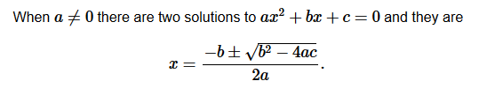

# Purpose # {#purpose}

This document outlines the methodology and tools utilized in the authoring
process for the
[DASH-IF IOP repository](https://github.com/dash-Industry-Forum/DASH-IF-IOP).

To streamline and enhance the creation of our documents, we employ a suite of
open source tools and packages. These tools are integral to our workflow,
enabling us to produce high-quality, well-structured, and visually engaging
documents. Below is an overview of the tools we use:

 * [Bikeshed](https://speced.github.io/bikeshed/) is our primary tool for
   drafting and maintaining the core text and documents. It offers robust
   features for creating comprehensive specifications, including syntax
   highlighting, automatic cross-references, and customizable formatting.
 * [Mermaid](https://mermaid.js.org/) is employed for diagramming within our
   documents. This tool allows us to visualize complex information, workflows,
   and relationships through a variety of diagram types, such as flowcharts,
   sequence diagrams, and class diagrams. The integration of Mermaid enhances
   the readability and comprehension of our documentation, making intricate
   concepts more accessible to our audience. Mermaid is also supported by GitHub
   markdown rendering directly.
 * [PlantUML](https://plantuml.com/) is another tool that will be part of the
   stack and allow us to create visualizations.

   Issue: Implement support for PlantUML
 * [Docker](https://www.docker.com/) is utilized to run the builds and create
   the resulting documents. By leveraging Docker, we achieve a consistent and
   reproducible environment for our documentation pipeline. This ensures that
   our build process is reliable and that the final documents are generated
   accurately every time.

# Local Editing Setup # {#local-setup}

The primary idea is to wrap to make editing of content easy within a GitHub Pull
Request based workflow. This means that all the primary text is written as
markdown. In addition to this, we process the resulting documents with various
tools. The entire build pipeline is exposed as a single
[Docker](https://www.docker.com/) Container that is publicly available and can
be fetched and updated on demand.

With the above in mind, what you need to do to get started including checking
your edits locally is to:

 * Install Docker
   * [Windows Instructions](https://docs.docker.com/desktop/install/windows-install/)
   * [Mac OS Instructions](https://docs.docker.com/desktop/install/mac-install/)
   * [Linux Instructions](https://docs.docker.com/desktop/install/linux-install/)
 * Open the files to edit with your text editor of choice.
   [Visual Studio Code](https://code.visualstudio.com/) is a good choice for
   markdown editing, but there are a lot of other editors available for that
   purpose.
 * Clone [the repository](https://github.com/Dash-Industry-Forum/DASH-IF-IOP)
   repository, i.e. `git clone git@github.com:Dash-Industry-Forum/DASH-IF-IOP.git`
 * Change to the cloned folder and build things locally:
   * `./build.sh` on Mac or Linux
   * `build.bat` on Windows

You might notice that the first build run will take a moment since the
respective container needs to be downloaded. Subsequent runs will be faster after
that initial bootstrap.

With the above command, _all_ the documents will be generated and you find the
results in the `dist` folder.

When you are working on a specific document, you can also use the following
commands. For example for `authoring`:

* `./build.sh authoring` will build only the authoring related artifacts
* `./build.sh authoring.html` will build the html version
* `./build.sh authoring.pdf` will build the pdf version
* `./build.sh authoring-watch` will build the html version and start watching
  the related documents for changes. If a change is detected, i.e. you edit one
  of the included markdown files and save, the page is re-generated. Reload the
  browser page and you will see the updated version. This process will keep on\
  running until you terminate it with `Ctrl-C`.

# Remote Editing Setup # {#remote-editing}

To quickly edit text in a GitHub repository, you can use the [github.dev](https://docs.github.com/en/codespaces/the-githubdev-web-based-editor)
browser-based editor. Simply press `.` while viewing the repository to open the
editor in your browser. This will launch a lightweight version of VSCode where
you can edit files, create branches, commit changes, and open pull requests
directly from the browser.

However, note that this method doesn’t allow you to preview rendered HTML since
the environment doesn’t support running builds.

If you need to edit documents and preview them, you can use GitHub Codespaces,
which provides a full development environment in the cloud. While not entirely
free, GitHub offers a monthly quota of free minutes for Codespaces usage.

Once your Codespaces is set up, you can run the build using the `build.sh`
script located in the root folder. To preview the generated HTML, install the
"Live Preview" extension by Microsoft. After running the build, expand the
`dist` folder, right-click on one of the generated HTML files, and select
"Show Preview." This will launch an internal server and allow you to view the
results in a browser window.

The key advantage of using Codespaces is that it simulates a local development
environment without needing to install any tools on your machine. However, be
mindful that Codespaces usage may incur costs after your free minutes are
exhausted, and it requires working within VSCode.

# Creating and Editing a Document # {#editing}

As described in [[#structure]], you will find individual documents in folders
inside the `specs` folder, for instance `specs/authoring` for this document.

A document consists of exactly one `.bs` bikeshed file and can have many
additional markdown (`.md`) files that are included in the bikeshed document.
For example, this document is primarily written in `authoring.md`. The
corresponding `authoring.bs` bikeshed document contains additional meta-data and
includes of other files. For example:

```
<pre class="metadata">
Revision: 0.1
Title: DASH-IF IOP Document Authoring
Status: LD
Shortname: authoring
URL: https://dashif.org/Guidelines/master/authoring.html
Group: dashif

!Contributor: Thasso Griebel
!Key Word: Authoring
!Related Features:
</pre>

<pre class=include>
path: authoring.md
</pre>
```

Note how the `authoring.md` file is included at the bottom. If your document
consists of multiple markdown files, you have to add multiple includes in the
bikeshed document.

Besides this, the file **must** contain the `<pre class="metadata">` section.
This is where surrounding document meta-data go including the Title, the Status,
URLs. etc. There are more details on the meta-data keys that are available
in the [Bikeshed Documentation](https://speced.github.io/bikeshed/#metadata).

The following keys are mandatory for our documents to be rendered correctly:

* `Group: dashif` -- We have custom boilerplate for the `dashif` group that is
  part of the tooling and identified by the group name.


# Folder Structure # {#structure}

The repository is organized in the following way. Note that the folder structure
is important for some of the tooling to work as expected.

- `specs` This folder contains sub-folders, one for each document that is
  managed and maintained as part of this repository.
- `build-tools` This folder container the build tools and describes the Docker
  container that we use.
- `data` This folder contains boilerplate data that is used by all documented.
  For example, the common header or the logo snippet.
- `dist` This folder is explicitly excluded from the git repository but this is
  where all the output of a build will be written to.
- `biblio.json` is a JSON file with custom [SpecRef](https://www.specref.org/)
  references. Note that is is much better to submit a missing ref to SpecRef
  instead of using custom references.

Any spec document folder should contain the following files or folders.

- A `.bs` file that is the actual Bikeshed file and will be used as an entry
  point. Note that there should be only one `.bs` file in each specs sub-folder.
- Any number of additional `*.md` files. Note that these files are not processed
  by default, but can be [included](#editing) in a bikeshed source.
- `Images` folder. This folder will be copied as is to the resulting document
  structure. Add any images that you want to include here.
- `Diagrams` folder. Files in this folder will be pushed through `plantuml` to
  generate images that in turn can be included in the document.


# Document Editing # {#elements}

We are using [Bikeshed](https://speced.github.io/bikeshed/) to write documents.
Bikeshed supports a subset of common markdown as well as html tags in the same
document.

In addition we included a few other tools that can be used to write content.
This section describes some of the Bikeshed features that we rely on, some
details around the markdown flavor that is used by Bikeshed, as well as the
usage of the additional tools that are integrated into our editing and
publishing pipeline.

## Markdown Basics ## {#markdown}

Please refer to the
[Bikeshed documentation on markdown](https://speced.github.io/bikeshed/) for
more details.

Here we just describe the fundamentals that are supported.

 * `**Bold**` becomes **Bold**
 * `*Italic*` becomes *Italic*
 * `#`, `##`, `###` etc create headings. There are more details around headings
   in [[#headings]].

Surrounding a word with \` or \~ will create inline code, i.e. ``` `code` ```
becomes `code`. You can also use triple \` or \~ to create a code block, i.e.

~~~
```
This is a code block
```
~~~

becomes

```
This is a code block
```

By default we render the content of code  blocks as text. However, if you know
the language, you can create highlighted code by naming the language after
the triple \`. For example

~~~
```xml
<MPD xmlns="urn:mpeg:dash:schema:mpd:2011"
     minBufferTime="PT1.920S" type="static"
     mediaPresentationDuration="PT0H0M28.800S"
     maxSegmentDuration="PT0H0M1.920S"
     profiles="urn:mpeg:dash:profile:full:2011,urn:mpeg:dash:profile:cmaf:2019">
  ...
</MPD>
```
~~~

will render highlighted xml:

```xml
<MPD xmlns="urn:mpeg:dash:schema:mpd:2011"
     minBufferTime="PT1.920S" type="static"
     mediaPresentationDuration="PT0H0M28.800S"
     maxSegmentDuration="PT0H0M1.920S"
     profiles="urn:mpeg:dash:profile:full:2011,urn:mpeg:dash:profile:cmaf:2019">
  ...
</MPD>
```

`*` or `-` is used to create unordered lists potentially with sub-items. For
example:

```
 * This is one item
 * This is another item
   * With a sub item
```

is rendered as

 * This is one item
 * This is another item
   * With a sub item

You can use `---` to create a horizontal rule. For example

---

Markdown syntax for links is `[name](link)`, for example
`[Bikeshed](https://speced.github.io/bikeshed)` becomes
[Bikeshed](https://speced.github.io/bikeshed).

## Highlighting notes ## {#notes}

Paragraphs starting with `Note: ` and `Advisement: ` will be highlighted in the
output document. Notes are considered informative, whereas advisements are
normative.

```
Note:

Advisement: Bee stings hurt!
```

For example

```
Note: Bees can fly up to two miles to find nectar and pollen.
```

becomes

Note: Bees can fly up to two miles to find nectar and pollen.

and

```
Advisement: Bee stings hurt!
```

becomes

Advisement: Bee stings hurt!

You can also use html elements and css classes to create these blocks. This is
useful if you want to write more extended notes that span multiple paragraphs
or contain images.

```
<div class="note" role="note">
This is a note that can be longer. In here I can use markdown **like this**.

And we can also write multiple paragraphs here.
</div>
```

becomes

<div class="note" role="note">
This is a note that can be longer. In here I can use markdown **like this**.

And we can also write multiple paragraphs here.
</div>

## Issues ## {#issues}

Bikeshed supports inline issues by starting a paragraph with `Issue:`. For
example

```
Issue: Maybe we need details on issues
```

becomes

Issue: Maybe we need details on issues

## Examples ## {#examples}

You have to use HTML to create examples, for instance

```html
<div class=example>
This is an example.
</div>
```

becomes

<div class=example>
This is an example.
</div>

## Headings and references ## {#headings}

To uniquely identify a heading for referencing purposes, you must explicitly add
an anchor. The anchor is the `{#xyz}` tag at the end of the heading. For this,
the heading needs to end with the same number of `#` characters

```
# First # {#first}
## First ## {#second}
### Headings and references ### {#headings}
```

Use the anchor to reference the heading elsewhere in the text. The link will
automatically be replaced with the heading text. For example `[[#headings]]`
becomes [[#headings]]. This will insert the header title as a link. You can also
customize the link text using a pipe (`|`) character. For example,
`[[#headings|here]]` becomes [[#headings|here]].

**Always add an anchor to every heading**, even those you do not currently
reference - other people might want to link to them later!


## Mermaid Diagrams ## {#mermaid}

You can use [Mermaid](https://mermaid.js.org/) to add diagrams to the document.
One benefit of mermaid is that this is also supported natively when viewing
markdown documents on GitHub.

For example
```
<pre class="mermaid">
  graph TD
  A[Client] --> B[Load Balancer]
  B --> C[Server01]
  B --> D[Server02]
</pre>
```

becomes

<pre class="mermaid">
  graph TD
  A[Client] --> B[Load Balancer]
  B --> C[Server01]
  B --> D[Server02]
</pre>

To create a caption, you can simply wrap a mermaid diagram in a `<figure>`
tag.

```
<figure>
  <pre class="mermaid">
    graph TD
    A[Client] --> B[Load Balancer]
    B --> C[Server01]
    B --> D[Server02]
  </pre>
  <figcaption>Example Mermaid diagram.</figcaption>
</figure>
```

becomes

<figure>
  <pre class="mermaid">
    graph TD
    A[Client] --> B[Load Balancer]
    B --> C[Server01]
    B --> D[Server02]
  </pre>
  <figcaption>Example Mermaid diagram.</figcaption>
</figure>


## Inserting images ## {#images}

Use HTML to insert images. The recommended format is:

```html
<figure>
  
  <figcaption>Example image.</figcaption>
</figure>
```

becomes

<figure>
  
  <figcaption>Example image.</figcaption>
</figure>

You must place all static images and manually exported diagrams in the `Images/`
directory.

## Inserting Links ## {#links}

Use Markdown link syntax for links to the web.

```markdown
[Click here for an adventure](https://zombo.com)
```

becomes

[Click here for an adventure](https://zombo.com)

## Tables ## {#tables}

Use HTML for tables.

Enclose tables in `figure` tags and provide a caption using `figcaption` to
enable automatic numbering.

```html
<figure>
  <table class="data">
    <thead>
      <tr>
        <th>Animal
        <th>Feet
        <th>Average height
    <tbody>
      <tr>
        <td>Duck
        <td>2
        <td>1 foot
      <tr>
        <td>Cow
        <td>4
        <td>1.612 meters
      <tr>
        <td>Cat
        <td>4
        <td>Not too much
  </table>
  <figcaption>Listing of critical animal measurements.</figcaption>
</figure>
```

Renders as

<figure>
  <table class="data">
    <thead>
      <tr>
        <th>Animal
        <th>Feet
        <th>Average height
    <tbody>
      <tr>
        <td>Duck
        <td>2
        <td>1 foot
      <tr>
        <td>Cow
        <td>4
        <td>1.612 meters
      <tr>
        <td>Cat
        <td>4
        <td>Not too much
  </table>
  <figcaption>Listing of critical animal measurements.</figcaption>
</figure>

The `data` class is a builtin table style suitable for presenting data. An
alternative builtin style you can use is the `def` class.

## Referencing illustrations and tables ## {#ref-figures}

Add an ID to the `figure` element and reference it in a hyperlink. Here is an
example of a reference target:

```html
<figure id="animal-facts">
  ...
</figure>
```

renders as

<figure id="animal-facts">
  This is a figure
  <figcaption>The figure caption</figcaption>
</figure>

You can link to the figure using
`<a href="#animal-facts">basic facts on important animals</a>` which will render
as <a href="#animal-facts">basic facts on important animals</a>.

## Defining terms ## {#defining-terms}


Use the `<dfn>` element to define a term. You can use it anywhere in text but a
common approach is to use a key-value table:

```text
: <dfn>apricot</dfn>
:: An apricot is a fruit, or the tree that bears the fruit, of several species
   in the genus Prunus
: <dfn>apple</dfn>
:: An apple is a sweet, edible fruit produced by an apple tree.
```

becomes

: <dfn>apricot</dfn>
:: An apricot is a fruit, or the tree that bears the fruit, of several species
   in the genus Prunus
: <dfn>apple</dfn>
:: An apple is a sweet, edible fruit produced by an apple tree.

You can reference defined terms using `[=apple=]`. This will create a link to
[=apple=]

Singular/plural matching is built-in so you can use `[=apples=]` to link to
[=apples=]. Additionally you can use a pipe character to specify custom text for
the generated link if you need to, i.e. use `[=apple|fruit of the apple tree=]`
to write "Not every [=apple|fruit of the apple tree=] is red".

Note: You can find more details about Defining terms [in the Bikeshed Documentation](https://speced.github.io/bikeshed/#definitions).

## Defining data structures ## {#defining-structs}

If you define, for example, an XML schema or another type of data format, use
the Bikeshed HTML element reference syntax to enable automatic
cross-referencing.

For example, consider the following XML element:

```xml
<employee id="123">
  <name>John Jackson</name>
<employee>
```

Use `<dfn element>employee</dfn>` to mark it as an element that may have
children as attributes. The common situation is to do this in a document section
heading:

```text
## <dfn element>employee</dfn> element ## {#schema-employee}
```

Then use the definition list syntax below to define its children:

```text
<dl dfn-type="element-attr" dfn-for="employee">

: <dfn>id</dfn> (required, attribute, xs:integer)
:: Employee ID.

: <dfn>name</dfn> (required, xs:string)
:: The full name of the employee.

</dl>
```

You can later reference the element as `<{employee}>` and its children as
`<{employee/name}>`.


## References to external documents ## {#specref}

You can directly reference any document listed in the
[SpecRef catalog](https://specref.org) using `[[!rfc7168]]` (normative)
and `[[rfc2324]]` (informative) tags in text. Such tags will be replaced
with a suitable hyperlink during document compilation and, if the reference is
normative, the referenced document will be added to the bibliography section.

This is a normative references to [[!rfc7168]] while we add an informative
reference to [[rfc2324]].

To use custom bibliography entries, update the `biblio.json` file in the root
folder of the repository.

[SpecRef accepts contributions](https://github.com/tobie/specref#updating--adding-new-references).
If you do not find a document in the catalog, consider adding it to SpecRef
instead of maintaining a custom bibliography section.

Note: allow up to 24 hours for caches to update after a contribution is merged
to the SpecRef database.

## Embedding formulas ## {#formulas}

You can use TeX syntax for formulas. Surround inline content with `\(` and `\)`
and block content with `$$`.

```text
When \(a \ne 0\) there are two solutions to \(ax^2 + bx + c = 0\)
and they are $$x = {-b \pm \sqrt{b^2-4ac} \over 2a}.$$
```

The above produces the following output.

When \(a \ne 0\) there are two solutions to \(ax^2 + bx + c = 0\)
and they are $$x = {-b \pm \sqrt{b^2-4ac} \over 2a}.$$
