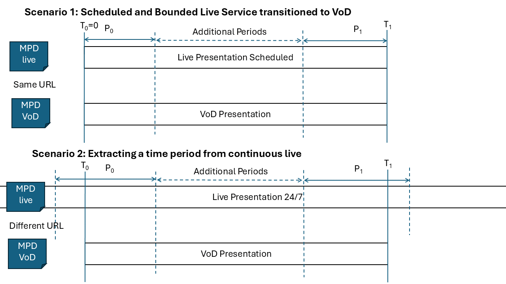

# [TITLE] # {#live2vod}

## Introduction ## {#live2vod_introduction}

This feature description is an update to DASH-IF IOP Guidelines v4.3 [[!IOP43]],
clause 4.6. It obsoletes clause 4.6 of DASH-IF IOP Guidelines v4.3 [[!IOP43]].

## Scenarios and Motivation ## {#live2vod_scenarios}

### Common aspects ### {#live2vod_scenario-common-aspects}

A common scenario for DASH distribution is that a live distributed content is
also made available On-Demand. Different use cases exist and are discussed in
the following. Common to the different use cases presented are the following
aspects when converting a live service to VoD:

  * desire to re-use the Segments as generated for the live service are also
    used for the On-Demand case. This avoids reformatting and also permits to
    reuse the Segments that are already cached.

  * the re-use of the live MPD, obviously with some modifications

  * Problems from live delivery may be addressed, e.g. variable segment durations can be signaled,
    or unavailable Segments can be marked properly or replaced.

  * The content may be augmented with ads.

In all cases, the VoD asset is defined by a time window of the live
presentation, whereby each, the start time and end time are defined by a Period in
the MPD and a media time within the Period. Specifically,

  * the first media presentation time of the new On-Demand presentation is
    specified by a Period <em>P0</em> of the live service, and the
    media presentation time <em>T0</em> within this Period
    <em>P0</em>.

  * the end time of the new On-Demand presentation is specified by a Period
    <em>P1</em> that is not earlier than Period
    <em>P1</em> of the live service, and the media presentation time
    <em>T1</em> within this Period <em>P1</em>.

<a href="#fig:live2vod">The figure below</a> provides an overview of the scenarios.

<figure id="fig:live2vod">
  
  <figcaption>Different Live to VoD Scenarios</figcaption>
</figure>

### Scheduled and Bounded Live Service transitioned to VoD ### {#live2vod_scenario-scheduled-and-bounded}

A first scenario for Live Content being converted to VOD is the case that a
scheduled live event starting at a known date and time is also made available
for On-Demand offering after the live program is completed. This case is
well-known from sports events, for example football matches (for which the duration
can be relatively easily predicted) or tennis matches (for which the duration may
be quite arbitrary).

### Extracting a time period from continuous live ### {#live2vod_scenario-extraction}

In the second scenario, the content is extracted from a longer, e.g. 24/7 stream,
at the beginning, the end, or in between. This allows that the content is
offered in a recorded fashion to users. The On-demand content again is defined by a
start and an end time in the live content.

### Transition between Live and On-Demand ### {#live2vod_scenario-transition}

In an extension of the first scenario, the live service may be converted to a VOD service
in a seamless manner. To allows this, the service is provided in live and on-demand
concurrently in a transition phase. Assume towards the end of a
live service, the content and service remains on the portal, but the clients are
no longer experience the joining of the live service at the live edge, but the
On-Demand service from the start while using the same MPD URL.

## Content Offering Requirements and Recommendations ## {#live2vod_content-offering}

### Common aspects ### {#live2vod_content-offering-common-aspects}

A live service is offered with an MPD, where for the MPD the `MPD@type` is set
to `dynamic`. In addition, the MPD may be updated by having the
`MPD@minimumUpdatePeriod` present. The live service may use different types of
profiles, including multi-Period content, number-based or time-based templating,
as well using `@duration` or Segment Timeline based segment duration signaling.
The live service may include events in the MPD and/or Inband Event Streams. Segments get
available over time, whereby the latest segment availability start time can be
determined by information in the MPD as the sum of the `MPD@availabilityStartTime`,
the start of the Period provided in *PeriodStart* as defined in [[!DASH]], clause
5.3.2.

In order to provide live content as On-Demand, the following is recommended:

  * The same Segments as generated for the live distribution are reused also for
    VoD distribution.

  * The Segments for live and VoD services share the same URLs in order to
    exploit caching advantages.

  * An MPD for the VOD service is created using the MPD for the live service
    with the following modifications

    * The `MPD@type` is set to `static`.

    * The `MPD@availabilityStartTime` may be removed, but could also be
      maintained from the live MPD since all resources referenced in the MPD are
      available assuming that the resources of the live program are available.
      The content author may also set the `MPD@availabilityStartTime` to a later
      time, for example to the largest availability time of any Segment in the
      live Media Presentation.

    * The attributes `@timeShiftBufferDepth` and `@minimumUpdatePeriod` should
      not be present (in contrast to the live MPD), i.e. it is expected that
      such attributes are removed. Note that according to ISO/IEC 23009-1
      [[!DASH]], that if present, a client is expected to ignore these
      attributes for `MPD@type` set to `static`.

    * Content may be offered in the same Period structure as for live or in a
      different one. However,

      * if Periods were only added to provide ad insertion opportunities and
        are signaled to be period-continuous [[!IOP5-PART5]], it is preferable
        to remove the Period structure.

      * if new Periods are added for Ad Insertion, the Periods are preferably
        added in a way that they are at Segment boundaries of video Adaptation
        Sets following the recommendations in [[!IOP5-PART5]].

    * The presentation duration is determined through either the
      `@mediaPresentationDuration` attribute or, if not present, through the sum
      of the *PeriodStart* and the `Period@duration` attribute of the last
      Period in the MPD. More details on this setting are defined specifically for
      each scenario further below.

    * Independent whether the `@duration` attribute or the `SegmentTimeline`
      element was used for the live distribution, the static distribution
      version preferably uses the `SegmentTimeline` with accurate timing to
      support seeking and to possibly also signal any gaps in the Segment
      timeline. However, to obtain the accurate timeline, the Segments may have
      to be parsed (at least up to the `tfdt`) to extract the accurate start
      time and duration of each Segment.

    * The same templating mode as used in the live service shall also be used
      for static distribution in order to reuse the URLs of the cached Segments.

    * MPD validity expiration events should not be present in the MPD. However,
      it is not recommended that `emsg` boxes are removed from Segments as this
      would result in change of Segments and invalidate caches. It is expected that
      by removal of the corresponding `InbandEventStream` element in the MPD, the
      DASH client will ignore the `emsg` boxes.

Specifically on the timing signaling of the Periods in the VoD offering,

  * for first Period <em>P0</em> in the live period,

    * `Period@start` shall be either be removed or set to zero.

    * the `@presentationTimeOffset` for each Adaptation Set shall be set to the media
      presentation time included in the first Segment at <em>T0</em>,
      normalized by the value of the `@timescale` of the Adaptation Set.

    * The value of the `Period@duration` attribute shall be set as follows: If
      the first Period and the last Period are identical, i.e.
      <em>P0</em> is <em>P1</em>, then *PeriodDuration* is
      set to <em>T1</em> – <em>T0</em>. If the first
      Period is different than the last Period, i.e. <em>P1</em> is
      not <em>P0</em>, then the *PeriodDuration* is set to the
      difference of *PeriodStart* value of the second Period minus
      <em>T0</em>.

  * For all remaining Periods except the last one, the *PeriodDuration* shall be
    set to the difference of the *PeriodStart* of the next Period and the
    *PeriodStart* value of the this Period in the live MPD.

  * For the last Period, if it is not the identical to the first Period, the
    *PeriodDuration* is set to the difference of <em>T1</em> and the
    *PeriodStart* of this last Period <em>P1</em> in the live MPD. If
    the first Period is different than the last Period, then the
    *PeriodDuration* is set to the difference of *PeriodStart* value of the
    second Period minus <em>T0</em>.

  * For all cases the *PeriodDuration* is preferably signaled by removing the
    `Period@start` attribute for each Period and setting the `Period@duration`
    attribute to *PeriodDuration*. However, setting the `Period@start` attribute
    may also be used. Also, to signal the *PeriodDuration* of the last Period,
    the `MPD@mediaPresentationDuration` attribute may be used. According to
    ISO/IEC 23009-1 [[!DASH]], Annex A.3.2, the `MPD@mediaPresentationDuration`
    attribute takes precendence over the *PeriodDuration*.

### Scheduled and Bounded Live Service transitioned to VoD ### {#live2vod_content-offering-scheduled-and-bounded}

In the specific scenario for a scheduled service, for which the start and end
times of the live and VOD service coincide, it is recommended that for the live
service, the `MPD@availabilityStartTime` is set as the availability time of the
initial Period, and the `Period@start` of the first Period of the live service
is set to 0.

If this is the case, the operations documented in the common aspects in clause
[[#live2vod_content-offering-common-aspects]] are significantly simplified and
no changes to period timing are needed. The only modifications to the MPD are as
follows:

  * adding the attribute `MPD@mediaPresentationDuration`

  * removing the attribute `MPD@minimumUpdatePeriod`

  * changing the `MPD@type` from `dynamic` to `static`

Note that these changes may happen all at the same time, or the first two 
may be applied first and the second change only in yet another update.

### Extracting a time period from continuous live ### {#live2vod_content-offering-extraction}

In the scenario, for which a part from the live service is extracted and made
available as On-Demand content, all recommendations from the common
aspects in clause [[#live2vod_content-offering-common-aspects]] apply.

### Transition between Live and On-Demand ### {#live2vod_content-offering-transition}

In the case of transitioning the services, the content offering should take into
account the following guidelines.

Generally, in particular in 24/7 live service,
or if the VOD service starts before the live service ends, it is discouraged
that the the same MPD URL is used for live and on-demand content. It is
preferred to create a new MPD URL for the on-demand content to not confuse
clients when transitioning from live to on-demand MPD. Note that the same Segments
with the same Segment URLs may and should be shared across live and VOD MPD.

However, there are relevant use cases to support a transition from live to on-demand content
at the end of a live service and re-using the existing MPD URL, in particular when the live
service follows the specific restrictions in section [[#live2vod_content-offering-scheduled-and-bounded]].

In this transitioning phase when the live service comes to an end, as a first action,
once the URL and publish time of the last Segment is known for the live service,
and the duration of the service is known as well, the live MPD should be changed
as defined in clause 4.4.3.1 of [[!IOP43]],, i.e.,

  * adding the attribute `MPD@mediaPresentationDuration` to match the duration of the service

  * removing the attribute `MPD@minimumUpdatePeriod`

This action is the normal action when terminating a live service.

In this case and at this time, all Segments URLs are known and clients playing the live
service can complete the playback of the service until the end without updating the MPD. 
However, some clients may also use the timeshift buffer to go back to earlier media times, 
or play the live service with some delay. The beneficial aspect of the action above, i.e. 
removing the the attribute `MPD@minimumUpdatePeriod` is that the DASH clients are expected 
to stop updating the MPD for operational reasons.

However, clients joining the service for the first time seeing the above MPD
will see the type `dynamic` and will attempt to access the live edge, but no content
is available as the live edge, as this is past the scheduled presentation. 
For this case, the client is expected to provide an indication to the user that it 
joined at the end of the media presentation, for example by playing the
last few video frames of the last segment. However, such user experience to join 
terminated services is less preferred.

In order for clients to join at the start of the live service, the `MPD@type`
needs to change from `dynamic` to `static`. While this change may confuse
clients that update the MPD, as long as this action happens only at a time when
clients no longer update the MPD, it will not create issues. For clients that
play back, MPD updates are expected to not happen anymore after the MPD change
from `@minimumUpdatePeriod` to `@mediaPresentationDuration` has been done, with
some grace period. The grace period can be estimated as the value of
`@minimumUpdatePeriod` plus the value of the `@maxSegmentDuration`. After this
time, it is expected that only clients would update the MPD that have paused
playback of live, and have not implemented MPD updates in pause state.

Hence, it is recommended that in the general case, service providers are
permitted to change the MPD and replace the `@type` to be `static` and apply all
of the modifications as documented in section [[#live2vod_content-offering-common-aspects]].

In the specific service offering above for which the `MPD@availabilityStartTime` is
set to a value that is aligned with the start of the live presentation, and for
which the `Period@start` of the first Period is set to 0, none of the Period
modifications described in section [[#live2vod_content-offering-common-aspects]]
need to be done and the MPD can be used as is. In this case, the change
from type `dynamic` to `static` may happen even earlier.

## Client Behavior ## {#live2vod_client}

For a DASH client, there is basically no difference on whether the content was
generated from a live service or the content is provided as On-Demand. However,
there are some aspects that may be “left-overs” from a live service distribution
that a DASH client should be aware of:

  * The Representations may show gaps in the Segment Timeline. Such gaps should
    be recognized and properly handled. For example a DASH client may find a gap
    only in one Representation of the content and therefore switches to another
    Representation that has no gap.

  * The DASH client shall ignore any possibly present DASH Event boxes `emsg`
    (e.g., MPD validity expirations) for which no Inband Event Stream is present
    in the MPD.

  * clients that access an MPD with `MPD@type='static'` for first time should
    start playback from the beginning (unless a specific start time is chosen
    using an MPD anchor).

  * clients that access an `MPD@type='dynamic'` for the
    first time should start from the live edge (unless a specific start time is
    chosen using an MPD anchor). If the live edge is close to the end or past the end
    of the media presentation, the DASH client should play the last few seconds
    of the live service in order for the user to provide the impression of
    joining the service. The DASH client should also update the MPD and should expect
    that the type changes from `dynamic` to `static`.

DASH clients should support the transition from `MPD@type` being `dynamic` to
`static` in the case when the `@minimumUpdatePeriod` is no longer present in the
MPD, as long as the Period structure is not changed.

## Examples ## {#live2vod_examples}

NOTE: Add some MPD examples

## Reference Tools ## {#live2vod_reference-tools}

NOTE: provide status for the following functionalities
  * Dash.js
  * Live Sim
  * Test Vectors
  * JCCP

## Additional Information ## {#live2vod_additional-information}

